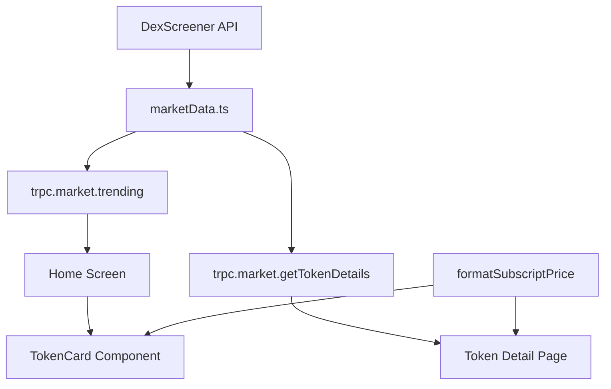

# Design Document: Token Display Improvements

## Overview

This design improves token display across the SoulWallet app to match DexScreener's presentation style. The changes affect three main areas:
1. TokenCard component (home screen list)
2. Token detail page layout
3. Price formatting utility

## Architecture



## Components and Interfaces

### 1. TokenCard Component Changes

Current props:
```typescript
interface TokenCardProps {
  symbol: string;
  name: string;      // Will be removed from display
  price: number;
  change: number;
  liquidity?: number;
  volume?: number;
  transactions?: number;
  logo?: string;
  onPress?: () => void;
}
```

Display changes:
- Show only `symbol` in uppercase as primary text
- Remove `name` from visible display (keep in props for navigation)
- Keep `logo` display with fallback to letter avatar

### 2. Price Formatter Utility

New utility function for subscript price formatting:

```typescript
/**
 * Format price with subscript notation for small values
 * Example: 0.00001367 -> $0.0₄1367
 * 
 * @param price - The price to format
 * @returns Formatted price string with subscript if needed
 */
function formatSubscriptPrice(price: number): string {
  if (price >= 0.0001) {
    // Standard formatting for larger prices
    return standardFormat(price);
  }
  
  // Count leading zeros after decimal
  const priceStr = price.toFixed(20);
  const afterDecimal = priceStr.split('.')[1] || '';
  let zeroCount = 0;
  for (const char of afterDecimal) {
    if (char === '0') zeroCount++;
    else break;
  }
  
  // Use subscript digits: ₀₁₂₃₄₅₆₇₈₉
  const subscriptDigits = '₀₁₂₃₄₅₆₇₈₉';
  const subscript = String(zeroCount).split('').map(d => subscriptDigits[parseInt(d)]).join('');
  
  // Get significant digits after zeros
  const significantPart = afterDecimal.slice(zeroCount, zeroCount + 4);
  
  return `$0.0${subscript}${significantPart}`;
}
```

### 3. Token Detail Page Layout

New header layout:
```
┌─────────────────────────────────────┐
│ [Logo]  TICKER          $0.0₄1367  │
│         Token Name      ↑ +2.45%   │
├─────────────────────────────────────┤
│         [Banner Image]              │
│                                     │
└─────────────────────────────────────┘
```

Data flow for banner image:
- Backend already fetches `header` field from DexScreener
- Pass `header` (banner URL) to detail page via navigation params
- Render banner image below header card if URL exists

## Data Models

### DexScreener Token Response (existing)

```typescript
interface DexScreenerToken {
  baseToken: {
    address: string;
    symbol: string;
    name: string;
  };
  info?: {
    imageUrl?: string;  // Profile image
  };
  header?: string;      // Banner image URL
  priceUsd: string;
  priceChange?: {
    h1?: string;
    h24?: string;
  };
}
```

### Navigation Params Update

```typescript
// Add header/banner to navigation params
router.push({
  pathname: `/coin/${symbol}`,
  params: {
    price: string;
    change: string;
    logo: string;           // Profile image
    header: string;         // Banner image (NEW)
    contractAddress: string;
    pairAddress: string;
    name: string;
  }
});
```

## Correctness Properties

*A property is a characteristic or behavior that should hold true across all valid executions of a system—essentially, a formal statement about what the system should do. Properties serve as the bridge between human-readable specifications and machine-verifiable correctness guarantees.*

### Property 1: Subscript Price Formatting

*For any* price value less than 0.0001, the formatted output SHALL contain a subscript digit representing the count of leading zeros after the decimal point.

**Validates: Requirements 3.1, 3.2**

### Property 2: Standard Price Formatting Threshold

*For any* price value greater than or equal to 0.0001, the formatted output SHALL NOT contain subscript notation.

**Validates: Requirements 3.3**

### Property 3: Price Formatter Range Handling

*For any* price value between 0.000000001 and 1000000000, the price formatter SHALL return a valid string without throwing an error.

**Validates: Requirements 3.4**

### Property 4: Ticker Uppercase Display

*For any* token with a symbol, the TokenCard SHALL display the symbol in uppercase format.

**Validates: Requirements 2.3**

### Property 5: Profile Image Fallback

*For any* token without a valid logo URL, the TokenCard SHALL render a letter avatar using the first character of the symbol.

**Validates: Requirements 1.2**

### Property 6: Banner Image Conditional Rendering

*For any* token with a header/banner URL, the Token Detail Page SHALL render an Image component with that URL.

**Validates: Requirements 4.3**

## Error Handling

1. **Image Load Failure**: TokenCard already handles this with `onError` callback setting `imageError` state
2. **Missing Banner**: Conditionally render banner section only if `header` URL exists
3. **Invalid Price**: Price formatter handles edge cases (0, negative, very large numbers)

## Testing Strategy

### Unit Tests
- Test `formatSubscriptPrice` with specific examples:
  - 0.00001367 → "$0.0₄1367"
  - 0.0001 → "$0.0001" (no subscript)
  - 0.000000001 → "$0.0₈1"
  - 150.50 → "$150.50"

### Property-Based Tests
- Use fast-check to generate random prices and verify:
  - Subscript appears only for prices < 0.0001
  - Zero count in subscript matches actual leading zeros
  - No errors for any valid price in range

### Component Tests
- TokenCard renders uppercase symbol
- TokenCard shows letter avatar when no logo
- Token detail page shows banner when header URL provided
