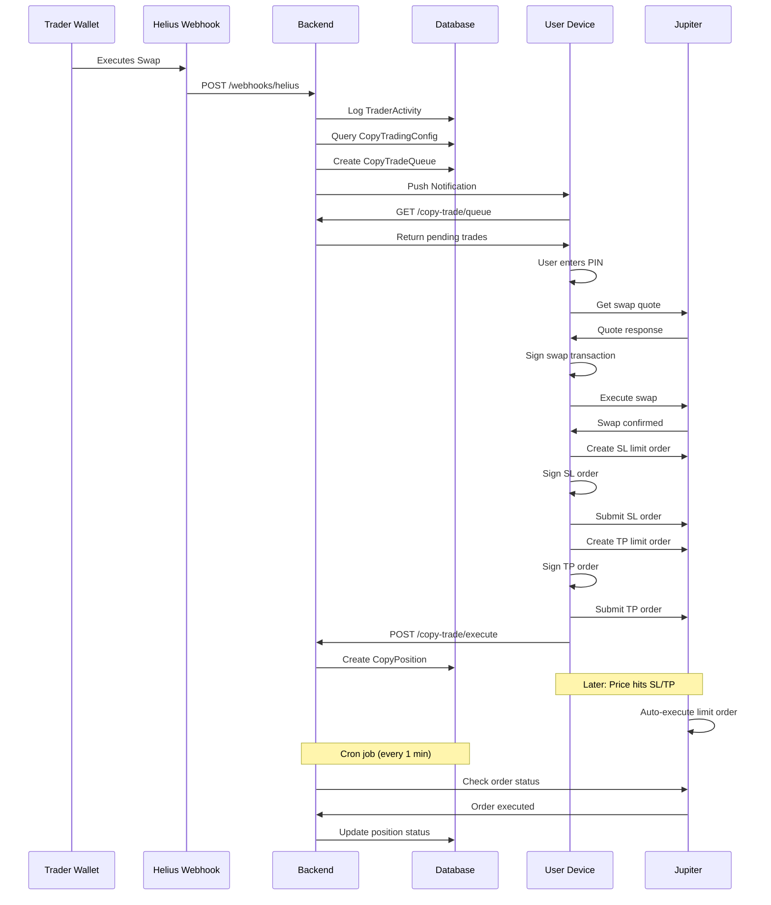

I have created the following plan after thorough exploration and analysis of the codebase. Follow the below plan verbatim. Trust the files and references. Do not re-verify what's written in the plan. Explore only when absolutely necessary. First implement all the proposed file changes and then I'll review all the changes together at the end.

## Observations

The codebase follows a **non-custodial architecture** where wallet keys are encrypted with PIN and stored client-side in `SecureStore`. Backend only knows public keys. Current swap implementation uses Jupiter API with client-side signing. The backend uses Express + Prisma + PostgreSQL, while frontend is React Native + Expo. No existing cron jobs, background tasks, or push notification infrastructure. The user emphasizes **beta simplicity** - no over-engineering or unnecessary security layers.

## Approach

Implement **hybrid queue + Jupiter Limit Orders** for copy trading. Helius webhooks detect trader swaps → backend queues copy trades → push notification alerts user → user device signs and executes (main swap + SL/TP limit orders). Jupiter Limit Orders handle SL/TP automatically even when user is offline. Background fetch enables auto-execution for small trades. Cron monitors trader exits and limit order status. All keys stay on device, backend only orchestrates.

---

## Implementation Steps

### **1. Database Schema Extension**

**File:** `file:soulwallet-backend/prisma/schema.prisma`

Add four new models after existing `Transaction` model:

- **`CopyTradingConfig`**: User's copy settings (trader address, budget, per-trade amount, SL/TP percentages, exit-with-trader flag)
- **`CopyPosition`**: Each copied position (entry price, SL/TP prices, Jupiter order IDs, status tracking)
- **`TraderActivity`**: Log of all trader swaps detected via webhooks (for exit detection)
- **`CopyTradeQueue`**: Pending trades awaiting user execution (with 5-minute expiry)

Include indexes on `traderAddress`, `configId + status`, `userId + status`, and `expiresAt` for query performance.

Run migration: `npx prisma migrate dev --name copy_trading`

---

### **2. Backend Environment Variables**

**File:** `file:soulwallet-backend/.env.example`

Add:
- `HELIUS_AUTH_HEADER`: Secret for webhook verification
- `HELIUS_WEBHOOK_URL`: Your Railway app webhook endpoint
- `JUPITER_LIMIT_API`: `https://jup.ag/api/limit/v1`

Update Railway deployment with these variables.

---

### **3. Backend Services Layer**

Create `file:soulwallet-backend/src/services/` directory with:

**`copyEngine.ts`**: 
- `queueCopyTrade()`: Check budget (totalInvestment - open positions), calculate SL/TP prices from current token price, create queue item with 5-min expiry
- Budget validation: Count open positions × perTradeAmount, reject if exceeds totalInvestment

**`priceService.ts`**:
- `getTokenPrice()`: Fetch current price from Jupiter Price API (`https://price.jup.ag/v6/price?ids={mint}`)
- Cache prices for 10 seconds to reduce API calls

**`jupiterLimitOrder.ts`**:
- `createLimitOrder()`: Generate unsigned limit order via Jupiter API (user signs on device)
- `cancelLimitOrder()`: Cancel existing limit order by ID
- `checkOrderStatus()`: Poll Jupiter API for order execution status

---

### **4. Helius Webhook Handler**

**File:** `file:soulwallet-backend/src/server.ts`

Add webhook endpoint `POST /webhooks/helius`:
- Verify `Authorization` header matches `HELIUS_AUTH_HEADER`
- Parse transaction data from Helius payload
- Detect swaps by checking for Jupiter program IDs (`JUP6LkbZbjS1jKKwapdHNyMrzcjD5E7KCDx1vqkK`, etc.)
- Extract swap details (inputMint, outputMint, amounts) from `tokenTransfers` array
- Query `CopyTradingConfig` for users copying this trader
- For each config, call `queueCopyTrade()` from copyEngine
- Log to `TraderActivity` table
- Always return `200 OK` to Helius (even on errors)

**Helius Dashboard Setup:**
- Create webhook pointing to `https://your-app.railway.app/webhooks/helius`
- Monitor trader addresses (added dynamically when users start copying)
- Event types: `SWAP`, `TOKEN_TRANSFER`

---

### **5. Copy Trading API Endpoints**

**File:** `file:soulwallet-backend/src/server.ts`

Add protected endpoints (all require `authMiddleware`):

**`POST /copy-trade/config`**: Create/update copy config
- Validate: `traderAddress` (Solana pubkey), `totalInvestment` (max 1000 USDC), `perTradeAmount` (≤ totalInvestment), `stopLossPercent`, `takeProfitPercent`
- Upsert `CopyTradingConfig` for user
- Register trader address with Helius webhook (via Helius API)

**`GET /copy-trade/queue`**: Fetch pending trades for user
- Query `CopyTradeQueue` where `userId = req.userId` and `status = 'pending'` and `expiresAt > now()`
- Return array with trade details, SL/TP prices

**`POST /copy-trade/execute/:queueId`**: Mark trade as executed
- Update queue item status to `'completed'`
- Create `CopyPosition` record with entry price, SL/TP order IDs
- Return success

**`GET /copy-trade/positions`**: List user's open positions
- Query `CopyPosition` where `configId` belongs to user and `status = 'open'`

**`POST /copy-trade/close/:positionId`**: Manual close position
- Cancel SL/TP limit orders via `cancelLimitOrder()`
- Update position status to `'closed'`
- Queue sell transaction for user to sign

**`DELETE /copy-trade/config/:configId`**: Stop copying trader
- Set `isActive = false`
- Cancel all open positions' SL/TP orders
- Unregister trader from Helius webhook if no other users copying

---

### **6. Cron Job for Monitoring**

**Install:** `npm install node-cron` in backend

**File:** `file:soulwallet-backend/src/cron/monitor.ts`

Create cron tasks (run every 1 minute):

**`monitorTraderExits()`**:
- Find `CopyPosition` where `status = 'open'` and `exitWithTrader = true`
- For each position, check `TraderActivity` for recent sell of `outputMint` by trader
- If trader exited, cancel SL/TP orders, notify user (push notification), queue sell

**`monitorLimitOrders()`**:
- Query all open positions with `slOrderId` or `tpOrderId`
- Check order status via `checkOrderStatus()`
- If order executed, update position status to `'sl_hit'` or `'tp_hit'`, mark `closedAt`

**`cleanExpiredQueue()`**:
- Delete queue items where `expiresAt < now()` and `status = 'pending'`

**File:** `file:soulwallet-backend/src/server.ts` (at bottom, before `app.listen()`)

```typescript
import cron from 'node-cron';
import { monitorTraderExits, monitorLimitOrders, cleanExpiredQueue } from './cron/monitor';

cron.schedule('* * * * *', async () => {
  await Promise.all([
    monitorTraderExits(),
    monitorLimitOrders(),
    cleanExpiredQueue()
  ]);
});
```

---

### **7. Frontend: Copy Trading Service**

**File:** `file:services/copyTrading.ts` (create new)

**Functions:**

**`checkCopyTradeQueue(authToken: string)`**:
- Fetch `GET /copy-trade/queue`
- Return array of pending trades

**`executeCopyTrade(queueItem, pin, authToken)`**:
- Step 1: Execute main swap via `executeSwap()` from `file:services/swap.ts` (buy token)
- Step 2: If `slPrice` set, create SL limit order (sell at loss price) via Jupiter API, sign with keypair
- Step 3: If `tpPrice` set, create TP limit order (sell at profit price), sign with keypair
- Step 4: POST to `/copy-trade/execute/:queueId` with SL/TP order IDs
- Clear keypair from memory after signing

**`createCopyConfig(config, authToken)`**:
- POST to `/copy-trade/config` with trader address, budget, SL/TP settings

**`fetchCopyPositions(authToken)`**:
- GET `/copy-trade/positions`

**`closeCopyPosition(positionId, pin, authToken)`**:
- POST `/copy-trade/close/:positionId`
- Sign and execute sell transaction returned by backend

---

### **8. Frontend: Background Fetch**

**Install:** `npx expo install expo-background-fetch expo-task-manager`

**File:** `file:app/_layout.tsx` (or create `file:services/backgroundTasks.ts`)

Register background task `'copy-trade-check'`:
- Runs every 15 minutes (minimum interval)
- Calls `checkCopyTradeQueue()`
- If trades pending and amount ≤ $50 (configurable), auto-execute with cached PIN
- For larger trades, show local notification

**PIN Caching (optional for beta):**
- Store hashed PIN in SecureStore with 1-hour expiry for auto-execution
- User enables "Auto-execute small trades" in settings

---

### **9. Frontend: Push Notifications**

**Install:** `npx expo install expo-notifications`

**Backend:** Add `POST /notifications/register` endpoint
- Store user's Expo push token in `User` model (add `pushToken` field)

**Send notification when trade queued:**
- Use Expo Push API: `https://exp.host/--/api/v2/push/send`
- Payload: `{ to: user.pushToken, title: 'New Copy Trade', body: 'Tap to execute' }`

**Frontend:** Handle notification tap → navigate to copy trade execution screen

---

### **10. Frontend: UI Components**

**File:** `file:components/CopyTradingModal.tsx` (already exists)

Update `handleStartCopying()`:
- Call `createCopyConfig()` instead of mock mutation
- Show success toast, navigate to positions screen

**File:** `file:components/QueueStatusBanner.tsx` (already exists)

Update to fetch real queue status:
- Call `checkCopyTradeQueue()` on mount
- Show count of pending trades
- "Execute Now" button → navigate to execution screen

**New Component:** `file:components/CopyTradeExecutionModal.tsx`

- Display pending trade details (token, amount, SL/TP)
- PIN input field
- "Execute Trade" button → calls `executeCopyTrade()`
- Show transaction progress (swap → SL order → TP order)

**New Screen:** `file:app/copy-positions.tsx`

- List open copy positions (token, entry price, current P&L, SL/TP levels)
- "Close Position" button for manual exit

---

### **11. Environment Variables (Frontend)**

**File:** `file:.env.example`

Add:
- `EXPO_PUBLIC_COPY_TRADE_ENABLED=true`
- `EXPO_PUBLIC_AUTO_EXECUTE_THRESHOLD=50` (USDC)

---

### **12. Testing & Validation**

**Backend:**
- Test webhook with Helius webhook tester (send mock swap transaction)
- Verify queue creation, budget validation
- Test cron jobs manually (call functions directly)

**Frontend:**
- Test copy config creation
- Test queue polling and execution flow
- Test background fetch (use Expo dev tools to trigger)
- Test push notifications (send test notification)

**Integration:**
- Create test trader wallet, execute swap, verify copy trade queued
- Execute copy trade, verify SL/TP orders created on Jupiter
- Trigger SL/TP by price movement, verify auto-execution

---

## Architecture Diagram



---

## Security Considerations (Beta-Appropriate)

| Risk | Mitigation |
|------|------------|
| **Keys exposed** | ✅ Keys stay in SecureStore, only decrypted for signing |
| **Malicious trader** | ✅ Per-trade limit + total budget cap prevent draining |
| **Webhook spoofing** | ✅ Verify `HELIUS_AUTH_HEADER` |
| **Queue poisoning** | ✅ 5-minute expiry, idempotent execution (check `traderTxSignature` uniqueness) |
| **Price manipulation** | ✅ Use strict slippage (0.5%), verify Jupiter routes |
| **SL/TP not executed** | ✅ Jupiter limit orders are on-chain, execute without backend |
| **Double execution** | ✅ Check `CopyPosition` for existing `traderTxSignature` before creating |

---

## File Summary

**Backend (New Files):**
- `file:soulwallet-backend/src/services/copyEngine.ts`
- `file:soulwallet-backend/src/services/priceService.ts`
- `file:soulwallet-backend/src/services/jupiterLimitOrder.ts`
- `file:soulwallet-backend/src/cron/monitor.ts`

**Backend (Modified):**
- `file:soulwallet-backend/prisma/schema.prisma` (add 4 models)
- `file:soulwallet-backend/src/server.ts` (add webhook + 6 endpoints + cron)
- `file:soulwallet-backend/.env.example` (add 3 variables)
- `file:soulwallet-backend/package.json` (add `node-cron`)

**Frontend (New Files):**
- `file:services/copyTrading.ts`
- `file:services/backgroundTasks.ts`
- `file:components/CopyTradeExecutionModal.tsx`
- `file:app/copy-positions.tsx`

**Frontend (Modified):**
- `file:components/CopyTradingModal.tsx` (connect to real API)
- `file:components/QueueStatusBanner.tsx` (fetch real queue)
- `file:app/_layout.tsx` (register background task)
- `file:.env.example` (add 2 variables)
- `file:package.json` (add `expo-background-fetch`, `expo-task-manager`, `expo-notifications`)