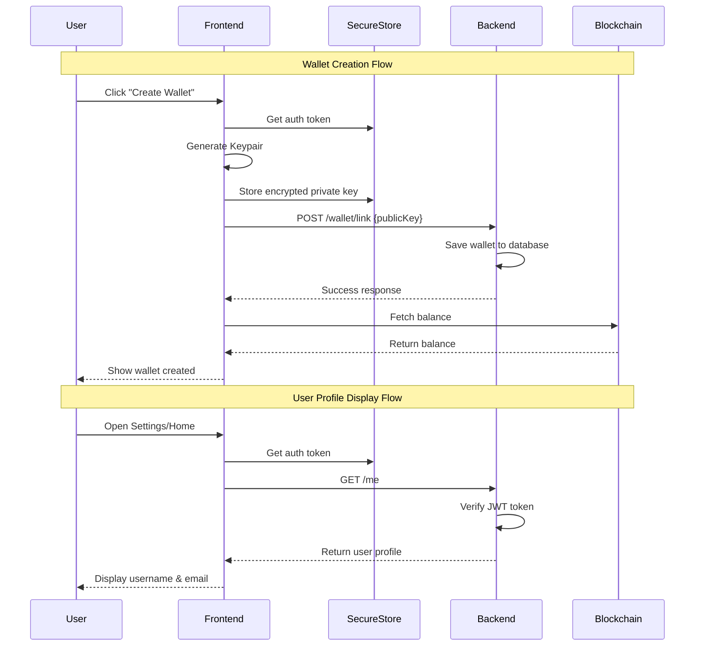

I have created the following plan after thorough exploration and analysis of the codebase. Follow the below plan verbatim. Trust the files and references. Do not re-verify what's written in the plan. Explore only when absolutely necessary. First implement all the proposed file changes and then I'll review all the changes together at the end.

## Observations

The wallet application has two critical issues: (1) The wallet creation flow in `file:app/solana-setup.tsx` uses hardcoded dummy functions that only show alerts instead of calling the real wallet service, and (2) User profile data shows "@demo_user" everywhere because `file:app/settings.tsx` and `file:app/(tabs)/index.tsx` use hardcoded DUMMY_USER constants instead of fetching real user data from the backend. The backend API is properly implemented with `/me`, `/wallet/link`, and `/wallet/balances` endpoints, and the real wallet service exists in `file:services/wallet.ts`, but the frontend components aren't connected to them.

## Approach

The solution involves replacing dummy data with real backend integration in three key files. First, update `file:app/solana-setup.tsx` to use the actual `createWallet` and `importWalletEncrypted` functions from `file:services/wallet.ts`. Second, modify `file:app/settings.tsx` to fetch user profile from the backend `/me` endpoint similar to how `file:app/account.tsx` does it. Third, update `file:app/(tabs)/index.tsx` to fetch real user data instead of using DUMMY_USER. Additionally, ensure the `.env` file contains the correct `EXPO_PUBLIC_API_URL` pointing to the backend server.

## Implementation Steps

### 1. Configure Backend API Connection

**File: `file:.env`**

Add the missing API URL configuration:
- Add `EXPO_PUBLIC_API_URL=http://localhost:3000` for local development
- For production, update this to point to your deployed backend URL (e.g., Railway deployment)
- Ensure the backend server is running on the specified port

### 2. Fix Wallet Creation in Solana Setup Screen

**File: `file:app/solana-setup.tsx`**

Replace the dummy wallet creation functions (lines 51-60) with real implementations:

- Import `createWallet` from `file:services/wallet.ts` at the top of the file
- Remove the dummy `createWalletEncrypted` function (lines 53-56)
- Remove the dummy `importWalletEncrypted` function (lines 57-60)
- In `handleCreateWallet` function (lines 70-95):
  - Get the authentication token from SecureStore: `const token = await SecureStore.getItemAsync('token')`
  - Call the real `createWallet(token, walletPassword)` function
  - Handle the response properly: if `result.success`, set the generated wallet data
  - If `result.error`, show the error message to the user
- For wallet import functionality (lines 97-116):
  - Implement proper private key import using Solana's `Keypair.fromSecretKey()`
  - Decrypt and store the keypair using the same encryption method as in `file:services/wallet.ts`
  - Link the imported wallet to the backend using the `/wallet/link` endpoint
- Update the wallet display section (lines 254-336) to show the actual generated public key and private key from the created wallet

### 3. Fix User Profile Display in Settings Screen

**File: `file:app/settings.tsx`**

Replace hardcoded DUMMY_USER with real user data:

- Remove the DUMMY_USER constant (lines 33-37)
- Remove the DUMMY_PUBLIC_KEY constant (line 38)
- Add state management for user profile similar to `file:app/account.tsx`:
  - Add `const [profile, setProfile] = useState<UserProfile | null>(null)`
  - Add `const [isLoading, setIsLoading] = useState(true)`
- Create a `fetchProfile` function (similar to lines 60-81 in `file:app/account.tsx`):
  - Get token from SecureStore
  - Call `${API_URL}/me` endpoint with Authorization header
  - Parse the response and set the profile state
- Add `useEffect` hook to call `fetchProfile` on component mount
- Update all references to `user` to use `profile` instead of DUMMY_USER
- Update the user info card (lines 167-172) to display `profile?.username` and `profile?.email`
- Update wallet address display to use the actual wallet public key from the backend or local storage
- Add loading state handling while fetching profile data

### 4. Fix User Profile Display in Home Screen

**File: `file:app/(tabs)/index.tsx`**

Replace hardcoded DUMMY_USER with real user data:

- Remove the DUMMY_USER constant (lines 36-41)
- Add state for user profile: `const [user, setUser] = useState<any>(null)`
- Create a `fetchUserProfile` function:
  - Get token from SecureStore
  - Call `${API_URL}/me` endpoint
  - Set the user state with the response
- Add `useEffect` hook to fetch user profile on component mount
- Update the header section where username is displayed to use `user?.username` instead of `DUMMY_USER.username`
- Ensure the profile image uses `user?.profileImage` if available
- Add fallback to show loading state or placeholder while user data is being fetched

### 5. Verify Backend Connectivity

**Backend Server: `file:soulwallet-backend/src/server.ts`**

Ensure the backend is properly configured and running:

- Verify `.env` file in `file:soulwallet-backend/` contains:
  - Valid `DATABASE_URL` pointing to PostgreSQL database
  - Strong `JWT_SECRET` (32+ characters)
  - `PORT=3000` or your preferred port
- Run database migrations: `npx prisma migrate dev`
- Start the backend server: `npm run dev` or `npm start`
- Test the `/health` endpoint to verify server is running
- Test the `/me` endpoint with a valid JWT token to ensure authentication works

### 6. Handle Authentication Flow

**Multiple Files**

Ensure proper authentication token management:

- Verify that login/signup flows in `file:app/(auth)/login.tsx` and `file:app/(auth)/signup.tsx` properly store the JWT token in SecureStore
- Add error handling for expired or invalid tokens:
  - If API calls return 401, redirect user to login screen
  - Clear invalid tokens from SecureStore
- Add token refresh logic if needed for long-lived sessions

### 7. Testing Checklist

After implementation, verify:

1. **Wallet Creation**:
   - Navigate to Settings → Create Wallet
   - Enter a password and create a new wallet
   - Verify a real Solana public key is generated (not the dummy address)
   - Verify the wallet is linked to the backend (check database)
   - Verify wallet balance is fetched from blockchain

2. **User Profile Display**:
   - Login with a real account
   - Verify username shows correctly in Settings (not "@demo_user")
   - Verify email shows correctly (not "demo@example.com")
   - Verify username shows correctly in Home screen header
   - Verify profile image displays if set

3. **Backend Connectivity**:
   - Check browser/app console for API errors
   - Verify no 404 or 500 errors from backend
   - Test wallet balance fetching
   - Test transaction history fetching

## Architecture Diagram

## Key Files Modified

- `file:.env` - Add API URL configuration
- `file:app/solana-setup.tsx` - Replace dummy wallet functions with real implementation
- `file:app/settings.tsx` - Fetch and display real user profile
- `file:app/(tabs)/index.tsx` - Fetch and display real user data
- `file:soulwallet-backend/.env` - Ensure backend configuration is correct

## Dependencies

All required dependencies are already installed:
- `@solana/web3.js` - For wallet generation
- `expo-secure-store` - For secure token storage
- `bs58` - For key encoding
- Backend is using Express, Prisma, and JWT