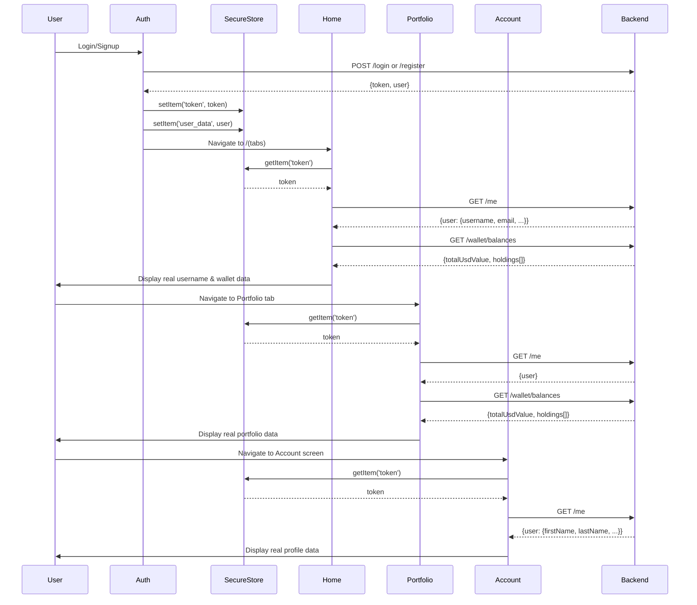

I have created the following plan after thorough exploration and analysis of the codebase. Follow the below plan verbatim. Trust the files and references. Do not re-verify what's written in the plan. Explore only when absolutely necessary. First implement all the proposed file changes and then I'll review all the changes together at the end.

## Observations

The app has a critical token storage inconsistency: auth screens store the JWT as `'auth_token'` while all other screens read it as `'token'`, causing authentication failures across Home, Account, and Portfolio screens. Additionally, all three screens use mock/dummy data instead of fetching real user profiles and wallet balances from the backend API endpoints (`/me` and `/wallet/balances`). The backend is properly configured and ready to serve real data.

## Approach

Fix the token storage key inconsistency first to enable authentication, then systematically replace mock data with real API calls across all three screens. Prioritize speed and simplicity—use direct fetch calls with minimal error handling (beta-appropriate), implement basic loading states, and leverage existing backend endpoints without adding unnecessary complexity. Focus on data flow: auth → user profile → wallet data → UI display.

## Implementation Steps

### 1. Fix Authentication Token Storage Inconsistency

**File: `file:app/(auth)/signup.tsx`**
- Line 112: Change `'auth_token'` to `'token'`
- This ensures the token is stored with the correct key that all other screens expect

**File: `file:app/(auth)/login.tsx`**
- Line 84: Change `'auth_token'` to `'token'`
- Maintains consistency with signup flow

### 2. Fix Home Screen (`file:app/(tabs)/index.tsx`)

**User Profile Display (Lines 88-117)**
- The `fetchUserProfile` function already exists and fetches from `/me` endpoint
- Line 96 already uses correct token key `'token'` (will work after Step 1)
- Display real username: Line 177 in the header section needs to use `user?.username` instead of hardcoded `'@user'`
- Conditional wallet address display: Show real address from `walletAddress` state if exists, otherwise show "No wallet" or prompt to create

**Wallet Data (Lines 129-157)**
- The `loadWalletData` function already fetches real balances from `fetchBalances(token)` 
- Line 131 uses correct token key (will work after Step 1)
- State variables `totalBalance` and `holdings` are already set correctly
- Ensure `WalletCard` component receives real `totalBalance` instead of dummy value

**Header Section Updates**
- Locate the header rendering section (around line 850+ in the JSX)
- Replace `@user` with `@{user?.username || 'user'}`
- Update wallet address display to show `walletAddress` if exists, else "Create Wallet"

### 3. Fix Account Screen (`file:app/account.tsx`)

**Token Key Fix (Line 62)**
- Already uses `'token'` key - will work after Step 1 fix
- The `fetchProfile` function (lines 60-81) already properly fetches from `/me`
- Profile state is already set correctly (line 74)
- Form fields are already synced with profile data (lines 237-247)

**No additional changes needed** - this screen is already properly structured to use real data once token storage is fixed

### 4. Fix Portfolio Screen (`file:app/(tabs)/portfolio.tsx`)

**Replace Dummy Data with Real Data**

**Add State and API Calls (After line 73)**
```
- Import SecureStore and wallet service functions at top
- Add state: `const [user, setUser] = useState<any>(null)`
- Add state: `const [walletAddress, setWalletAddress] = useState<string | null>(null)`
- Add state: `const [totalBalance, setTotalBalance] = useState<number>(0)`
- Add state: `const [holdings, setHoldings] = useState<any[]>([])`
- Add state: `const [dailyPnl, setDailyPnl] = useState<number>(0)`
- Add state: `const [isLoading, setIsLoading] = useState(true)`
```

**Fetch User Profile (Add new function)**
```
- Create `fetchUserProfile` async function
- Get token from SecureStore with key `'token'`
- Fetch from `${API_URL}/me` with Authorization header
- Set user state with response data
- Handle errors silently (beta mode)
```

**Fetch Wallet Data (Add new function)**
```
- Create `fetchWalletData` async function  
- Get token from SecureStore with key `'token'`
- Call `fetchBalances(token)` from wallet service
- Set totalBalance, holdings, walletAddress from response
- Calculate dailyPnl from holdings (can be 0 for now)
- Handle errors silently
```

**Load Data on Mount (Add useEffect)**
```
- Call fetchUserProfile and fetchWalletData
- Set isLoading to false after both complete
- Add to dependency array: []
```

**Update Refresh Handler (Line 149-155)**
```
- Replace dummy refetch with real fetchUserProfile and fetchWalletData calls
- Keep existing loadWatchlist call
```

**Update UI Data Bindings**
- Line 177: Replace `user?.username || 'user'` with real user state
- Line 189-191: Replace `solanaPublicKey || user?.walletAddress` with real `walletAddress` state
- Line 239: Replace `totalBalance` with real state value
- Line 245: Replace `dailyPnl` with real state value
- Line 320-327: Replace `tokens.map` with `holdings.map` using real data
- Transform holdings to match Token type: `{ symbol, name, balance, usdValue, price, change24h: 0, value: usdValue }`

**Loading State (Line 221)**
```
- Change condition from `isInitialLoad && tokens.length === 0` to `isLoading`
- Show skeleton while fetching real data
```

### 5. Performance Optimizations

**Caching Strategy**
- Store last fetched user data in AsyncStorage with timestamp
- On app launch, show cached data immediately while fetching fresh data
- Update cache after successful fetch
- Cache key: `'cached_user_profile'`, `'cached_wallet_data'`
- Cache TTL: 5 minutes for user profile, 30 seconds for wallet balances

**Debouncing & Throttling**
- Home screen already has debounced search (lines 341-347)
- Add pull-to-refresh throttling: prevent multiple simultaneous refreshes
- Implement simple flag: `isRefreshing` state to disable refresh while in progress

**Reduce Re-renders**
- Wrap expensive calculations in `useMemo` (e.g., token transformations, percentage calculations)
- Use `useCallback` for event handlers passed to child components
- Already implemented in Home screen (line 129), apply same pattern to Portfolio

### 6. Error Handling (Minimal - Beta Appropriate)

**Silent Failures**
- Wrap all fetch calls in try-catch
- Log errors to console only (no user-facing alerts for network issues)
- Show stale/cached data if fetch fails
- Only show alerts for critical errors (invalid token → redirect to login)

**Loading States**
- Show skeleton loaders while fetching (already implemented in Account screen lines 398-442)
- Use same pattern for Home and Portfolio screens
- Keep loading states simple: boolean flag, no complex state machines

**Retry Logic**
- Add simple retry button in error states
- No automatic retries (keeps app fast, user controls when to retry)
- Existing `QueueStatusBanner` component can be reused for retry UI

### 7. Data Flow Diagram



### 8. Testing Checklist

**After Implementation:**
- [ ] Signup creates account and stores token with key `'token'`
- [ ] Login authenticates and stores token with key `'token'`
- [ ] Home screen displays real username in header
- [ ] Home screen shows real wallet address or "Create Wallet" prompt
- [ ] Home screen displays real total balance in WalletCard
- [ ] Account screen loads and displays real user profile data
- [ ] Account screen Save button updates profile successfully
- [ ] Portfolio screen displays real username in header
- [ ] Portfolio screen shows real wallet address
- [ ] Portfolio screen displays real total balance
- [ ] Portfolio screen Holdings tab shows real token balances
- [ ] Pull-to-refresh updates data on all screens
- [ ] App remains fast and responsive during data fetching