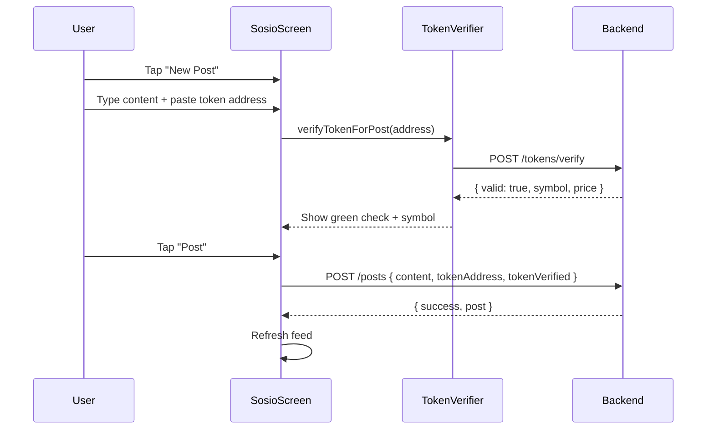
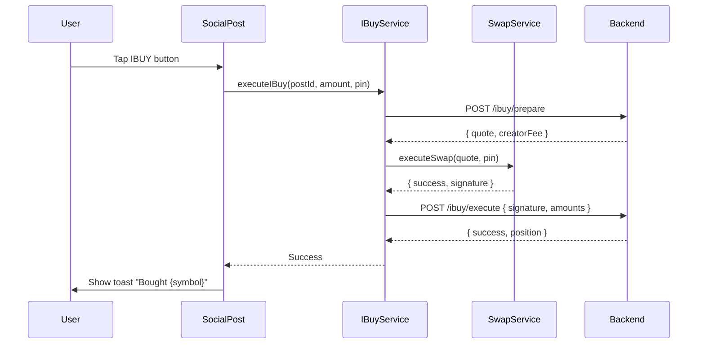
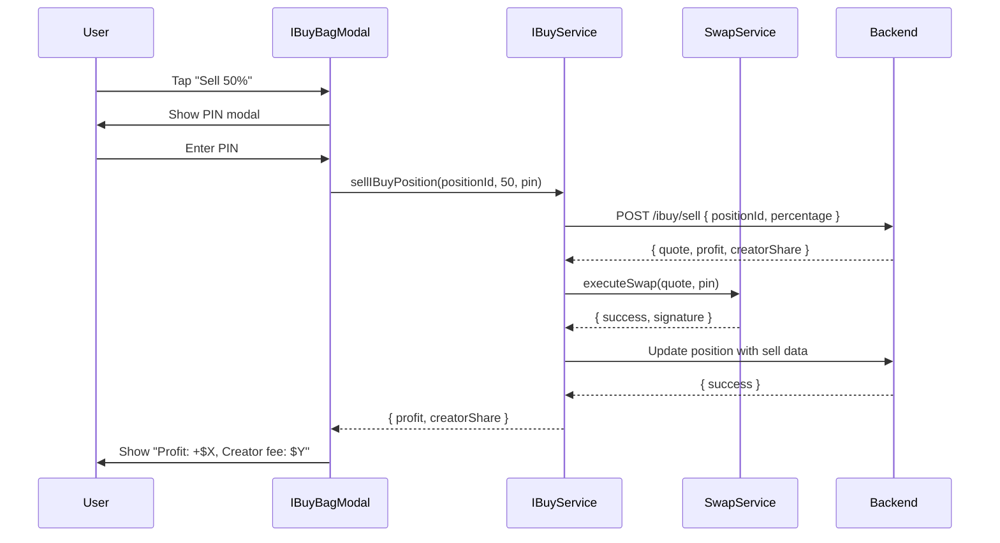

I have created the following plan after thorough exploration and analysis of the codebase. Follow the below plan verbatim. Trust the files and references. Do not re-verify what's written in the plan. Explore only when absolutely necessary. First implement all the proposed file changes and then I'll review all the changes together at the end.

## Observations

The codebase follows a **full-stack TypeScript architecture** with:
- **Backend**: Express.js REST API using Prisma ORM (PostgreSQL), JWT auth, Zod validation, and external integrations (Jupiter, DexScreener, Helius)
- **Frontend**: React Native (Expo) with centralized API client (`file:services/api.ts`), PIN-encrypted wallet management (`file:services/wallet.ts`), and Jupiter swap integration (`file:services/swap.ts`)
- **Existing Social Features**: Post creation with token mentions (`file:app/(tabs)/sosio.tsx`), user profiles (`file:app/profile/self.tsx`), and social interactions (likes, comments, follows)
- **Copy Trading Infrastructure**: Position tracking, queue system, and Jupiter limit orders for SL/TP (`file:services/copyTrading.ts`)

The IBUY feature will **extend the social layer** by adding buy/sell functionality to token-mentioned posts, tracking positions with creator revenue sharing, and reusing the existing swap infrastructure.

---

## Approach

The implementation will **leverage existing patterns** to minimize complexity:

1. **Database Layer**: Extend `file:soulwallet-backend/prisma/schema.prisma` with `IBuyPosition`, `CreatorRevenue`, and `UserSettings` models, plus new fields on `Post` (token verification, IBUY stats)
2. **Backend Services**: Create `file:soulwallet-backend/src/services/tokenVerifier.ts` for multi-source token validation (Jupiter, Pump.fun, BirdEye) and `file:soulwallet-backend/src/cron/revenueDistribution.ts` for batch creator payouts
3. **Backend Endpoints**: Add 7 new routes in `file:soulwallet-backend/src/server.ts` for token verification, IBUY buy/sell, position management, and settings
4. **Frontend Service**: Create `file:services/ibuy.ts` to wrap IBUY API calls and reuse `executeSwap` from `file:services/swap.ts`
5. **UI Components**: Create `file:components/IBuyBagModal.tsx` (similar to `file:components/TokenBagModal.tsx`) and enhance `file:components/SocialPost.tsx` with IBUY button integration
6. **Screen Integration**: Add IBUY bag access to `file:app/(tabs)/sosio.tsx` and creator earnings display to `file:app/profile/self.tsx`

This approach **reuses 80% of existing infrastructure** (swap execution, wallet signing, API client, UI patterns) while adding IBUY-specific logic for position tracking and revenue sharing.

---

## Implementation Steps

### 1. Database Schema Updates

**File**: `file:soulwallet-backend/prisma/schema.prisma`

**Actions**:
- **Update `Post` model**:
  - Add `tokenVerified Boolean @default(false)` to indicate Jupiter/Pump.fun verification
  - Add `tokenPriceAtPost Float?` to store price snapshot when posted
  - Add `ibuyCount Int @default(0)` to track total IBUY purchases
  - Add `ibuyVolume Float @default(0)` to track total SOL/USDC volume
  - Add `ibuys IBuyPosition[]` relation for linking purchases
  - Add `@@index([tokenAddress])` for efficient token lookups

- **Create `IBuyPosition` model**:
  - Fields: `id`, `userId`, `postId`, `creatorId`, `tokenAddress`, `tokenSymbol`, `entryPrice`, `solAmount`, `tokenAmount`, `creatorFee` (5% of SOL spent), `remainingAmount`, `realizedPnl`, `creatorSharePaid`, `status` (open/closed), `createdAt`, `closedAt`
  - Relations: `user` (buyer), `creator` (post author), `post`
  - Indexes: `@@index([userId, status])`, `@@index([creatorId])`, `@@index([postId])`

- **Create `CreatorRevenue` model**:
  - Fields: `id`, `creatorId`, `positionId`, `amount` (SOL), `type` (ibuy_fee/profit_share), `createdAt`
  - Relation: `creator User`
  - Index: `@@index([creatorId, createdAt])`

- **Create `UserSettings` model**:
  - Fields: `id`, `userId @unique`, `ibuySlippage Int @default(50)` (0.5% in bps), `ibuyDefaultSol Float @default(0.1)`, `autoApprove Boolean @default(false)`
  - Relation: `user User`

- **Update `User` model**:
  - Add `settings UserSettings?` relation
  - Add `ibuyPositions IBuyPosition[] @relation("buyer")` relation
  - Add `creatorPositions IBuyPosition[] @relation("creator")` relation
  - Add `creatorRevenues CreatorRevenue[]` relation

**Migration**:
```bash
cd soulwallet-backend
npx prisma migrate dev --name ibuy_feature
npx prisma generate
```

---

### 2. Token Verification Service

**File**: `file:soulwallet-backend/src/services/tokenVerifier.ts`

**Actions**:
- **Create `verifyToken(address: string)` function**:
  - **Step 1**: Validate Solana address format using `@solana/web3.js` `PublicKey` constructor
  - **Step 2**: Check Jupiter Price API (`https://price.jup.ag/v6/price?ids=${address}`) for price data (indicates liquid token)
    - If found: Return `{ valid: true, source: 'jupiter', symbol, name, price, verified: true }`
  - **Step 3**: Check Pump.fun API (`https://api.pump.fun/coins/${address}`) for new tokens
    - If found: Return `{ valid: true, source: 'pumpfun', symbol, name, price: marketCap/totalSupply, verified: false }`
  - **Step 4**: Check BirdEye API (`https://public-api.birdeye.so/defi/token?address=${address}`) with `process.env.BIRDEYE_API_KEY`
    - If found: Return `{ valid: true, source: 'birdeye', symbol, name, price, verified }`
  - **Step 5**: If no price data but valid address: Return `{ valid: true, source: 'unknown', symbol: 'Unknown', price: 0, verified: false }`
  - **Error handling**: Catch invalid addresses and return `{ valid: false, error: 'Invalid address' }`

- **Export function** for use in server endpoints

---

### 3. Backend IBUY Endpoints

**File**: `file:soulwallet-backend/src/server.ts`

**Actions**:

#### 3.1 Token Verification Endpoint
```typescript
POST /tokens/verify
- Middleware: auth (JWT validation)
- Body: { address: string }
- Logic: Call verifyToken(address) from tokenVerifier service
- Response: { valid, source?, symbol?, name?, price?, verified?, error? }
```

#### 3.2 IBUY Prepare Endpoint
```typescript
POST /ibuy/prepare
- Middleware: auth
- Body: { postId: string, amount: number } // amount in SOL
- Logic:
  1. Fetch post with tokenAddress and creator wallet
  2. Validate post has tokenAddress
  3. Get user's wallet from DB
  4. Fetch Jupiter quote (SOL → Token) with 95% of amount (5% creator fee)
  5. Calculate creatorFee = amount * 0.05
- Response: { success, quote, postId, tokenAddress, tokenSymbol, amount, creatorFee, creatorWallet }
```

#### 3.3 IBUY Execute Endpoint
```typescript
POST /ibuy/execute
- Middleware: auth
- Body: { postId, signature, tokenAmount, solAmount, price, creatorFee }
- Logic:
  1. Fetch post with creator info
  2. Create IBuyPosition record with status='open', remainingAmount=tokenAmount
  3. Update post.ibuyCount += 1, post.ibuyVolume += solAmount
- Response: { success, position }
```

#### 3.4 Get IBUY Positions Endpoint
```typescript
GET /ibuy/positions
- Middleware: auth
- Query: None
- Logic:
  1. Fetch all open positions for user (status='open', remainingAmount > 0)
  2. Extract unique token addresses
  3. Batch fetch current prices from Jupiter/BirdEye
  4. Calculate P&L for each position:
     - currentValue = remainingAmount * currentPrice
     - costBasis = remainingAmount * entryPrice
     - unrealizedPnl = currentValue - costBasis
     - pnlPercent = (unrealizedPnl / costBasis) * 100
- Response: { success, positions: [{ ...position, currentPrice, currentValue, unrealizedPnl, pnlPercent }] }
```

#### 3.5 IBUY Sell Endpoint
```typescript
POST /ibuy/sell
- Middleware: auth
- Body: { positionId: string, percentage: number } // 25, 50, 75, 100
- Logic:
  1. Fetch position with creator wallet
  2. Validate user owns position and status='open'
  3. Calculate sellAmount = remainingAmount * (percentage / 100)
  4. Get Jupiter quote (Token → SOL) for sellAmount
  5. Calculate P&L:
     - costBasis = sellAmount * entryPrice
     - revenue = quote.outAmount / 1e9 (SOL)
     - profit = revenue - costBasis
     - creatorShare = profit > 0 ? profit * 0.05 : 0
  6. Update position:
     - remainingAmount -= sellAmount
     - realizedPnl += max(0, profit)
     - creatorSharePaid += creatorShare
     - status = remainingAmount < 0.000001 ? 'closed' : 'open'
     - closedAt = status === 'closed' ? now : null
  7. Create CreatorRevenue record if creatorShare > 0
- Response: { success, solReceived, profit, creatorShare, isFullyClosed, quote }
```

#### 3.6 Get IBUY Settings Endpoint
```typescript
GET /ibuy/settings
- Middleware: auth
- Logic: Fetch or create default UserSettings for user
- Response: { success, settings: { ibuySlippage, ibuyDefaultSol, autoApprove } }
```

#### 3.7 Update IBUY Settings Endpoint
```typescript
PUT /ibuy/settings
- Middleware: auth
- Body: { ibuySlippage?: number, ibuyDefaultSol?: number, autoApprove?: boolean }
- Logic: Upsert UserSettings record
- Response: { success, settings }
```

**Integration Notes**:
- Add endpoints after existing social endpoints (around line 2161 in `file:soulwallet-backend/src/server.ts`)
- Reuse existing `auth` middleware and Prisma client (`prisma`)
- Follow existing error handling patterns (try/catch with 500 status)

---

### 4. Revenue Distribution Cron Job

**File**: `file:soulwallet-backend/src/cron/revenueDistribution.ts`

**Actions**:
- **Create `distributeCreatorRevenues()` function**:
  - **Step 1**: Query all unpaid `CreatorRevenue` records (no `paidAt` field yet, so query all with `amount > 0`)
  - **Step 2**: Group by `creatorId` and sum amounts
  - **Step 3**: For each creator with total > 0.01 SOL and valid wallet:
    - Log payout details (for beta: manual payout weekly)
    - In production: Execute SOL transfer transaction
    - Mark revenues as paid (add `paidAt` field in future migration)
  - **Error handling**: Continue on individual failures, log errors

- **Schedule in `file:soulwallet-backend/src/server.ts`**:
  - Add to existing cron jobs section (around line 2162)
  - Run daily at midnight: `setInterval(distributeCreatorRevenues, 24 * 60 * 60 * 1000)`

---

### 5. Frontend IBUY Service

**File**: `file:services/ibuy.ts`

**Actions**:

#### 5.1 Token Verification Function
```typescript
export const verifyTokenForPost = async (address: string): Promise<{ valid: boolean; symbol?: string; price?: number; error?: string }>
- Get auth token from SecureStore
- POST to /tokens/verify with { address }
- Return verification result
```

#### 5.2 Execute IBUY Function
```typescript
export const executeIBuy = async (postId: string, amount: number, pin: string): Promise<{ success: boolean; position?: any; error?: string }>
- Step 1: Fetch settings via getIBuySettings()
- Step 2: POST to /ibuy/prepare with { postId, amount }
- Step 3: Execute swap using executeSwap() from file:services/swap.ts:
  - inputMint: SOL_MINT
  - outputMint: prepareData.tokenAddress
  - amount: prepareData.amount (95% of input)
  - slippageBps: settings.ibuySlippage
- Step 4: POST to /ibuy/execute with swap result
- Return { success, position } or { success: false, error }
```

#### 5.3 Get IBUY Bag Function
```typescript
export const getMyIBuyBag = async (): Promise<{ success: boolean; positions?: any[]; error?: string }>
- GET /ibuy/positions
- Return positions with P&L data
```

#### 5.4 Sell IBUY Position Function
```typescript
export const sellIBuyPosition = async (positionId: string, percentage: number, pin: string): Promise<{ success: boolean; solReceived?: number; profit?: number; error?: string }>
- Step 1: POST to /ibuy/sell with { positionId, percentage }
- Step 2: Execute swap using executeSwap() from file:services/swap.ts:
  - inputMint: data.quote.inputMint
  - outputMint: SOL_MINT
  - amount: data.quote.inAmount
  - slippageBps: 50
- Return sell result with P&L
```

#### 5.5 Settings Functions
```typescript
export const getIBuySettings = async (): Promise<{ ibuySlippage: number; ibuyDefaultSol: number; autoApprove: boolean }>
- GET /ibuy/settings
- Return settings or defaults

export const updateIBuySettings = async (settings: any): Promise<{ success: boolean; error?: string }>
- PUT /ibuy/settings with settings object
- Return result
```

**Import Dependencies**:
- Import `executeSwap` from `file:services/swap.ts`
- Import `api` from `file:services/api.ts`
- Import `SecureStore` from `expo-secure-store`

---

### 6. IBUY Bag Modal Component

**File**: `file:components/IBuyBagModal.tsx`

**Actions**:
- **Create modal component** similar to `file:components/TokenBagModal.tsx` structure:
  - **Props**: `visible: boolean`, `onClose: () => void`, `onRefresh?: () => void`
  - **State**: `positions`, `loading`, `selling`, `showSettings`, `settings` (slippage, defaultSol, autoApprove)
  
- **UI Structure**:
  - **Header**: "My IBUY Bag" title with settings gear icon and close button
  - **Settings Panel** (collapsible):
    - Default SOL amount input (0.05, 0.1, 0.5, 1.0 presets)
    - Slippage tolerance input (0.5%, 1%, 2% presets)
    - Auto-approve toggle for small amounts (<0.05 SOL)
  - **Positions List**:
    - For each position: Token symbol/name, holdings amount, current value, P&L (green/red), cost basis
    - Quick sell buttons: 10%, 25%, 50%, 100%
    - "Buy More" button (uses default amount from settings)
  - **Empty State**: "No IBUY positions yet. Tap IBUY on posts to start!"

- **Functions**:
  - `loadPositions()`: Call `getMyIBuyBag()` and update state
  - `handleSell(positionId, percentage)`: Show PIN modal, call `sellIBuyPosition()`, refresh positions
  - `handleBuyMore(position)`: Navigate to post or execute IBUY with default amount
  - `handleSaveSettings()`: Call `updateIBuySettings()` and close settings panel

- **Styling**: Follow `file:components/TokenBagModal.tsx` patterns (NeonCard, COLORS, FONTS, SPACING)

---

### 7. Social Post IBUY Integration

**File**: `file:components/SocialPost.tsx`

**Actions**:
- **IBUY Button Enhancement** (already has color-coded styling at lines 104-165):
  - Button is already implemented with age-based colors (green <1min, yellow <10min, red 10+min)
  - Add `onBuyPress` prop handling (line 340-345)
  
- **No changes needed** - component already supports IBUY button with:
  - `mentionedToken` prop for displaying token symbol
  - `onBuyPress` callback for handling IBUY action
  - Age-based color coding with pulsing animation for yellow/red states

---

### 8. Social Feed Integration

**File**: `file:app/(tabs)/sosio.tsx`

**Actions**:

#### 8.1 Add IBUY Bag FAB
- **Import**: `IBuyBagModal` from `file:components/IBuyBagModal.tsx`
- **State**: Add `showIBuyBag` boolean state
- **FAB Button** (add next to existing FABs around line 600):
  - Icon: `ShoppingBag` from lucide-react-native
  - Position: Bottom-left (opposite of new post FAB)
  - Color: COLORS.success with gradient
  - Action: `setShowIBuyBag(true)`
- **Modal**: Render `<IBuyBagModal visible={showIBuyBag} onClose={() => setShowIBuyBag(false)} onRefresh={loadFeed} />`

#### 8.2 IBUY Button Handler
- **Add function** `handleIBuy(post)`:
  - Show modal with amount input (default from settings)
  - On confirm: Show PIN modal
  - Call `executeIBuy(post.id, amount, pin)`
  - On success: Show toast "Bought {tokenSymbol}", refresh feed
  - On error: Show error toast

- **Pass to SocialPost**:
  - Add `onBuyPress={() => handleIBuy(post)}` prop to `<SocialPost>` component (around line 500)

#### 8.3 Post Creation Token Verification
- **Enhance token mention flow** (around line 650 in new post modal):
  - When user pastes token address, call `verifyTokenForPost(address)`
  - Show verification status (green check + symbol if valid, red X if invalid)
  - Store `tokenAddress`, `tokenSymbol`, `tokenVerified` in post creation payload

---

### 9. Profile Creator Earnings Display

**File**: `file:app/profile/self.tsx`

**Actions**:

#### 9.1 Add IBUY Earnings Card
- **Add after Trading Summary card** (around line 300):
  - **Title**: "IBUY Creator Earnings"
  - **Stats**:
    - Total earnings (SOL)
    - Total positions created (count)
    - Average profit per position
  - **Action**: "View Breakdown" button → navigate to earnings detail screen (future)

#### 9.2 Fetch Earnings Data
- **Add API call** in `loadProfile()`:
  - GET `/ibuy/creator-earnings` (new endpoint to add in backend)
  - Response: `{ totalEarnings, positionCount, avgProfit, breakdown: [{ postId, tokenSymbol, earnings }] }`
  - Store in state and display in card

#### 9.3 Backend Endpoint for Creator Earnings
- **Add to `file:soulwallet-backend/src/server.ts`**:
```typescript
GET /ibuy/creator-earnings
- Middleware: auth
- Logic:
  1. Query CreatorRevenue where creatorId = userId
  2. Sum amounts for totalEarnings
  3. Count distinct positionIds for positionCount
  4. Calculate avgProfit = totalEarnings / positionCount
  5. Group by postId for breakdown
- Response: { success, totalEarnings, positionCount, avgProfit, breakdown }
```

---

## Key UX Flows

### Flow 1: Creating Post with Token


### Flow 2: Buying from Post (IBUY)


### Flow 3: Selling from IBUY Bag


---

## Testing Checklist

- [ ] Database migration runs successfully
- [ ] Token verification works for Jupiter, Pump.fun, BirdEye tokens
- [ ] IBUY prepare endpoint returns valid Jupiter quote
- [ ] IBUY execute creates position and updates post stats
- [ ] Position list shows correct P&L calculations
- [ ] Sell endpoint calculates creator fee correctly (5% of profit)
- [ ] Settings CRUD operations work
- [ ] Revenue distribution cron job groups and logs payouts
- [ ] Frontend IBUY service handles errors gracefully
- [ ] IBUY Bag modal displays positions with live prices
- [ ] Quick sell buttons (10%, 25%, 50%, 100%) work correctly
- [ ] Buy More button reuses post context
- [ ] Social post IBUY button shows correct age-based colors
- [ ] Creator earnings display on profile screen
- [ ] PIN validation works for all IBUY operations