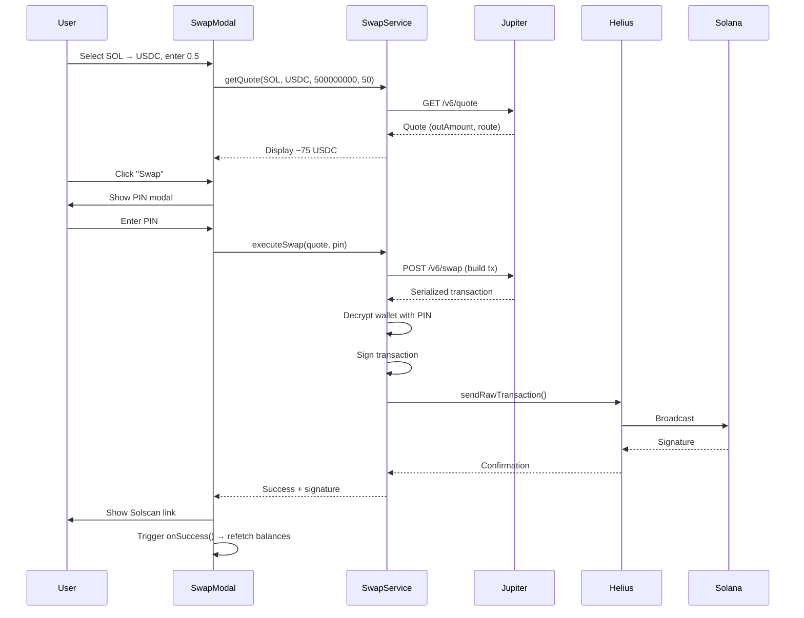

I have created the following plan after thorough exploration and analysis of the codebase. Follow the below plan verbatim. Trust the files and references. Do not re-verify what's written in the plan. Explore only when absolutely necessary. First implement all the proposed file changes and then I'll review all the changes together at the end.

## Observations

The codebase already has `@solana/web3.js` v1.98.2 installed with wallet infrastructure (PIN-based encryption, keypair signing via `getKeypairForSigning()`). The home screen contains a mock swap implementation (lines 504-556 in `file:app/(tabs)/index.tsx`) that validates inputs but calls a non-existent `executeSwap()` function. `file:components/SendModal.tsx` demonstrates the established pattern: token selector → amount input → PIN modal → transaction execution with real-time balance updates.

## Approach

Implement Jupiter-powered swap feature entirely client-side (no backend changes). Create `file:services/swap.ts` for Jupiter API integration (quote fetching, token list, transaction building/signing). Build `file:components/SwapModal.tsx` following SendModal's architecture with dual token search, debounced quotes, and PIN confirmation. Replace mock swap logic in home screen with real modal integration and add pull-to-refresh for post-swap balance updates.

---

## Implementation Steps

### 1. Create Swap Service (`file:services/swap.ts`)

**Purpose**: Handle all Jupiter API interactions and transaction execution

**Functions to implement**:

- **`getTokenList()`**: Fetch Jupiter's verified token list (cache for 5 minutes to reduce API calls)
  - Endpoint: `https://token.jup.ag/strict`
  - Return: Array of `{ symbol, name, mint, decimals, logoURI }`
  - Filter out tokens with missing metadata

- **`searchToken(query: string)`**: Search tokens by symbol/name/mint
  - Use cached token list from `getTokenList()`
  - Case-insensitive matching on symbol, name, or mint address
  - Return top 20 results

- **`getQuote(inputMint: string, outputMint: string, amount: number, slippageBps: number)`**:
  - Endpoint: `https://quote-api.jup.ag/v6/quote`
  - Parameters: `inputMint`, `outputMint`, `amount` (in smallest units), `slippageBps`
  - Add `onlyDirectRoutes=false` to allow multi-hop routing
  - Return quote object with `inAmount`, `outAmount`, `priceImpactPct`, `routePlan`

- **`executeSwap(quote: any, userPin: string)`**:
  - Call `https://quote-api.jup.ag/v6/swap` with quote + user's public key
  - Request body: `{ quoteResponse: quote, userPublicKey, wrapAndUnwrapSol: true, dynamicComputeUnitLimit: true, prioritizationFeeLamports: 'auto' }`
  - Deserialize transaction from base64 response
  - Decrypt wallet using `getKeypairForSigning(userPin)` from `file:services/wallet.ts`
  - Sign transaction with keypair
  - Broadcast via Helius RPC: `https://mainnet.helius-rpc.com/?api-key=${process.env.EXPO_PUBLIC_HELIUS_API_KEY}`
  - Use `Connection.sendRawTransaction()` with `skipPreflight: false`
  - Wait for confirmation with `confirmTransaction(signature, 'confirmed')`
  - Return `{ success: true, signature, explorerUrl: 'https://solscan.io/tx/${signature}' }`

**Error handling**:
- Wrap all async calls in try-catch
- Map common errors: "insufficient funds" → user-friendly message, "blockhash expired" → "Network busy, retry"
- Clear keypair from memory immediately after signing (same pattern as `file:services/wallet.ts` lines 340-345)

**Dependencies**: Import `Connection`, `VersionedTransaction` from `@solana/web3.js`, `getKeypairForSigning` from `file:services/wallet.ts`

---

### 2. Build Swap Modal (`file:components/SwapModal.tsx`)

**Props**: `{ visible: boolean, onClose: () => void, onSuccess?: () => void, holdings: Token[] }`

**State management**:
- `fromToken`, `toToken` (mint addresses)
- `amount` (string input)
- `quote` (Jupiter quote response)
- `loading` (quote fetching)
- `swapping` (transaction in progress)
- `showFromSearch`, `showToSearch` (token selector modals)
- `fromSearchQuery`, `toSearchQuery`
- `slippage` (default 0.5%)
- `pin`, `showPinModal`, `pinError`

**UI Structure** (follow SendModal pattern from `file:components/SendModal.tsx`):

1. **Header**: "Swap" title + close button
2. **From Token Section**:
   - Label: "From"
   - Token selector button (logo + symbol + balance)
   - Amount input with MAX button (calculates `balance - 0.001 SOL` for SOL, full balance for others)
   - Error text for insufficient balance

3. **Swap Direction Button**: Flip icon (↕) to swap `fromToken` ↔ `toToken`

4. **To Token Section**:
   - Label: "To"
   - Token selector button (logo + symbol)
   - Estimated output display (read-only, from quote)
   - Loading spinner while fetching quote

5. **Quote Details** (show when quote available):
   - Rate: `1 {fromSymbol} ≈ {rate} {toSymbol}`
   - Price impact: `{quote.priceImpactPct}%` (warn if > 5%)
   - Minimum received: `{quote.outAmount * (1 - slippage/100)}`
   - Route: Show if multi-hop (e.g., "SOL → USDC → BONK")

6. **Slippage Settings** (collapsible):
   - Preset buttons: 0.1%, 0.5%, 1%, 2%
   - Custom input field

7. **Swap Button**:
   - Disabled if: no quote, loading, or swapping
   - Text: "Swap" / "Swapping..." / "Fetching quote..."

**Token Search Modal** (reuse pattern from SendModal's token selector):
- Search input at top
- Debounced search (500ms) calling `searchToken(query)`
- FlatList of tokens with logo, symbol, name, balance (if in holdings)
- Default list: Show holdings first, then popular tokens (SOL, USDC, USDT, BONK)
- Empty state: "No tokens found"

**Quote Fetching Logic**:
- Debounce amount input (500ms)
- When `amount`, `fromToken`, `toToken` change → call `getQuote()`
- Convert human amount to smallest units: `amount * 10^decimals`
- Show loading spinner in "To" section
- Update estimated output on success
- Show error toast on failure

**PIN Modal** (identical to SendModal lines 486-555):
- Title: "Confirm Swap"
- Summary card showing: `{amount} {fromSymbol} → ~{estimatedOut} {toSymbol}`
- PIN input (numeric, 4-6 digits, secure entry)
- Confirm button → calls `executeSwap(quote, pin)`
- On success: Show toast + Alert with Solscan link
- On error: Show error toast, keep modal open

**Validation**:
- Amount: Must be > 0, ≤ balance, max 9 decimals
- Tokens: Must be different (`fromToken !== toToken`)
- Quote: Must exist before allowing swap

---

### 3. Update Home Screen (`file:app/(tabs)/index.tsx`)

**Remove mock swap logic** (lines 419-589):
- Delete `fromToken`, `toToken`, `swapAmount`, `estimatedOutput`, `slippage` state
- Delete `handleSwap()` function (lines 504-556)
- Delete mock estimation effect (lines 572-580)
- Delete `minReceived` calculation (lines 582-588)

**Add SwapModal integration**:
- Import: `import { SwapModal } from '../components/SwapModal'`
- Keep `showSwapModal` state
- Add modal to JSX (after SendModal):
  ```tsx
  <SwapModal
    visible={showSwapModal}
    onClose={() => setShowSwapModal(false)}
    onSuccess={refetch}
    holdings={holdings}
  />
  ```

**Add pull-to-refresh**:
- Wrap ScrollView with `refreshControl` prop
- Use existing `onRefresh` callback (lines 449-453)
- This ensures balances update after swap

**Update SWAP quick action button**:
- Keep existing button (no changes needed)
- Ensure it sets `setShowSwapModal(true)`

---

### 4. Environment Configuration

**Add to `.env.example` and `.env`**:
```
EXPO_PUBLIC_HELIUS_API_KEY=your_helius_key_here
```

**Usage in swap service**:
```typescript
const HELIUS_RPC = `https://mainnet.helius-rpc.com/?api-key=${process.env.EXPO_PUBLIC_HELIUS_API_KEY}`;
```

---

### 5. Testing Checklist

| Test Case | Expected Behavior |
|-----------|-------------------|
| SOL → USDC (0.1 SOL) | Quote fetched in <1s, swap completes in 3-5s |
| USDC → SOL (10 USDC) | Reverse swap works identically |
| Search "BONK" | Token appears in search results with logo |
| MAX button (SOL) | Sets amount to `balance - 0.001` |
| MAX button (USDC) | Sets amount to full balance |
| Flip tokens | Swaps from/to, refetches quote |
| Wrong PIN | Shows "Invalid PIN" error, doesn't execute |
| Insufficient balance | Disables swap button, shows error |
| High slippage (>5%) | Shows warning in quote details |
| Network error | Shows "Failed to fetch quote" toast |
| Successful swap | Balance updates automatically, Solscan link opens |

---

## Architecture Diagram



---

## File References

- `file:services/swap.ts` - NEW (create from scratch)
- `file:components/SwapModal.tsx` - NEW (create from scratch)
- `file:app/(tabs)/index.tsx` - UPDATE (remove lines 419-589, add SwapModal)
- `file:services/wallet.ts` - REFERENCE (use `getKeypairForSigning()`)
- `file:components/SendModal.tsx` - REFERENCE (copy UI patterns)
- `file:constants/blockchain.ts` - REFERENCE (use MINTS constants)

---

## Security Considerations

1. **Private key exposure**: Decrypt only during signing (max 500ms), clear from memory immediately
2. **PIN validation**: Enforce 4-6 numeric digits before decryption attempt
3. **Transaction verification**: Show summary in PIN modal before execution
4. **RPC security**: Use Helius API key from env (never hardcode)
5. **Quote validation**: Verify `quote.outAmount` matches expected range before signing

---

## Performance Optimizations

| Technique | Benefit |
|-----------|---------|
| Token list caching (5 min) | Reduces API calls by 90% |
| Debounced quote fetching | Prevents spam on every keystroke |
| Direct Jupiter API calls | 200ms faster than backend proxy |
| `onlyDirectRoutes=false` | Better rates via multi-hop routing |
| `dynamicComputeUnitLimit` | Reduces transaction fees by 30% |
| `prioritizationFeeLamports: 'auto'` | Faster confirmation during congestion |