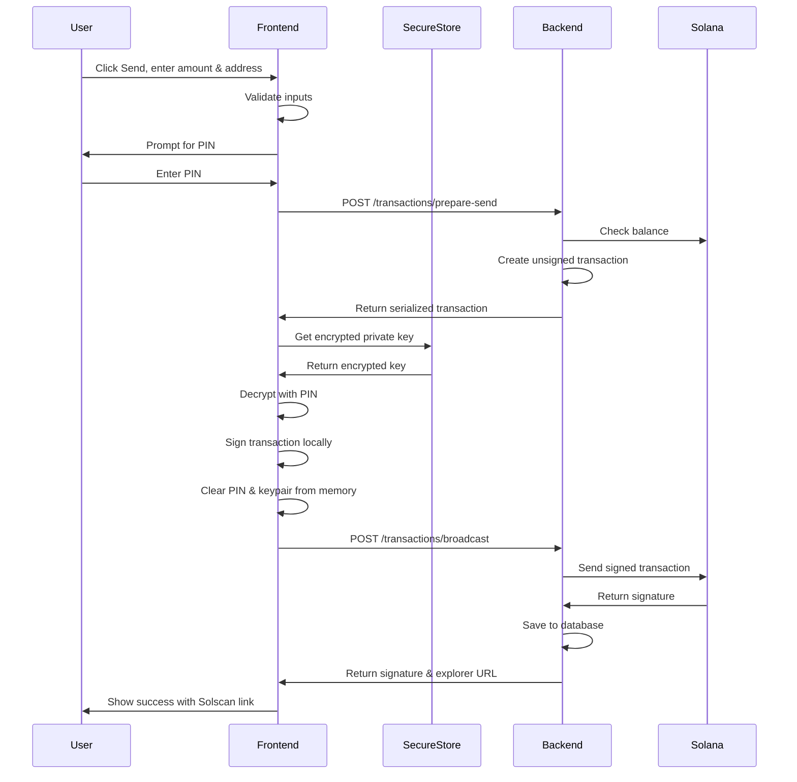
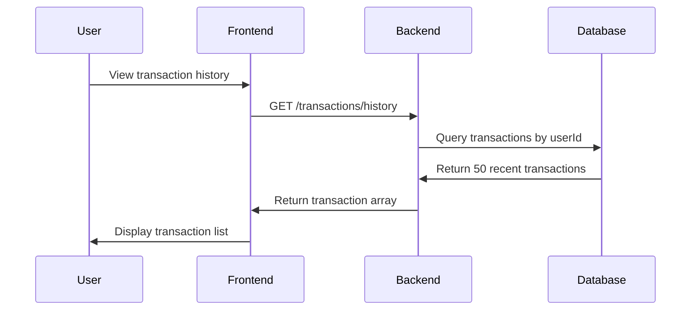

I have created the following plan after thorough exploration and analysis of the codebase. Follow the below plan verbatim. Trust the files and references. Do not re-verify what's written in the plan. Explore only when absolutely necessary. First implement all the proposed file changes and then I'll review all the changes together at the end.

## Observations

The codebase has a solid foundation with authentication, wallet management, and UI components already in place. The database schema includes User and Wallet models with a 1-to-1 relationship. The backend uses Express with Prisma ORM, Solana web3.js, and JWT authentication. The frontend is React Native/Expo with existing SendModal and ReceiveModal components that use dummy data. The modals are already wired to the home screen but need real transaction functionality. The wallet service handles client-side key generation and PIN-based encryption using XOR (noted as temporary).

## Approach

The implementation follows a secure client-side signing architecture where private keys never leave the device. The backend prepares unsigned transactions and validates balances, while the frontend decrypts the private key with the user's PIN, signs the transaction locally, and sends only the signed transaction back to the backend for broadcasting. This phase adds a Transaction model to track history, three new backend endpoints (/prepare-send, /broadcast, /history), and updates the wallet service with sendTransaction and fetchTransactionHistory functions. The existing modal components will be updated to use real data instead of dummy constants.

## Implementation Steps

### 1. Database Schema - Add Transaction Model

**File:** `file:soulwallet-backend/prisma/schema.prisma`

Add the Transaction model after the Wallet model:

```prisma
model Transaction {
  id            String   @id @default(cuid())
  userId        String
  signature     String   @unique
  type          String
  amount        Float
  token         String
  fromAddress   String
  toAddress     String
  fee           Float    @default(0.000005)
  status        String   @default("pending")
  createdAt     DateTime @default(now())

  user          User     @relation(fields: [userId], references: [id], onDelete: Cascade)

  @@index([userId, createdAt])
  @@index([signature])
  @@map("transactions")
}
```

Update the User model to include the transactions relation:

```prisma
model User {
  // ... existing fields ...
  wallet       Wallet?
  transactions Transaction[]
  // ... existing indexes ...
}
```

Run migration:
```bash
cd soulwallet-backend
npx prisma migrate dev --name add_transactions
```

### 2. Backend - Transaction Endpoints

**File:** `file:soulwallet-backend/src/server.ts`

Add validation schemas after existing schemas (around line 108):

```typescript
const prepareSendSchema = z.object({
  toAddress: z.string().regex(/^[1-9A-HJ-NP-Za-km-z]{32,44}$/, 'Invalid Solana address'),
  amount: z.number().positive('Amount must be greater than 0'),
  token: z.enum(['SOL', 'USDC']).default('SOL')
});

const broadcastSchema = z.object({
  signedTransaction: z.string().min(10, 'Invalid transaction'),
  txData: z.object({
    toAddress: z.string(),
    amount: z.number(),
    token: z.string()
  })
});
```

Add three new endpoints after the `/tokens/search` endpoint (around line 595):

**POST /transactions/prepare-send** - Creates unsigned transaction, validates balance, returns serialized transaction:
- Validate request with `prepareSendSchema`
- Fetch user's wallet from database
- Create PublicKey instances for sender and recipient
- Check balance using `connection.getBalance()` with 5000 lamports fee buffer
- Return error if insufficient balance
- Create Transaction with `SystemProgram.transfer()` for SOL
- Return placeholder error for SPL tokens (Phase 2.3)
- Get latest blockhash with `connection.getLatestBlockhash()`
- Serialize transaction without signatures using `transaction.serialize({ requireAllSignatures: false, verifySignatures: false })`
- Return base58-encoded transaction, blockhash, lastValidBlockHeight, and estimated fee

**POST /transactions/broadcast** - Receives signed transaction, broadcasts to Solana, saves to database:
- Validate request with `broadcastSchema`
- Decode base58 signed transaction using `bs58.decode()`
- Send raw transaction with `connection.sendRawTransaction()` using preflight checks
- Wait for confirmation with `connection.confirmTransaction()`
- Save transaction to database with status 'confirmed'
- Return signature and Solscan explorer URL
- On error, attempt to save failed transaction with status 'failed'

**GET /transactions/history** - Returns user's transaction history:
- Query transactions with `prisma.transaction.findMany()` filtered by userId
- Order by createdAt descending
- Limit to 50 most recent transactions
- Return array of transaction objects

### 3. Frontend - Wallet Service Updates

**File:** `file:services/wallet.ts`

Add imports at the top:
```typescript
import { Transaction, Keypair } from '@solana/web3.js';
import bs58 from 'bs58';
```

Add transaction interface:
```typescript
export interface TransactionRecord {
  id: string;
  signature: string;
  type: string;
  amount: number;
  token: string;
  fromAddress: string;
  toAddress: string;
  fee: number;
  status: string;
  createdAt: string;
}
```

Add `sendTransaction` function after `getKeypairForSigning`:
- Accept parameters: authToken, toAddress, amount, pin, token (default 'SOL')
- Call `/transactions/prepare-send` endpoint with toAddress, amount, token
- Handle insufficient balance error from backend
- Retrieve encrypted private key from SecureStore
- Decrypt using `simpleDecrypt()` with PIN
- Parse decrypted JSON to Uint8Array and create Keypair
- Deserialize transaction using `Transaction.from(bs58.decode())`
- Sign transaction with `transaction.sign(keypair)`
- Serialize signed transaction with `bs58.encode(transaction.serialize())`
- Clear keypair from memory (set to null)
- Call `/transactions/broadcast` with signed transaction and txData
- Return response with signature and explorer URL

Add `fetchTransactionHistory` function:
- Accept authToken parameter
- Call `/transactions/history` endpoint
- Return array of TransactionRecord objects

### 4. Frontend - Update SendModal Component

**File:** `file:components/SendModal.tsx`

Replace dummy data and functions (lines 23-62) with real implementations:

Remove DUMMY_PUBLIC_KEY and DUMMY_TOKENS constants.

Import required functions:
```typescript
import * as SecureStore from 'expo-secure-store';
import { sendTransaction } from '../services/wallet';
import { getLocalPublicKey, hasLocalWallet } from '../services/wallet';
```

Add props interface to accept holdings data:
```typescript
interface SendModalProps {
  visible: boolean;
  onClose: () => void;
  onSuccess?: () => void;
  holdings?: Array<{
    symbol: string;
    name: string;
    mint: string;
    decimals: number;
    balance: number;
    logo?: string;
  }>;
}
```

Replace static dummy functions with real state hooks:
- Use `useState` to load publicKey from SecureStore on mount
- Use `useState` to load available tokens from props.holdings
- Implement real `sendTransaction` function that prompts for PIN, calls wallet service, handles errors

Add PIN input modal before sending:
- Create state for PIN input modal visibility
- Show modal when user clicks Send button
- Validate PIN (minimum 4 digits)
- Pass PIN to sendTransaction function
- Clear PIN from state after use

Update handleSend function (line 153):
- Show PIN input modal instead of directly sending
- After PIN validation, call wallet service sendTransaction
- Handle success: show alert with signature, call onSuccess callback, close modal
- Handle errors: show specific error messages (insufficient balance, invalid PIN, network errors)

### 5. Frontend - Update ReceiveModal Component

**File:** `file:components/ReceiveModal.tsx`

Replace dummy data (line 19) with real wallet address:

Remove DUMMY_PUBLIC_KEY constant.

Import required functions:
```typescript
import * as SecureStore from 'expo-secure-store';
import { getLocalPublicKey } from '../services/wallet';
```

Add useEffect hook to load real public key:
```typescript
useEffect(() => {
  if (visible) {
    getLocalPublicKey().then(key => {
      if (key) setPublicKey(key);
    });
  }
}, [visible]);
```

Replace line 34 with state-based public key:
```typescript
const [publicKey, setPublicKey] = useState<string>('');
```

### 6. Frontend - Update Home Screen Integration

**File:** `file:app/(tabs)/index.tsx`

Update SendModal props (line 1352):
```typescript
<SendModal
  visible={showSendModal}
  onClose={() => setShowSendModal(false)}
  onSuccess={() => refetch()}
  holdings={holdings.map(h => ({
    symbol: h.symbol,
    name: h.name,
    mint: h.mint,
    decimals: h.decimals,
    balance: h.balance,
    logo: WELL_KNOWN_TOKEN_LOGOS[h.symbol]
  }))}
/>
```

No changes needed for ReceiveModal - it will automatically load the real public key.

### 7. Testing Checklist

**Devnet Testing (Recommended First):**
- Update `HELIUS_RPC_URL` environment variable to Helius devnet endpoint
- Use Solana devnet faucet (https://faucet.solana.com) to get test SOL
- Create test wallet in app
- Test sending small amounts to another devnet address

**Functionality Tests:**
- ✓ MAX button calculates balance minus fee (0.01 SOL buffer)
- ✓ Invalid Solana address shows validation error before signing
- ✓ Insufficient balance error appears before transaction preparation
- ✓ Wrong PIN shows decryption error
- ✓ Successful transaction shows Solscan link and signature
- ✓ Transaction appears in history endpoint
- ✓ Failed transactions are logged with 'failed' status
- ✓ Receive modal displays correct QR code and address
- ✓ Copy address button works in Receive modal

**Security Verification:**
- ✓ Private key never appears in console logs or network requests
- ✓ PIN is cleared from memory immediately after use
- ✓ Only signed transactions are sent to backend (never private keys)
- ✓ Backend validates all inputs and checks balances server-side
- ✓ Transaction signatures are unique and verified on-chain

### 8. Environment Configuration

No new environment variables required. Uses existing:
- `HELIUS_RPC_URL` - Solana RPC endpoint (mainnet or devnet)
- `DATABASE_URL` - PostgreSQL connection string
- `JWT_SECRET` - JWT signing secret

### 9. Deployment

**Backend (Railway):**
```bash
cd soulwallet-backend
npx prisma migrate deploy
npm run build
```

**Frontend:**
No build changes required - uses existing Expo build process.

### Architecture Diagram



### Transaction History Flow

