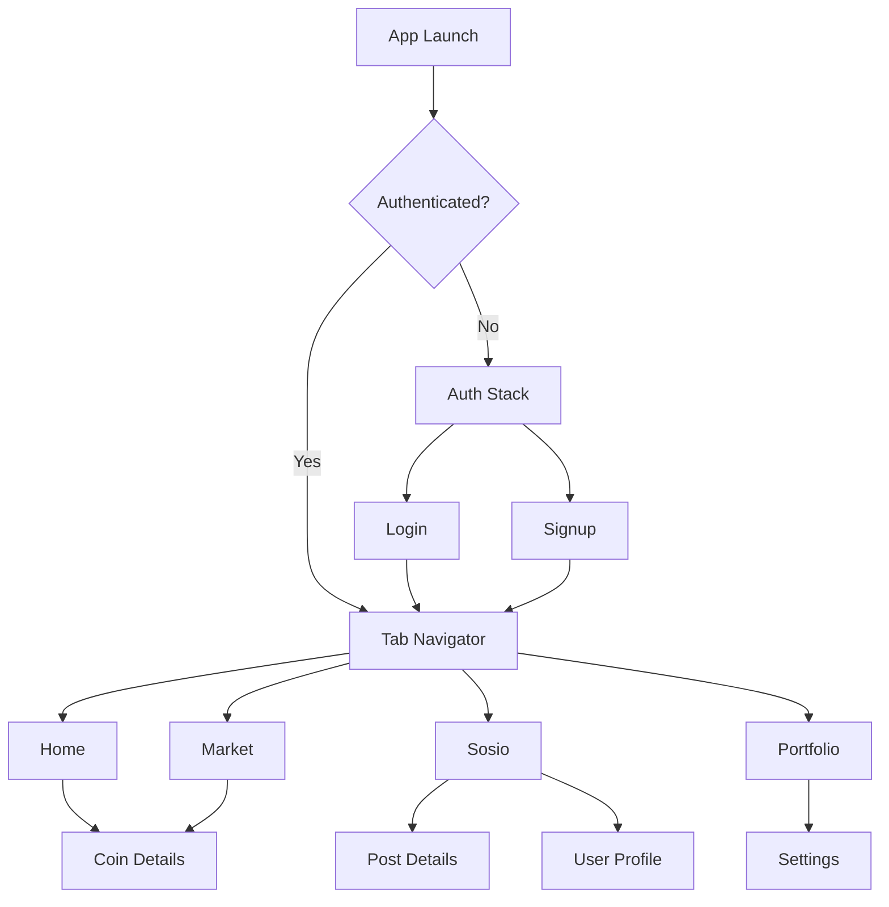
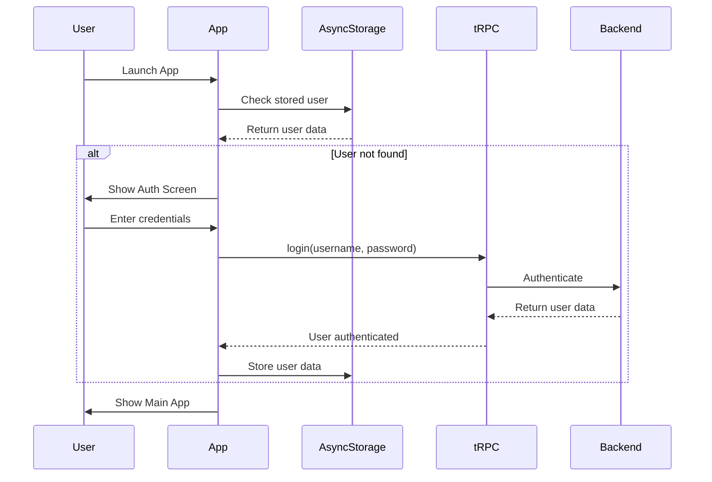

# SOULWALLET - Complete Project Architecture & Agent Guide

## Project Overview

SOULWALLET is a comprehensive React Native cryptocurrency trading application built with Expo Router, featuring social trading, copy trading, portfolio management, and real Solana blockchain integration. The app combines DeFi functionality with social media features in a cyberpunk-themed interface.

## 🏗️ Project Structure

```
SOULWALLET/
├── app/                           # Expo Router screens
│   ├── (auth)/                   # Authentication flow
│   ├── (tabs)/                   # Main tab navigation
│   ├── coin/                     # Dynamic coin details
│   ├── post/                     # Social post details
│   ├── profile/                  # User profiles
│   └── *.tsx                     # Root-level screens (empty)
├── components/                   # Reusable UI components
├── constants/                    # Theme and color definitions
├── hooks/                        # State management stores
├── lib/                          # External service configurations
├── packages/shared/              # Shared types and utilities
└── [config files]               # App configuration (empty)
```

## 🎨 Design System Architecture

### Color Scheme (`constants/colors.ts`)
```typescript
// Core Design Philosophy: Cyberpunk/Neon Aesthetic
COLORS = {
  background: "#0B0F1F",           // Dark space background
  cardBackground: "#131A35",       // Card containers
  textPrimary: "#FFFFFF",          // Primary text
  textSecondary: "#B0B7C3",        // Secondary text
  
  // Chain-Specific Branding
  solana: "#9945FF",               // Solana purple (primary brand)
  ethereum: "#F0F0F0",             // Ethereum white
  binance: "#F0B90B",              // Binance gold
  usdc: "#2775CA",                 // USDC blue
  wif: "#00FF7F",                  // WIF fluorescent green
  
  // Status Colors
  success: "#00FF7F",              // Fluorescent green
  error: "#FF3D71",                // Neon red
  warning: "#FFAA00",              // Amber
  
  // Gradient Systems
  gradientPurple: ["#9945FF", "#14F195"],  // Primary gradients
  gradientBlue: ["#2775CA", "#14F195"],    // Secondary gradients
  gradientPink: ["#FF3D71", "#9945FF"],    // Accent gradients
  gradientGold: ["#FFD700", "#FFA500"],    // Premium gradients
}
```

### Typography System (`constants/theme.ts`)
```typescript
// Font Hierarchy
FONTS = {
  // Primary Font System (Phantom-style)
  phantomBold: { fontFamily: "System", fontWeight: "700" },
  phantomSemiBold: { fontFamily: "System", fontWeight: "600" },
  phantomMedium: { fontFamily: "System", fontWeight: "500" },
  phantomRegular: { fontFamily: "System", fontWeight: "400" },
  
  // Monospace for Numbers/Addresses
  monospace: { fontFamily: "monospace", fontWeight: "400" },
  
  // Legacy Support (Orbitron/SF Pro)
  orbitronBold: { fontFamily: "System", fontWeight: "700" },
  sfProRegular: { fontFamily: "System", fontWeight: "400" },
}

// Spacing Scale
SPACING = {
  xs: 4, s: 8, m: 16, l: 24, xl: 32, xxl: 48
}

// Border Radius System
BORDER_RADIUS = {
  small: 8, medium: 12, large: 16, extraLarge: 24, full: 9999
}
```

## 🧩 Component Architecture

### Core UI Components

#### 1. **NeonCard** (`components/NeonCard.tsx`)
```typescript
// Base container with cyberpunk styling
interface NeonCardProps {
  color?: string[];              // Gradient border colors
  intensity?: 'low' | 'medium' | 'high';  // Glow intensity
  borderWidth?: number;          // Border thickness
}
// Usage: Wraps all content containers with neon glow effects
```

#### 2. **NeonButton** (`components/NeonButton.tsx`)
```typescript
// Primary action button with gradients
interface NeonButtonProps {
  variant?: 'primary' | 'secondary' | 'outline' | 'danger';
  size?: 'small' | 'medium' | 'large';
  icon?: React.ReactNode;
  loading?: boolean;
  fullWidth?: boolean;
}
// Usage: All CTAs, form submissions, navigation actions
```

#### 3. **NeonInput** (`components/NeonInput.tsx`)
```typescript
// Form input with focus glow effects
interface NeonInputProps {
  label: string;
  error?: string;
  leftIcon?: React.ReactNode;
  isPassword?: boolean;
}
// Usage: All form fields with validation states
```

#### 4. **GlowingText** (`components/GlowingText.tsx`)
```typescript
// Text with customizable glow effects
interface GlowingTextProps {
  text: string;
  color?: string;
  fontSize?: number;
  fontFamily?: 'orbitron' | 'system' | 'monospace';
  intensity?: 'low' | 'medium' | 'high';
}
// Usage: Headings, important labels, brand text
```

### Specialized Components

#### 5. **TokenCard** (`components/TokenCard.tsx`)
```typescript
// Cryptocurrency display card
interface TokenCardProps {
  symbol: string;              // Token symbol (SOL, ETH, etc.)
  name: string;               // Full token name
  price: number;              // Current price
  change: number;             // 24h change percentage
  liquidity?: number;         // Pool liquidity
  volume?: number;            // 24h trading volume
  age?: string;              // Time since launch
  logo?: string;             // Token logo URL
  onPress?: () => void;      // Navigation handler
}
// Usage: Market listings, portfolio holdings
```

#### 6. **TraderCard** (`components/TraderCard.tsx`)
```typescript
// Social trader profile display
interface TraderCardProps {
  username: string;           // Trader username
  profileImage?: string;      // Avatar URL
  roi: number;               // Return on investment %
  period?: string;           // Performance period
  isVerified?: boolean;      // Verification status
  onPress?: () => void;      // Profile navigation
  onCopyPress?: () => void;  // Copy trading setup
}
// Usage: Top traders lists, social feeds
```

#### 7. **SocialPost** (`components/SocialPost.tsx`)
```typescript
// Social media post component
interface SocialPostProps {
  id: string;
  username: string;
  profileImage?: string;
  content: string;
  images?: string[];
  comments: number;
  reposts: number;
  likes: number;
  timestamp: string;
  mentionedToken?: string;    // Token mentioned in post
  isVerified?: boolean;
  onBuyPress?: () => void;   // Quick buy action
  onUpdate?: () => void;     // Refresh callback
}
// Features:
// - Rich text parsing (hashtags, mentions, tokens)
// - tRPC integration for likes/reposts
// - Token navigation on mention click
// - "Ibuy" button for mentioned tokens
```

#### 8. **WalletCard** (`components/WalletCard.tsx`)
```typescript
// Portfolio balance display
interface WalletCardProps {
  balance: number;
  dailyPnl: number;
  currency?: string;
  pnlPeriod?: '1d' | '7d' | '30d' | '1y';
  onPeriodChange?: (period) => void;
  isMultiChain?: boolean;
}
// Features:
// - PnL period switching
// - Currency formatting
// - Percentage calculations
```

#### 9. **TabBar** (`components/TabBar.tsx`)
```typescript
// Custom tab navigation with animations
interface TabBarProps {
  state: any;
  descriptors: any;
  navigation: any;
}
// Features:
// - 360° spin animation on tab press
// - Gradient background
// - Active state indicators
```

## 🔄 State Management Architecture

### Authentication System (`hooks/auth-store.ts`)

```typescript
interface User {
  id: string;
  username: string;
  email: string;
  profileImage?: string;
  walletAddress?: string;
  isVerified: boolean;
  walletData?: {
    publicKey: string;
    privateKey: string;
    mnemonic: string;
  };
}

// Core Functions:
const useAuth = () => ({
  user: User | null,
  isLoading: boolean,
  error: string | null,
  login: (username: string, password: string) => Promise<boolean>,
  signup: (username: string, email: string, password: string) => Promise<boolean>,
  updateUser: (updates: Partial<User>) => Promise<void>,
  logout: () => Promise<void>,
  isAuthenticated: boolean,
});
```

**Connections:**
- Uses AsyncStorage for session persistence
- Integrates with tRPC for API authentication
- Connected to all protected screens and components
- Provides user context throughout the app

### Account Management (`hooks/account-store.ts`)

```typescript
interface UserProfile {
  id: string;
  username: string;
  email: string;
  firstName?: string;
  lastName?: string;
  phone?: string;
  dateOfBirth?: string;
  profileImage?: string;
  defaultCurrency?: string;
  language?: string;
  twoFactorEnabled?: boolean;
  walletAddress?: string;
}

interface SecuritySettings {
  twoFactorEnabled: boolean;
  lastPasswordChange: Date;
  loginAttempts: number;
  lockedUntil?: Date;
  recoveryEmail?: string;
  backupCodes?: string[];
}

// Core Functions:
const useAccount = () => ({
  profile: UserProfile | null,
  securitySettings: SecuritySettings | null,
  walletInfo: WalletInfo | null,
  updateProfile: (data: Partial<UserProfile>) => Promise<any>,
  updateSecurity: (data) => Promise<any>,
  resetPassword: (current: string, new: string) => Promise<any>,
  getWalletPrivateKey: (password: string) => Promise<any>,
  getWalletRecoveryPhrase: (password: string) => Promise<any>,
  generateBackupCodes: () => Promise<any>,
  uploadProfileImage: (image: string, type: string) => Promise<any>,
  deleteAccount: (password: string, confirm: string) => Promise<any>,
});
```

**Connections:**
- Deep tRPC integration with comprehensive mutations
- Connected to settings screens and profile management
- Integrates with wallet security features
- Provides account data to all user-facing components

### Wallet Management (`hooks/wallet-store.ts`)

```typescript
interface Token {
  id: string;
  symbol: string;
  name: string;
  price: number;
  change24h: number;
  balance: number;
  value: number;
  logo?: string;
}

interface CopiedWallet {
  id: string;
  username: string;
  walletAddress: string;
  roi: number;
  pnl: number;
}

// Core Functions:
const useWallet = () => ({
  tokens: Token[],
  copiedWallets: CopiedWallet[],
  totalBalance: number,
  dailyPnl: number,
  isLoading: boolean,
  refetch: () => Promise<any>,
});
```

**Mock Data Includes:**
- 11 realistic tokens (RNDR, SOL, PEPE, JUP, WIF, BONK, RAY, USDC, PYTH, ORCA, MNGO)
- Real token logos and market data
- Copy trading wallet tracking
- Portfolio calculations and PnL tracking

**Connections:**
- Uses React Query for caching and synchronization
- AsyncStorage for offline persistence
- Connected to portfolio screens and wallet displays
- Integrates with trading and balance components

### Solana Blockchain Integration (`hooks/solana-wallet-store.ts`)

```typescript
interface SolanaWalletState {
  wallet: Keypair | null;
  publicKey: string | null;
  balance: number;
  tokenBalances: TokenBalance[];
  isLoading: boolean;
  connection: Connection;
}

interface TokenBalance {
  mint: string;
  symbol: string;
  name: string;
  balance: number;
  decimals: number;
  logo?: string;
  uiAmount: number;
}

// Core Functions:
const useSolanaWallet = () => ({
  ...state,
  createWallet: () => Promise<Keypair>,
  importWallet: (privateKey: string) => Promise<Keypair>,
  refreshBalances: (wallet?: Keypair) => Promise<void>,
  sendSol: (toAddress: string, amount: number) => Promise<string>,
  sendToken: (to: string, amount: number, mint: string, decimals: number) => Promise<string>,
  getTokenInfo: (symbol: string) => TokenInfo | null,
  getAvailableTokens: () => TokenInfo[],
});
```

**Blockchain Features:**
- Real Solana mainnet connection
- Wallet creation with Keypair generation
- Private key import/export with bs58 encoding
- SOL and SPL token balance tracking
- Transaction signing and broadcasting
- Associated token account management
- Popular token mint address registry

**Security Measures:**
- Private keys stored in AsyncStorage with encryption
- Platform-specific SPL token loading
- Transaction confirmation waiting
- Error handling for network issues

**Connections:**
- Integrates with authentication system for wallet binding
- Connected to send/receive screens
- Provides real blockchain data to wallet displays
- Integrates with swap and trading functionality

### Market Data (`hooks/market-store.ts`)

```typescript
interface Token {
  id: string;
  symbol: string;
  name: string;
  price: number;
  change24h: number;
  liquidity?: number;
  volume?: number;
  age?: string;
  logo?: string;
}

type FilterType = 'volume' | 'liquidity' | 'change' | 'age' | 'verified';

// Core Functions:
const useMarket = () => ({
  tokens: Token[],
  isLoading: boolean,
  activeFilters: FilterType[],
  toggleFilter: (filter: FilterType) => void,
  searchQuery: string,
  setSearchQuery: (query: string) => void,
  refetch: () => Promise<void>,
});
```

**Mock Data:**
- SOL, WIF, JUP, BONK with realistic market metrics
- Liquidity, volume, and age data
- Price change percentages
- Logo URLs for major tokens

**Connections:**
- Connected to market screens and token listings
- Integrates with search and filtering functionality
- Provides data to TokenCard components
- Links to detailed coin pages

### Social Trading System (`hooks/social-store.ts`)

```typescript
interface TraderProfile {
  id: string;
  username: string;
  profileImage?: string;
  isVerified: boolean;
  badge?: 'elite' | 'general' | 'pro' | 'vip';
  followers: number;
  following: number;
  copyTraders: number;
  roi30d: number;
  vipFollowers: number;
  pnl24h: number;
  maxDrawdown: number;
  winRate: number;
  vipPrice?: number;
}

interface SocialPost {
  id: string;
  username: string;
  profileImage?: string;
  isVerified: boolean;
  content: string;
  timestamp: string;
  likes: number;
  comments: number;
  reposts: number;
  mentionedToken?: string;
  visibility?: 'public' | 'vip' | 'followers';
}

// Core Functions:
const useSocial = () => ({
  traders: TraderProfile[],
  posts: SocialPost[],
  getTraderProfile: (username: string) => TraderProfile | undefined,
  toggleFollow: (username: string) => void,
  isFollowing: (username: string) => boolean,
  followedUsers: string[],
});
```

**Mock Data:**
- 12 detailed trader profiles with realistic stats
- 30+ social posts with rich content and engagement
- Profile images from Unsplash
- Token mentions and trading signals
- VIP content and followers-only posts

**Connections:**
- Connected to social feeds and trader discovery
- Integrates with copy trading functionality
- Provides data to TraderCard and SocialPost components
- Links to profile pages and trader details

## 🚦 Navigation Architecture

### Route Structure (Expo Router)

```typescript
// App Router Structure
app/
├── (auth)/
│   ├── login.tsx           // Login form with social options
│   ├── signup.tsx          // Registration with validation
│   └── _layout.tsx         // Auth layout wrapper
├── (tabs)/
│   ├── index.tsx           // Home dashboard
│   ├── market.tsx          // Token market with filters
│   ├── sosio.tsx           // Social trading feed
│   ├── portfolio.tsx       // Portfolio management
│   └── _layout.tsx         // Tab navigation layout
├── coin/
│   └── [symbol].tsx        // Dynamic coin details
├── post/
│   └── [id].tsx           // Social post details
├── profile/
│   ├── self.tsx           // User's own profile
│   └── [username].tsx     // Public user profiles
└── [root screens]         // (Currently empty placeholders)
```

### Navigation Flow



### Tab Navigation (`app/(tabs)/_layout.tsx`)

```typescript
// Tab Configuration
<Tabs screenOptions={{
  headerShown: false,
  tabBarActiveTintColor: COLORS.solana,
  tabBarInactiveTintColor: COLORS.textSecondary,
  tabBarStyle: {
    backgroundColor: COLORS.cardBackground,
    borderTopColor: COLORS.solana + '30',
  },
}}>
  <Tabs.Screen name="index" options={{ title: 'Home', tabBarIcon: Home }} />
  <Tabs.Screen name="market" options={{ title: 'Market', tabBarIcon: BarChart3 }} />
  <Tabs.Screen name="sosio" options={{ title: 'Sosio', tabBarIcon: Users }} />
  <Tabs.Screen name="portfolio" options={{ title: 'Portfolio', tabBarIcon: Wallet }} />
</Tabs>
```

## 📱 Screen Architecture

### Home Screen (`app/(tabs)/index.tsx`)

**Main Features:**
```typescript
// Core State Management
const { user } = useAuth();
const { tokens, totalBalance, dailyPnl, isLoading, refetch } = useWallet();
const { wallet, publicKey, balance, tokenBalances, sendSol, sendToken } = useSolanaWallet();

// Tab System
type ActiveTab = 'coins' | 'traders' | 'copy';
const [activeTab, setActiveTab] = useState<'coins' | 'traders' | 'copy'>('coins');

// Modal Management
const [showCopyModal, setShowCopyModal] = useState(false);
const [showSendModal, setShowSendModal] = useState(false);
const [showReceiveModal, setShowReceiveModal] = useState(false);
const [showSwapModal, setShowSwapModal] = useState(false);
```

**Component Hierarchy:**
```
HomeScreen
├── Header (Profile + Actions)
├── WalletCard (Balance + PnL)
├── QuickActions (Send/Receive/Swap/Buy)
├── TabsContainer
│   ├── CoinsTab (TokenCard list with search/filter)
│   ├── TradersTab (TraderCard list with search/filter)
│   └── CopyTradeTab (Setup + Stats + Active trades)
└── Modals
    ├── CopyTradingModal (Setup parameters)
    ├── SendModal (Token selection + Amount)
    ├── ReceiveModal (QR + Address)
    └── SwapModal (Token pair selection)
```

**Key Connections:**
- **Authentication**: User profile display and wallet binding
- **Wallet Management**: Balance display and transaction history
- **Solana Integration**: Real SOL/token balances and sending
- **Market Data**: Top coins display with live prices
- **Social Data**: Top traders with copy trading options
- **Navigation**: Links to coin details, trader profiles, send/receive pages

### Market Screen (`app/(tabs)/market.tsx`)

**Features:**
```typescript
// Market Data Integration
const { tokens, isLoading, activeFilters, toggleFilter, searchQuery, setSearchQuery, refetch } = useMarket();

// Filter System
type MarketTab = 'soulmarket' | 'raydium' | 'pumpfun' | 'bullx' | 'dexscreener';
const [activeTab, setActiveTab] = useState<MarketTab>('soulmarket');

// Advanced Filtering
const [showAdvancedFilters, setShowAdvancedFilters] = useState(false);
// Supports: Liquidity, Market Cap, FDV, Pair, Age, Transactions, Buys, Sells, Volume
```

**Integration Points:**
- **Market Store**: Live token data and filtering
- **TokenCard**: Display with navigation to coin details
- **Search System**: Real-time filtering with debounce
- **External Platforms**: WebView integration for other DEXs
- **Navigation**: Links to detailed coin analysis pages

### Social Screen (`app/(tabs)/sosio.tsx`)

**Features:**
```typescript
// Social Data Integration
const { user } = useAuth();
const [activeFeed, setActiveFeed] = useState<'all' | 'following' | 'vip'>('all');

// tRPC Integration
const postsQuery = trpc.social.getPosts.useQuery({ feed: activeFeed, search: searchQuery });
const createPostMutation = trpc.social.createPost.useMutation();

// Post Creation
const [showNewPostModal, setShowNewPostModal] = useState(false);
const [mentionToken, setMentionToken] = useState(false);
const [postVisibility, setPostVisibility] = useState<'public' | 'vip' | 'followers'>('public');
```

**Component Flow:**
```
SosioScreen
├── Header (Profile + Settings)
├── SearchBar (Users/Posts/Coins/Hashtags)
├── FeedTabs (Feed/Following/Groups/VIP)
├── PostsList (SocialPost components)
├── FloatingActionButton (New Post)
└── NewPostModal
    ├── ContentInput
    ├── TokenMention (Optional)
    ├── VisibilitySelector
    └── PostActions (Photo + Submit)
```

**tRPC Connections:**
```typescript
// Real-time Social Features
trpc.social.getPosts.useQuery()      // Fetch posts by feed type
trpc.social.createPost.useMutation() // Create new posts
trpc.social.likePost.useMutation()   // Like/unlike posts  
trpc.social.repost.useMutation()     // Repost functionality
```

### Portfolio Screen (`app/(tabs)/portfolio.tsx`)

**Features:**
```typescript
// Multi-Store Integration
const { user, updateUser } = useAuth();
const { tokens, copiedWallets, totalBalance, dailyPnl, isLoading, refetch } = useWallet();

// Wallet Management
const [showWalletModal, setShowWalletModal] = useState(false);
const [walletStep, setWalletStep] = useState<'choose' | 'import' | 'create' | 'mnemonic'>('choose');

// Portfolio Analysis
const [activeTab, setActiveTab] = useState<'tokens' | 'copied'>('tokens');
const [chartPeriod, setChartPeriod] = useState<'24h' | '7d' | '30d' | 'all'>('24h');
```

**Wallet Creation Flow:**
```
WalletModal
├── ChooseStep
│   ├── ImportWallet (Mnemonic/Private Key)
│   └── CreateWallet (Generate New)
├── ImportStep
│   ├── MnemonicInput (12/24 words)
│   └── ValidationStep
├── CreateStep
│   ├── MnemonicDisplay (Hidden by default)
│   ├── SecurityWarning
│   └── ConfirmationCheckbox
└── CompletionStep
```

**Security Features:**
- Mnemonic phrase generation with 12-word BIP39
- Show/hide toggle for sensitive data
- Copy to clipboard with confirmation
- User confirmation checkbox for backup
- Secure storage in AsyncStorage

### Coin Details (`app/coin/[symbol].tsx`)

**Features:**
```typescript
// Dynamic Route Parameter
const { symbol } = useLocalSearchParams<{ symbol: string }>();

// Comprehensive Token Data
interface CoinData {
  symbol: string;
  name: string;
  price: number;
  change24h: number;
  marketCap: number;
  volume24h: number;
  liquidity: number;
  holders: number;
  contractAddress: string;
  verified: boolean;
  age: string;
  logo?: string;
  description?: string;
}

// Tab System
const [activeTab, setActiveTab] = useState<'chart' | 'trades' | 'holders'>('chart');
```

**Data Sources:**
- Mock data generation for development
- Real-time price and market data integration ready
- Transaction history with wallet addresses
- Top trader analysis for specific tokens
- Chart integration placeholder for TradingView

## 🔌 API Integration Architecture

### tRPC Configuration (`lib/trpc.ts`)

```typescript
// Type-Safe API Client
export const trpc = createTRPCReact<AppRouter>();

// Environment-Based Configuration
const getBaseUrl = () => {
  if (process.env.EXPO_PUBLIC_RORK_API_BASE_URL) {
    return process.env.EXPO_PUBLIC_RORK_API_BASE_URL;
  }
  throw new Error("No base url found, please set EXPO_PUBLIC_RORK_API_BASE_URL");
};

// Authenticated HTTP Client
export const trpcClient = trpc.createClient({
  links: [
    httpLink({
      url: `${getBaseUrl()}/api/trpc`,
      async headers() {
        const userId = await AsyncStorage.getItem('userId');
        return {
          authorization: 'Bearer mock-token',
          'x-user-id': userId || '',
        };
      },
    }),
  ],
});
```

**API Router Structure (Expected):**
```typescript
// Backend API Routes (Type Definitions)
interface AppRouter {
  auth: {
    login: (input: { username: string; password: string }) => Promise<User>;
    signup: (input: { username: string; email: string; password: string }) => Promise<User>;
  };
  social: {
    getPosts: (input: { feed: string; search?: string }) => Promise<SocialPost[]>;
    createPost: (input: { content: string; mentionedToken?: string; visibility: string }) => Promise<any>;
    likePost: (input: { postId: string }) => Promise<{ liked: boolean; count: number }>;
    repost: (input: { postId: string }) => Promise<{ reposted: boolean; count: number }>;
  };
  account: {
    getUserProfile: () => Promise<UserProfile>;
    updateUserProfile: (input: Partial<UserProfile>) => Promise<any>;
    getSecuritySettings: () => Promise<SecuritySettings>;
    updateSecuritySettings: (input: any) => Promise<any>;
    resetPassword: (input: { currentPassword: string; newPassword: string }) => Promise<any>;
    getWalletPrivateKey: (input: { password: string }) => Promise<any>;
    getWalletRecoveryPhrase: (input: { password: string }) => Promise<any>;
    generateBackupCodes: () => Promise<any>;
    uploadProfileImage: (input: { imageBase64: string; mimeType: string }) => Promise<any>;
    deleteAccount: (input: { password: string; confirmText: string }) => Promise<any>;
  };
}
```

### Data Types (`packages/shared/types.ts`)

**Comprehensive Type System:**
```typescript
// Token & Market Data
interface TokenItem {
  mint: string;
  symbol: string;
  name: string;
  balance: string;
  decimals: number;
  price_usd: number;
  price_change_24h: number;
  usd_value: number;
}

interface DashboardResponse {
  wallet: string;
  network: string;
  total_usd: number;
  daily_pnl: number;
  daily_pnl_percent: number;
  period: string;
  tokens: TokenItem[];
  quick_actions: string[];
  last_updated: string;
}

// Trading & Copy Trading
interface CopySetupPayload {
  targetWallet: string;
  managerWallet: string;
  totalAmountUsd: number;
  amountPerTradeUsd: number;
  stopLossPercent?: number;
  takeProfitPercent?: number;
  autoExecute?: boolean;
}

interface BuyOption {
  type: 'jupiter_route' | 'webview';
  routeId?: string;
  estimatedPriceImpact?: number;
  estimatedSlippage?: number;
  serializedTxBase64?: string | null;
  url?: string;
}

// Security & Compliance
interface RugCheckResult {
  mint: string;
  rugScore: number;
  safeToBuy: boolean;
  reasons: RugCheckReason[];
}
```

## 🔐 Security Architecture

### Authentication Flow


### Wallet Security
```typescript
// Private Key Management
const STORAGE_KEY = 'solana_wallet_private_key';

// Secure Key Storage
const createWallet = async () => {
  const wallet = Keypair.generate();
  const privateKeyString = bs58.encode(wallet.secretKey);
  await AsyncStorage.setItem(STORAGE_KEY, privateKeyString);
  return wallet;
};

// Key Import with Validation
const importWallet = async (privateKeyString: string) => {
  const privateKeyBytes = bs58.decode(privateKeyString);
  const wallet = Keypair.fromSecretKey(privateKeyBytes);
  await AsyncStorage.setItem(STORAGE_KEY, privateKeyString);
  return wallet;
};
```

### Data Persistence Strategy
```typescript
// AsyncStorage Usage Patterns
- 'user' → User profile and authentication state
- 'userId' → Current user identifier
- 'tokens' → Portfolio token holdings
- 'copiedWallets' → Copy trading configurations
- 'solana_wallet_private_key' → Encrypted wallet private key
```

## 🎯 Agent Development Guidelines

### 1. **Component Development**
```typescript
// Standard Component Pattern
import { COLORS } from '@/constants/colors';
import { FONTS, SPACING, BORDER_RADIUS } from '@/constants/theme';
import { NeonCard } from '@/components/NeonCard';

interface ComponentProps {
  // Define all props with proper types
}

export const Component: React.FC<ComponentProps> = ({ props }) => {
  // Use consistent styling patterns
  const styles = StyleSheet.create({
    container: {
      backgroundColor: COLORS.cardBackground,
      borderRadius: BORDER_RADIUS.medium,
      padding: SPACING.m,
    },
    text: {
      ...FONTS.phantomRegular,
      color: COLORS.textPrimary,
      fontSize: 16,
    },
  });
  
  return (
    <NeonCard>
      {/* Component content */}
    </NeonCard>
  );
};
```

### 2. **State Management Integration**
```typescript
// Hook Usage Pattern
const Component = () => {
  // Always destructure needed values
  const { user, isLoading, error } = useAuth();
  const { tokens, totalBalance } = useWallet();
  
  // Handle loading states
  if (isLoading) return <LoadingComponent />;
  if (error) return <ErrorComponent error={error} />;
  
  return <MainComponent />;
};
```

### 3. **Navigation Patterns**
```typescript
// Use Expo Router for navigation
import { useRouter } from 'expo-router';

const Component = () => {
  const router = useRouter();
  
  const handleNavigation = (id: string) => {
    router.push(`/coin/${id}`);                    // Dynamic routes
    router.push('/profile/self');                  // Static routes
    router.push(`/post/${postId}`);               // Parameterized routes
  };
};
```

### 4. **Error Handling**
```typescript
// Consistent Error Handling Pattern
const handleApiCall = async () => {
  try {
    setIsLoading(true);
    const result = await apiCall();
    setData(result);
  } catch (error) {
    console.error('Operation failed:', error);
    setError(error instanceof Error ? error.message : 'Unknown error');
  } finally {
    setIsLoading(false);
  }
};
```

### 5. **Performance Optimization**
```typescript
// Use React.memo for expensive components
export const ExpensiveComponent = React.memo<Props>(({ props }) => {
  return <Component />;
});

// Use useCallback for event handlers
const handlePress = useCallback(() => {
  // Handler logic
}, [dependencies]);

// Use useMemo for expensive calculations
const expensiveValue = useMemo(() => {
  return expensiveCalculation(data);
}, [data]);
```

## 🚀 Development Workflow

### 1. **Environment Setup**
```bash
# Install dependencies (using Bun)
bun install

# Start development server
bun run start

# Platform-specific development
bun run ios
bun run android
bun run web
```

### 2. **Configuration Files** (Need Setup)
```json
// package.json (Empty - needs setup)
{
  "name": "soulwallet",
  "version": "1.0.0",
  "scripts": {
    "start": "expo start",
    "ios": "expo run:ios",
    "android": "expo run:android",
    "web": "expo start --web"
  },
  "dependencies": {
    // React Native & Expo dependencies
    // tRPC & React Query
    // Solana Web3.js
    // UI & Animation libraries
  }
}

// app.json (Empty - needs setup)
{
  "expo": {
    "name": "SoulWallet",
    "slug": "soulwallet",
    "version": "1.0.0",
    "platforms": ["ios", "android", "web"],
    "icon": "./assets/icon.png",
    "splash": {
      "image": "./assets/splash.png",
      "backgroundColor": "#0B0F1F"
    }
  }
}

// .env.example (Empty - needs setup)
EXPO_PUBLIC_RORK_API_BASE_URL=https://api.soulwallet.com
EXPO_PUBLIC_SOLANA_RPC_URL=https://api.mainnet-beta.solana.com
```

### 3. **Testing Strategy**
```typescript
// Component Testing
import { render, screen } from '@testing-library/react-native';
import { TokenCard } from '@/components/TokenCard';

test('renders token information correctly', () => {
  render(<TokenCard symbol="SOL" name="Solana" price={150} change={5.2} />);
  expect(screen.getByText('SOL')).toBeTruthy();
  expect(screen.getByText('$150.00')).toBeTruthy();
});

// Hook Testing
import { renderHook } from '@testing-library/react-hooks';
import { useAuth } from '@/hooks/auth-store';

test('authentication flow', () => {
  const { result } = renderHook(() => useAuth());
  expect(result.current.isAuthenticated).toBe(false);
});
```

### 4. **Deployment Considerations**
```typescript
// Environment-specific configurations
const config = {
  development: {
    apiUrl: 'http://localhost:3000/api',
    solanaRpc: 'https://api.devnet.solana.com',
  },
  production: {
    apiUrl: 'https://api.soulwallet.com/api',
    solanaRpc: 'https://api.mainnet-beta.solana.com',
  },
};
```

## 📋 TODO & Improvement Areas

### Immediate Priorities
1. **Setup configuration files** (package.json, app.json, .env)
2. **Implement empty root screens** (account.tsx, settings.tsx, etc.)
3. **Complete tRPC backend integration**
4. **Add real market data APIs**
5. **Implement proper error boundaries**

### Advanced Features
1. **Real-time WebSocket integration** for live prices
2. **Push notifications** for price alerts and social interactions
3. **Chart integration** with TradingView or custom charts
4. **Advanced trading features** (limit orders, DCA, etc.)
5. **Multi-chain support** (Ethereum, BSC, etc.)

### Performance Optimizations
1. **Image caching and optimization**
2. **Lazy loading for long lists**
3. **Background refresh strategies**
4. **Offline mode capabilities**
5. **Memory management for large datasets**

## 🔍 Architecture Insights

### Strengths
- **Comprehensive type safety** throughout the application
- **Modular state management** with focused concerns
- **Real blockchain integration** with proper security
- **Consistent design system** with cyberpunk theming
- **Scalable component architecture**
- **Professional navigation structure**

### Areas for Enhancement
- **Error handling** could be more centralized
- **Loading states** need consistent patterns
- **Caching strategy** for offline functionality
- **Testing coverage** needs implementation
- **Configuration management** requires setup

This architecture provides a solid foundation for building a professional-grade cryptocurrency trading application with social features, real blockchain integration, and a modern React Native tech stack.