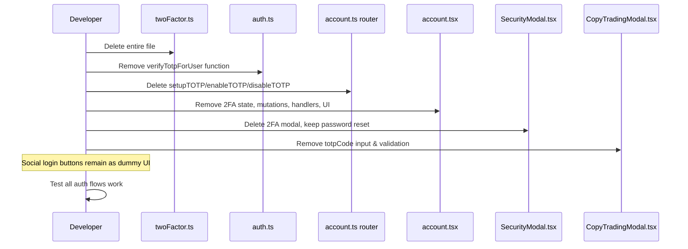

I have created the following plan after thorough exploration and analysis of the codebase. Follow the below plan verbatim. Trust the files and references. Do not re-verify what's written in the plan. Explore only when absolutely necessary. First implement all the proposed file changes and then I'll review all the changes together at the end.

## Observations

The codebase has a comprehensive 2FA/TOTP implementation spanning multiple layers: service layer (`twoFactor.ts`), middleware (`auth.ts` with `verifyTotpForUser`), backend endpoints (`setupTOTP`, `enableTOTP`, `disableTOTP`), and frontend UI (account settings with SecurityModal). Social login buttons (Google/Apple) exist in login/signup screens but only show "Coming Soon" alerts. Copy trading modal requires 2FA code input for security. The implementation is well-structured but adds complexity that needs removal per requirements.

## Approach

Remove all 2FA/TOTP functionality systematically from backend to frontend: delete the `twoFactor.ts` service, remove `verifyTotpForUser` from auth middleware, delete 2FA endpoints from account router, strip 2FA UI from account settings and SecurityModal, remove 2FA requirement from copy trading modal, and keep social login buttons as dummy UI only. This ensures clean removal without breaking authentication flows, maintaining only basic login/signup/password-reset functionality.

## Implementation Steps

### 1. Remove 2FA Service Layer
- Delete file:src/lib/services/twoFactor.ts entirely
- Remove all imports of `TwoFactorService` from other files

### 2. Clean Up Auth Middleware
In file:src/lib/middleware/auth.ts:
- Remove import of `TwoFactorService` (line 10)
- Delete the `verifyTotpForUser` function (lines 318-340)
- Remove any other 2FA-related helper functions

### 3. Remove 2FA Backend Endpoints
In file:src/server/routers/account.ts:
- Delete `setupTOTP` procedure (around line 689)
- Delete `enableTOTP` procedure (around line 755)
- Delete `disableTOTP` procedure (around line 822)
- Remove any imports related to `TwoFactorService`

### 4. Strip 2FA from Account Settings UI
In file:app/account.tsx:
- Remove 2FA state variables:
  - `twoFactorEnabled` (line 74)
  - `showTwoFactorModal`, `twoFactorStep`, `totpPassword`, `totpQrCode`, `totpBackupCodes`, `totpVerifyCode` (lines 97-106)
  - `showDisableTwoFactorModal`, `disableTotpPassword`, `disableTotpCode`, `isDisablingTwoFactor` (lines 107-110)
  - `isTwoFactorLoading` (line 111)
- Remove 2FA mutations:
  - `setupTOTPMutation` (line 92)
  - `enableTOTPMutation` (line 90)
  - `disableTOTPMutation` (line 91)
- Delete 2FA handlers:
  - `handleSetupTwoFactor` (lines 302-318)
  - `handleTwoFactorNext` (lines 409-459)
  - `handleTwoFactorBack` (lines 461-465)
  - `handleConfirmDisableTwoFactor` (lines 467-490)
- Remove 2FA toggle switch from security section (around lines 673-680)
- Remove 2FA-related useEffect logic (around lines 124, 237-243)
- Delete disable 2FA modal JSX (around lines 804-1017)

### 5. Clean Up SecurityModal Component
In file:components/account/SecurityModal.tsx:
- Remove all 2FA modal props from interface (lines 28-40)
- Delete entire 2FA modal JSX (lines 236-374)
- Keep only password reset modal functionality
- Update component to only handle password reset flow

### 6. Remove 2FA from Copy Trading Modal
In file:components/CopyTradingModal.tsx:
- Remove `totpCode` state (line 37)
- Delete 2FA code input section (lines 240-254)
- Remove `totpCode` from mutation call (line 85)
- Update button disabled condition to remove `totpCode.length !== 6` check (line 261)
- Remove `totpCode` from `resetForm` function (line 58)

### 7. Keep Social Login as Dummy UI
In file:app/(auth)/login.tsx and file:app/(auth)/signup.tsx:
- **Keep** the social login buttons UI (Google/Apple) as-is
- **Keep** the `handleSocialPress` function that shows "Coming Soon" alert
- No changes needed - already implemented as dummy UI

### 8. Update Database Schema (Optional)
In file:prisma/schema.prisma:
- Consider removing 2FA-related fields from `UserSettings` model if they exist
- This is optional and can be done later to avoid migration complexity

### 9. Clean Up Dependencies
In file:package.json:
- Remove `otplib` package (used for TOTP generation)
- Remove `qrcode` package (used for QR code generation)
- Run `npm install` or `yarn install` to update lockfile

### 10. Verification Steps
- Test login flow works without 2FA
- Test signup flow works without 2FA
- Test password reset flow works without 2FA
- Test copy trading modal works without 2FA requirement
- Verify social login buttons show "Coming Soon" alert
- Ensure no console errors related to missing 2FA functions

## Visual Flow

## Files to Modify

| File | Action |
|------|--------|
| file:src/lib/services/twoFactor.ts | **DELETE** entire file |
| file:src/lib/middleware/auth.ts | Remove `verifyTotpForUser` function and imports |
| file:src/server/routers/account.ts | Delete 3 TOTP endpoints |
| file:app/account.tsx | Remove all 2FA state, handlers, UI elements |
| file:components/account/SecurityModal.tsx | Delete 2FA modal, keep password reset |
| file:components/CopyTradingModal.tsx | Remove 2FA code input requirement |
| file:app/(auth)/login.tsx | **NO CHANGES** - keep dummy social buttons |
| file:app/(auth)/signup.tsx | **NO CHANGES** - keep dummy social buttons |
| file:package.json | Remove `otplib` and `qrcode` dependencies |