I have created the following plan after thorough exploration and analysis of the codebase. Follow the below plan verbatim. Trust the files and references. Do not re-verify what's written in the plan. Explore only when absolutely necessary. First implement all the proposed file changes and then I'll review all the changes together at the end.

## Observations

The codebase has accumulated significant complexity with multiple security layers, advanced features, and over-engineered components. Key observations:

- **Copy Trading**: Core functionality exists but has complex validation, 2FA requirements (already removed), and extensive monitoring
- **Token Display**: DexScreener integration is present but mixed with complex chart components and unused features
- **Market Tab**: WebView implementation is solid but has advanced filters and complex state management
- **Sosio**: Core social features work but include VIP, notifications, and groups (marked as coming soon)
- **Security Overkill**: Multiple layers including adaptive rate limiting, geo-blocking, security monitoring, KYC/GDPR, device tracking, and captcha
- **Portfolio**: Basic functionality exists but includes complex charting and snapshot services
- **Settings**: Wallet management is functional but mixed with device management and session tracking

## Approach

The simplification strategy focuses on **removing complexity while preserving core functionality**. The approach:

1. **Remove Security Overkill**: Strip out adaptive rate limiter, geo-blocking, security monitor, transaction security middleware - keep only basic rate limiting
2. **Simplify Copy Trading**: Remove complex validations, focus on speed by streamlining execution queue and profit sharing
3. **Clean Market/Sosio UI**: Remove advanced filters, VIP tabs, notification badges, groups - keep search and basic filtering
4. **Streamline Token Display**: Remove complex charts, keep DexScreener data loading simple
5. **Simplify Portfolio**: Remove complex charting, keep basic balance display
6. **Remove Unused Services**: Delete KYC, GDPR, captcha, device tracking, password strength meter
7. **Clean Tests**: Remove chaos tests, keep only essential integration tests

This maintains all working features the user mentioned while dramatically reducing code complexity and improving performance.

## Implementation Steps

### 1. Remove Security Overkill Services

**Files to Delete:**
- `file:src/lib/middleware/adaptiveRateLimiter.ts` - Complex attack detection, not needed
- `file:src/lib/middleware/geoBlock.ts` - Geographic blocking, unnecessary
- `file:src/lib/middleware/transactionSecurity.ts` - Over-engineered wrapper, use direct calls
- `file:src/lib/services/securityMonitor.ts` - Extensive monitoring, keep basic logging only
- `file:src/lib/services/kyc.ts` - KYC/AML not needed for current scope
- `file:src/lib/services/gdpr.ts` - GDPR export/deletion, remove for simplicity
- `file:src/lib/services/captcha.ts` - Captcha verification, not required
- `file:src/lib/services/device.ts` - Device fingerprinting, too complex

**Files to Update:**
- `file:src/server/routers/copyTrading.ts`:
  - Remove `adaptiveRateLimiter` imports and calls
  - Remove `geoBlockMiddleware` calls
  - Remove `transactionSecurityMiddleware` usage
  - Keep basic `applyRateLimit` from `rateLimit.ts`
  - Remove device/geo context from audit logs

- `file:src/services/copyTradingService.ts`:
  - Remove `securityMonitor` imports and event recording
  - Remove `transactionSecurityMiddleware` wrapper
  - Simplify validation to basic checks only
  - Focus on speed: direct execution without security layers

- `file:src/lib/services/executionQueue.ts`:
  - Remove `securityMonitor` event recording
  - Remove `transactionSecurityMiddleware` usage
  - Simplify error handling - log and continue
  - Remove DLQ complexity for failed trades (keep simple retry)

### 2. Simplify Copy Trading for Speed

**File: `file:src/services/copyTradingService.ts`**
- Remove complex budget validation (keep basic checks)
- Remove slippage cap enforcement (trust user input within reasonable bounds)
- Remove N+1 query optimization comments (already optimized)
- Simplify `executeCopyTrade` - remove security event recording
- Remove DLQ integration for failed trades

**File: `file:src/server/routers/copyTrading.ts`**
- Remove 2FA verification (already done in previous phase)
- Remove complex ownership procedures
- Simplify `startCopying` - remove device/geo tracking
- Remove `updateSettings` 2FA requirement
- Remove `stopCopying` 2FA requirement
- Remove `closePosition` 2FA requirement
- Keep basic validation only

**File: `file:src/lib/services/profitSharing.ts`**
- Keep core 5% profit sharing logic
- Remove security event recording
- Simplify error handling
- Remove complex verification steps
- Focus on speed: direct SOL transfer without extensive checks

**File: `file:src/lib/services/executionQueue.ts`**
- Remove security monitoring integration
- Simplify buy/sell order processing
- Remove transaction security middleware
- Keep MEV protection (Jito) as-is
- Remove DLQ complexity
- Focus on fast execution

### 3. Clean Market Tab UI

**File: `file:app/(tabs)/market.tsx`**
- Remove advanced filters modal (lines 592-816)
- Keep search bar and basic filter chips
- Remove filter state management complexity
- Simplify to: Search + SoulMarket tokens + External WebViews
- Remove unused filter options (liquidity, market cap, FDV, age, transactions, volume)

**File: `file:components/market/MarketFilters.tsx`**
- Simplify to basic tab selection only
- Remove filter chips (Market Cap, Volume, Price, Change)
- Remove timeframe selector
- Keep only platform tabs (All, Favorites, DeFi, Gaming, AI) if needed, or remove entirely

**File: `file:components/AdvancedFilters.tsx`**
- **Delete this file entirely** - not needed per user requirements

**File: `file:components/market/ExternalPlatformWebView.tsx`**
- Keep as-is - working well for in-app WebViews
- No wallet connection needed (per user requirements)
- Token detection and buy modal are good features

### 4. Simplify Token Display

**File: `file:app/coin/[symbol].tsx`**
- Remove complex chart rendering (lines 713-885)
- Keep: Token header, stats, sentiment, contract address
- Simplify to: DexScreener data + Buy/Sell buttons + "More Info" link
- Remove TradingView modal complexity
- Remove mock data generation
- Keep watchlist functionality (star icon)

**File: `file:components/TokenDetails.tsx`**
- Keep as-is - simple modal for token info
- Already clean and functional

**File: `file:components/TokenChart.tsx`**
- Simplify to placeholder or remove entirely
- Replace with "Chart coming soon" message
- Remove mock data generation

**File: `file:src/services/tokenMetadata.ts`**
- Keep as-is - simple Jupiter API integration
- Already optimized with caching

### 5. Clean Sosio Tab

**File: `file:app/(tabs)/sosio.tsx`**
- Remove VIP tab from feed selector (line 253-657)
- Remove Notifications tab
- Remove Groups tab (already marked "coming soon")
- Keep: For You, Following tabs only
- Remove notification badge component usage
- Simplify feed type to: `'all' | 'following'`
- Remove VIP-related state and queries
- Keep iBuy, copy trading, post creation as-is

**File: `file:components/NotificationBadge.tsx`**
- **Delete this file** - notifications tab removed

**File: `file:components/TokenBagModal.tsx`**
- Keep as-is - working well for iBuy token management
- Settings panel is useful (buy amount, slippage, input currency)
- Sell functionality with P&L calculation is good

**File: `file:src/server/routers/social.ts`**
- Remove VIP-related endpoints (`subscribeToVIP`, `getVIPStatus`)
- Remove notification endpoints (`getNotifications`)
- Keep: posts, comments, likes, follows, iBuy, sell
- Simplify user profile queries - remove VIP fields

### 6. Simplify Portfolio

**File: `file:app/(tabs)/portfolio.tsx`**
- Remove complex chart rendering
- Keep: Balance display, holdings list, copied wallets, watchlist
- Remove chart period selector
- Remove chart type selector
- Simplify to basic list views only

**File: `file:app/portfolio-tracking.tsx`**
- Simplify or remove entirely (seems like advanced feature)
- If kept, remove complex chart rendering
- Keep basic snapshot creation

**File: `file:components/portfolio/PortfolioCharts.tsx`**
- Simplify to placeholder or remove
- Replace with "Charts coming soon" message

**File: `file:src/services/portfolioSnapshotService.ts`**
- Keep basic snapshot creation
- Remove complex caching logic
- Simplify to: Create snapshot on demand, no automatic hourly snapshots

### 7. Remove Unused Components

**Files to Delete:**
- `file:components/PasswordStrengthMeter.tsx` - Not needed, basic password validation sufficient
- `file:__tests__/chaos/*` - All chaos tests, not needed
- `file:__tests__/security/*` - Security-specific tests, keep only basic auth tests
- `file:__tests__/services/adaptiveRateLimiter.test.ts`
- `file:__tests__/services/securityMonitor.test.ts`

### 8. Simplify Sentry Integration

**File: `file:lib/sentry.ts`**
- Keep basic crash reporting
- Remove complex filtering and breadcrumb logic
- Simplify to: Initialize, capture exceptions, capture messages
- Remove user context tracking (privacy concern)
- Keep minimal configuration

### 9. Update Router Imports

**Files to Update:**
- `file:src/server/routers/copyTrading.ts` - Remove security middleware imports
- `file:src/server/routers/social.ts` - Remove VIP/notification endpoints
- `file:src/server/routers/auth.ts` - Remove device tracking, captcha, geo-blocking
- `file:src/server/routers/account.ts` - Remove device management endpoints

### 10. Clean Up Dependencies

**File: `file:package.json`**
- Review and remove unused security packages
- Keep: Core functionality, TRPC, Prisma, Solana, Jupiter, React Native
- Remove: Captcha libraries, device fingerprinting, advanced security tools (if any)

### 11. Database Cleanup (Optional)

**Considerations:**
- Remove unused tables: `Device`, `KYCVerification`, `AMLAlert`, `DataExportRequest`, `DataDeletionRequest`, `ConsentLog`
- Keep: Core tables for users, posts, copy trading, positions, transactions
- This is optional - can leave tables in schema but not use them

### 12. Testing Strategy

**Keep:**
- Basic integration tests for copy trading
- Basic integration tests for social features
- Basic integration tests for wallet operations

**Remove:**
- Chaos tests (entire `__tests__/chaos` directory)
- Security-specific tests
- Property-based tests for security features
- Device tracking tests
- KYC/GDPR tests

### 13. Configuration Cleanup

**Files to Update:**
- `file:.env.example` - Remove security-related env vars (CAPTCHA, GEO_BLOCKING, ADAPTIVE_RATE_LIMITING, etc.)
- Keep: Core API keys (Jupiter, DexScreener, Birdeye), database URLs, basic rate limiting

## Visual Overview

```mermaid
graph TD
    A[Simplification Strategy] --> B[Remove Security Overkill]
    A --> C[Optimize Copy Trading]
    A --> D[Clean UI Components]
    A --> E[Remove Unused Services]
    
    B --> B1[Delete: adaptiveRateLimiter]
    B --> B2[Delete: geoBlock]
    B --> B3[Delete: securityMonitor]
    B --> B4[Delete: transactionSecurity]
    
    C --> C1[Remove 2FA checks]
    C --> C2[Simplify validation]
    C --> C3[Direct execution]
    C --> C4[Focus on speed]
    
    D --> D1[Market: Remove advanced filters]
    D --> D2[Sosio: Remove VIP/Notifications]
    D --> D3[Portfolio: Remove complex charts]
    D --> D4[Token: Simplify display]
    
    E --> E1[Delete: KYC/GDPR]
    E --> E2[Delete: Captcha]
    E --> E3[Delete: Device tracking]
    E --> E4[Delete: Password strength]
    
    style A fill:#9b59b6,stroke:#8e44ad,color:#fff
    style B fill:#e74c3c,stroke:#c0392b,color:#fff
    style C fill:#3498db,stroke:#2980b9,color:#fff
    style D fill:#2ecc71,stroke:#27ae60,color:#fff
    style E fill:#e67e22,stroke:#d35400,color:#fff
```

## Key Files Reference

**Delete Entirely:**
- `file:src/lib/middleware/adaptiveRateLimiter.ts`
- `file:src/lib/middleware/geoBlock.ts`
- `file:src/lib/middleware/transactionSecurity.ts`
- `file:src/lib/services/securityMonitor.ts`
- `file:src/lib/services/kyc.ts`
- `file:src/lib/services/gdpr.ts`
- `file:src/lib/services/captcha.ts`
- `file:src/lib/services/device.ts`
- `file:components/PasswordStrengthMeter.tsx`
- `file:components/AdvancedFilters.tsx`
- `file:components/NotificationBadge.tsx`
- All files in `file:__tests__/chaos/`

**Simplify Heavily:**
- `file:src/services/copyTradingService.ts` - Remove security layers
- `file:src/server/routers/copyTrading.ts` - Remove 2FA, security middleware
- `file:src/lib/services/profitSharing.ts` - Simplify to core logic
- `file:src/lib/services/executionQueue.ts` - Remove monitoring, focus on speed
- `file:app/(tabs)/market.tsx` - Remove advanced filters
- `file:app/(tabs)/sosio.tsx` - Remove VIP/Notifications tabs
- `file:app/coin/[symbol].tsx` - Simplify token display
- `file:app/(tabs)/portfolio.tsx` - Remove complex charts
- `file:lib/sentry.ts` - Keep minimal crash reporting

**Keep As-Is:**
- `file:components/market/ExternalPlatformWebView.tsx` - Working well
- `file:components/TokenBagModal.tsx` - iBuy functionality good
- `file:components/CopyTradingModal.tsx` - Core UI working
- `file:src/services/tokenMetadata.ts` - Simple and efficient