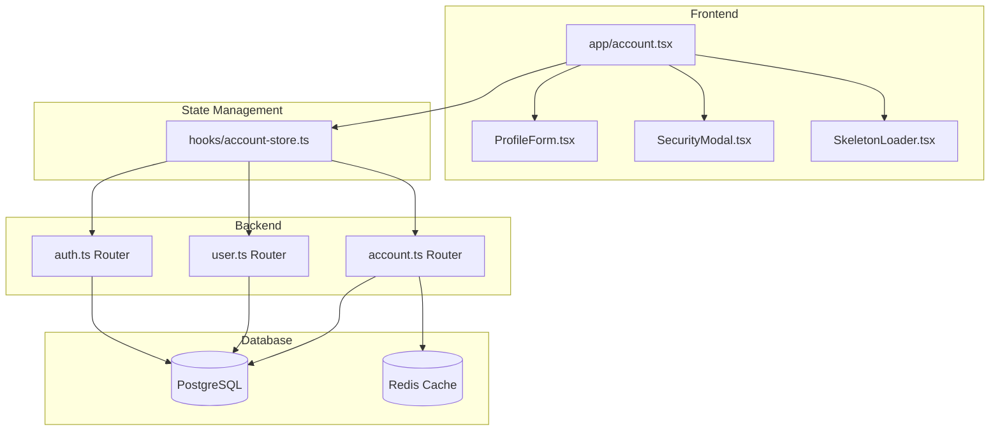

# Account Settings Architecture

This document describes the architecture, security considerations, and troubleshooting guide for the Account Settings feature.

## Overview

The Account Settings feature provides comprehensive profile management, security controls (2FA), device tracking, and GDPR compliance. It follows a **layered architecture** with clear separation between frontend, state management, and backend.

## Architecture Diagram



## Key Components

### Frontend (`app/account.tsx`)
- **Role**: Main screen component orchestrating account settings UI
- **Features**: Profile form, security toggles, session management, account deletion
- **Uses**: `useAccount` hook for state management, `ProfileForm` and `SecurityModal` extracted components

### ProfileForm (`components/account/ProfileForm.tsx`)
- **Role**: Extracted component for profile information editing
- **Features**: 
  - Skeleton loading states for smooth UX
  - Image picker with camera/library options
  - Input validation feedback

### SecurityModal (`components/account/SecurityModal.tsx`)
- **Role**: Handles password reset and 2FA setup flows
- **Features**:
  - Multi-step password reset (email OTP)
  - TOTP 2FA setup with QR code
  - Backup codes management
  - KeyboardAvoidingView for mobile

### account-store.ts (`hooks/account-store.ts`)
- **Role**: Centralized state management for account data
- **Features**:
  - **Optimistic updates** with error rollback
  - tRPC mutations for all account operations
  - Unified error handling

### account.ts Router (`src/server/routers/account.ts`)
- **Role**: Backend API for account operations
- **Endpoints**:
  - `getUserProfile` - Fetch user profile
  - `updateUserProfile` - Update with validation (phone/DOB)
  - `setupTOTP` / `enableTOTP` / `disableTOTP` - 2FA management
  - `uploadProfileImage` - Image upload (base64)
  - `deleteAccount` - Account deletion with verification

## Security Considerations

### 1. Password Verification
All sensitive operations require password verification:
- Private key access
- Recovery phrase access
- 2FA setup/disable
- Account deletion

### 2. Input Validation
Server-side validation using Zod schemas:
```typescript
phone: z.string().max(20).optional().refine((val) => {
  if (!val) return true;
  return validatePhoneNumber(val).isValid;
}, { message: 'Invalid phone number format' }),

dateOfBirth: z.string().optional().refine((val) => {
  return validateDateOfBirth(val).isValid;
}, { message: 'Invalid date of birth (must be 13+ years old)' }),
```

### 3. 2FA (TOTP)
- Uses `TwoFactorService` for TOTP generation/verification
- Secrets encrypted before storage
- Backup codes hashed with bcrypt
- 6-digit codes with time-based verification

### 4. Device Trust & Sessions
- Sessions tracked with IP and user agent
- Current session marked in UI
- Non-current sessions can be revoked
- Automatic session invalidation on account deletion

### 5. Image Upload Security
- Base64 validation before processing
- MIME type restricted to: JPEG, PNG, WebP, GIF
- Max size: 5MB (client-side compression to ~500KB)
- Images resized to 800x800px, 70% quality

## Data Flow

### Profile Update
```
1. User edits form → updateProfile()
2. Optimistic update to local state
3. tRPC mutation to server
4. Server validates input (phone/DOB)
5. Server updates database + invalidates Redis cache
6. On success: Server response updates local state
7. On error: Local state reverted to previous
```

### Image Upload
```
1. User picks image (camera/library)
2. Image compressed (800x800, 0.7 quality, JPEG)
3. Optimistic preview shown immediately
4. Base64 sent to server
5. Server validates and stores
6. Local state updated with server URL
```

## Troubleshooting

### Common Issues

| Issue | Cause | Solution |
|-------|-------|----------|
| Profile not loading | Network/auth issue | Check auth token, retry |
| Image upload fails | Size too large or invalid format | Ensure under 5MB, valid image type |
| 2FA QR not generated | Password incorrect | Re-enter password |
| Session revoke fails | Session already expired | Refresh session list |
| Validation errors | Invalid phone/DOB format | Phone: E.164 format (+1234...), DOB: YYYY-MM-DD, age 13+ |

### Error Messages

| Error | Meaning |
|-------|---------|
| "Invalid phone number format" | Phone doesn't match E.164 pattern |
| "Invalid date of birth (must be 13+ years old)" | DOB is future, non-ISO, or age < 13 |
| "Username already taken" | Another user has this username |
| "Current password is incorrect" | Wrong password for password reset |
| "Please type \"DELETE MY ACCOUNT\" to confirm" | Confirmation text doesn't match |

### Debugging

1. **Check Network Tab**: Verify tRPC requests/responses
2. **Check Redux/Zustand State**: Inspect `useAccount` state for loading/error
3. **Check Server Logs**: Look for validation errors in backend logs
4. **Check Redis Cache**: Ensure profile cache invalidated after updates

## Testing

### Unit Tests
```bash
npm run test -- --testNamePattern="account"
```

### Integration Tests
```bash
RUN_INTEGRATION_TESTS=true npm run test
```

### E2E Tests
```bash
npm run test:e2e -- --testNamePattern="Account"
```

## Performance

- Target load time: <500ms
- Target update latency: <1s
- Target image upload: <3s
- Skeleton loaders for perceived performance
- Optimistic updates for instant feedback
