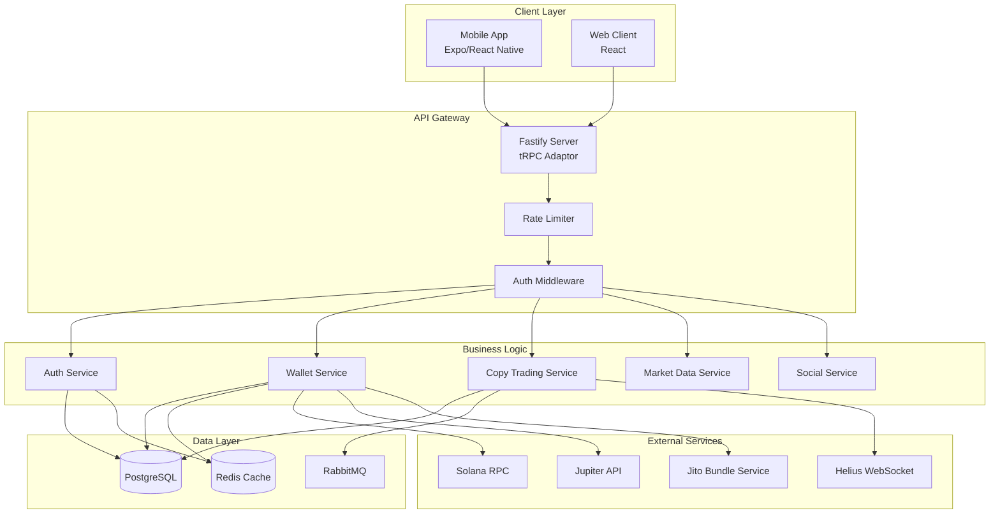
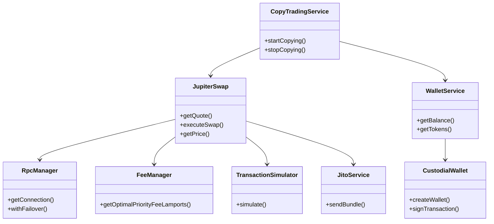
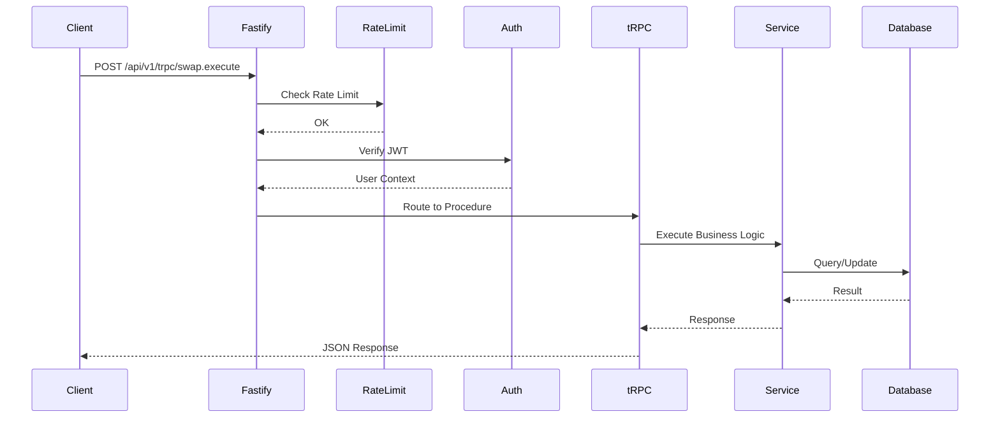
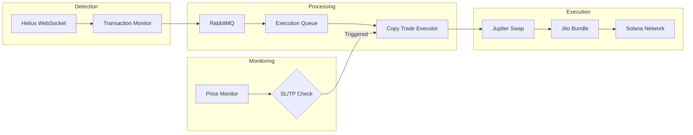

# SoulWallet Architecture

## System Overview



---

## Service Dependencies



---

## Dependency Injection Container

SoulWallet uses **tsyringe** for dependency injection, enabling testability and loose coupling.

### DI Architecture

```mermaid
graph TD
    subgraph DI Container
        Container[setupContainer]
    end
    
    subgraph Core Services - No Dependencies
        RpcManager[RpcManager]
        FeeManager[FeeManager]
        JitoService[JitoService]
        QueueManager[QueueManager]
    end
    
    subgraph Services with Dependencies
        TransactionSimulator[TransactionSimulator]
        JupiterSwap[JupiterSwap]
        CustodialWallet[CustodialWalletService]
        ProfitSharing[ProfitSharing]
    end
    
    subgraph Factories
        KeyManagementService[KeyManagementService]
    end
    
    Container -->|registerSingleton| RpcManager
    Container -->|registerSingleton| FeeManager
    Container -->|registerSingleton| JitoService
    Container -->|registerSingleton| QueueManager
    Container -->|registerSingleton| TransactionSimulator
    Container -->|registerSingleton| JupiterSwap
    Container -->|registerSingleton| CustodialWallet
    Container -->|registerSingleton| ProfitSharing
    Container -->|useFactory| KeyManagementService
    
    TransactionSimulator -->|@inject| RpcManager
    
    JupiterSwap -->|@inject| RpcManager
    JupiterSwap -->|@inject| FeeManager
    JupiterSwap -->|@inject| TransactionSimulator
    JupiterSwap -->|@inject| JitoService
    
    CustodialWallet -->|@inject| RpcManager
    CustodialWallet -->|@inject| KeyManagementService
    
    ProfitSharing -->|@inject| RpcManager
    ProfitSharing -->|@inject| JupiterSwap
    ProfitSharing -->|@inject| CustodialWallet
```

### Registered Services

| Token | Class | Dependencies |
|-------|-------|--------------|
| `RpcManager` | RpcManager | None |
| `FeeManager` | FeeManager | None |
| `QueueManager` | QueueManager | None |
| `JitoService` | JitoService | None |
| `TransactionSimulator` | TransactionSimulator | RpcManager |
| `JupiterSwap` | JupiterSwap | RpcManager, FeeManager, TransactionSimulator, JitoService |
| `CustodialWallet` | CustodialWalletService | RpcManager, KeyManagementService |
| `ProfitSharing` | ProfitSharing | RpcManager, JupiterSwap, CustodialWallet |
| `KeyManagementService` | (factory) | None |

### Usage

```typescript
// In services - constructor injection
@injectable()
export class JupiterSwap {
  constructor(
    @inject('RpcManager') private readonly rpcManager: RpcManager,
    @inject('FeeManager') private readonly feeManager: FeeManager,
  ) {}
}

// In routers - resolve from container
import { container } from '../lib/di/container';
const jupiterSwap = container.resolve<JupiterSwap>('JupiterSwap');
```

---

## Request Flow



---

## Data Flow: Copy Trading



---

## Key Components

| Component | Purpose | Location |
|-----------|---------|----------|
| **Fastify** | HTTP Server | `src/server/fastify.ts` |
| **tRPC** | Type-safe API | `src/server/trpc.ts` |
| **Prisma** | ORM/Database | `prisma/schema.prisma` |
| **Bull** | Job Queues | `src/lib/services/executionQueue.ts` |
| **Redis** | Cache/Sessions | `src/lib/redis.ts` |
| **RabbitMQ** | Pub/Sub | `src/lib/services/messageQueue.ts` |

---

## Routers (17 total)

| Router | Endpoints | Purpose |
|--------|-----------|---------|
| `auth` | login, signup, logout | Authentication |
| `wallet` | getBalance, send, receive | Wallet operations |
| `swap` | executeSwap, getQuote | Token swaps |
| `copyTrading` | start, stop, positions | Copy trading |
| `social` | posts, follows, likes | Social features |
| `webhook` | register, list, delete | Webhook integrations |

---

## Security Layers

1. **Rate Limiting** - Per-IP and per-user limits via Redis
2. **JWT Auth** - Access + refresh token rotation
3. **CSRF Protection** - Double-submit cookie pattern
4. **Input Validation** - Zod schemas on all tRPC procedures
5. **Encryption** - AES-256-GCM for sensitive data at rest
