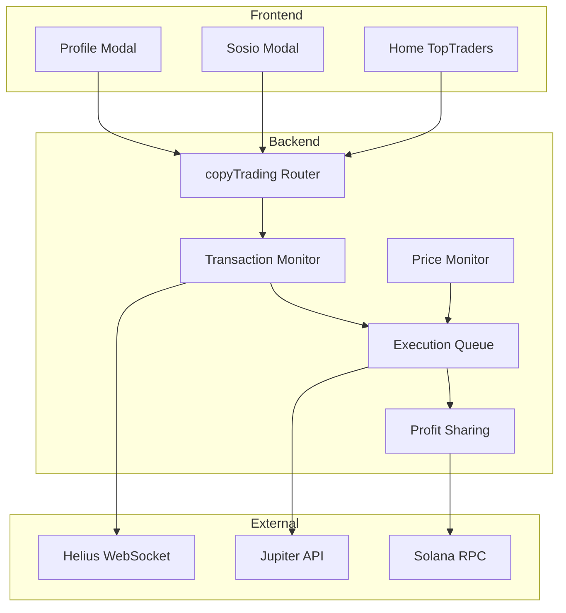

# Copy Trading System Documentation

> Last Updated: January 9, 2026

## Overview

SoulWallet's Copy Trading feature allows users to automatically replicate trades from successful traders on the Solana blockchain. When a trader you're copying executes a swap through Jupiter, the system instantly detects it and executes a proportional trade on your behalf.

## Architecture



## Core Components

### Transaction Monitor (`src/lib/services/transactionMonitor.ts`)

Monitors trader wallets via Helius WebSocket for real-time swap detection.

**Features:**
- WebSocket connection with exponential backoff (1s → 30s max)
- Heartbeat ping every 30s for stale connection detection
- Wallet refresh every 30s for fast new trader detection
- Jupiter swap detection and parsing

**Configuration:**
```typescript
// Environment variables
HELIUS_API_KEY=your_api_key
HELIUS_WS_URL=wss://mainnet.helius-rpc.com/?api-key=...
```

### Price Monitor (`src/lib/services/priceMonitor.ts`)

Monitors open positions for Stop Loss and Take Profit conditions.

**Features:**
- Price checks every 2 seconds (optimized from 5s)
- Position locking to prevent duplicate sells
- Auto-exit when trader exits (if enabled)
- P&L calculation with position locking

### Execution Queue (`src/lib/services/executionQueue.ts`)

Bull queue-based system for processing copy trades reliably.

**Queues:**
| Queue | Concurrency | Purpose |
|-------|-------------|---------|
| `copy-trades-buy` | 5 | Buy orders from trader detection |
| `copy-trades-sell` | 3 | SL/TP/exit sells |
| `transaction-processing` | 1 | Transaction parsing |
| `profit-sharing` | 1 | Fee distribution |

**Features:**
- 3 retry attempts with exponential backoff
- Dead Letter Queue (DLQ) for failed jobs
- Priority support for urgent orders

### Profit Sharing (`src/lib/services/profitSharing.ts`)

Handles the 5% profit sharing fee to traders.

**Features:**
- 5% fee on profitable positions
- Configurable minimum profit threshold (`minProfitForSharing`)
- USDC to SOL conversion via Jupiter
- Minimum fee threshold (0.001 SOL) to avoid excessive tx costs
- On-chain transaction verification

## API Reference

### `copyTrading.startCopying`

Start copying a trader.

**Input:**
```typescript
{
  walletAddress: string,       // Trader's Solana wallet
  totalBudget: number,         // Max USDC to allocate (1-1,000,000)
  amountPerTrade: number,      // USDC per copy trade (1-10,000)
  stopLoss?: number,           // Loss % to trigger sell (-100 to 0)
  takeProfit?: number,         // Profit % to trigger sell (0-1000)
  maxSlippage?: number,        // Max slippage % (0-5, default 0.5)
  exitWithTrader?: boolean,    // Auto-exit when trader exits
  minProfitForSharing?: number,// Min profit for 5% fee (0-1000)
  totpCode: string             // 2FA code (required)
}
```

**Returns:**
```typescript
{
  success: boolean,
  copyTradingId: string,
  trader: { walletAddress, username, ... }
}
```

### `copyTrading.stopCopying`

Stop copying a trader.

**Input:**
```typescript
{
  traderId: string,
  totpCode?: string
}
```

### `copyTrading.updateSettings`

Update copy trading settings.

**Input:**
```typescript
{
  copyTradingId: string,
  totalBudget?: number,
  amountPerTrade?: number,
  stopLoss?: number,
  takeProfit?: number,
  maxSlippage?: number,
  exitWithTrader?: boolean,
  minProfitForSharing?: number,
  totpCode?: string
}
```

### `copyTrading.getOpenPositions`

Get all open positions for a user.

**Returns:**
```typescript
{
  positions: Position[],
  summary: {
    totalValue: number,
    totalPnL: number,
    positionCount: number
  }
}
```

## Security

### 2FA Requirements

All financial operations require TOTP verification:
- `startCopying` - Always required
- `updateSettings` - Required for budget changes
- `stopCopying` - Recommended

### Rate Limiting

| Operation | Limit |
|-----------|-------|
| startCopying | 5/minute |
| updateSettings | 10/minute |
| getTopTraders | 30/minute |

### Custodial Wallet Security

- AES-256-GCM encryption for private keys
- KMS integration for key wrapping
- Per-wallet unique salt for PBKDF2

## Monitoring

### Prometheus Metrics

```typescript
// Copy trade execution latency
copy_trade_execution_latency_seconds{type="buy|sell", status="success|failed"}

// Copy trades total
copy_trades_total{type="buy|sell", status="success|failed"}

// Active copy trading positions
copy_trading_active_positions_total
```

### Logs

Key log events to monitor:
- `WebSocket connected to Helius`
- `Processing BUY order: User X, Token Y`
- `✅ BUY executed: Position ID, Tx X`
- `Fee too small, skipping transfer`
- `Profit X below user threshold Y, no fee charged`

## Troubleshooting

### WebSocket Disconnections

**Symptoms:** Trades not being detected

**Diagnosis:**
1. Check Helius API key validity
2. Monitor WebSocket connection logs
3. Verify wallet is in `monitored_wallets` table

**Fix:** System auto-reconnects with exponential backoff. If persistent, restart the service.

### Positions Not Closing

**Symptoms:** SL/TP not triggering

**Diagnosis:**
1. Check `slTpTriggeredAt` is null
2. Verify position status is OPEN
3. Check price monitor logs

**Fix:** Manually trigger via `sellPosition` API or check for stale position locks (>5 min).

### High Latency

**Symptoms:** >5 second delay from trader tx to copy

**Causes:**
1. WebSocket reconnection in progress
2. Queue backlog
3. Solana network congestion

**Diagnosis:**
1. Check `copy_trade_execution_latency_seconds` histogram
2. Monitor queue depth via `/queue/stats` endpoint
3. Check Helius connection status

## Configuration

### Environment Variables

```bash
# Required
HELIUS_API_KEY=your_helius_api_key
REDIS_URL=redis://localhost:6379

# Optional
HELIUS_WS_URL=custom_ws_url
JITO_ENABLED=true  # Enable MEV protection
```

### Database Schema

Key models:
- `CopyTrading` - User-trader relationships and settings
- `Position` - Individual trade positions
- `TraderProfile` - Trader stats and metadata
- `MonitoredWallet` - WebSocket-tracked wallets
- `DetectedTransaction` - Raw trader transactions

## Performance Targets

| Metric | Target | Current |
|--------|--------|---------|
| Trade detection latency | <2s | ~2-3s |
| Copy execution latency | <3s | ~2-5s |
| SL/TP trigger latency | <3s | ~2-4s |
| Concurrent copiers per trader | 1000+ | Tested 100 |
