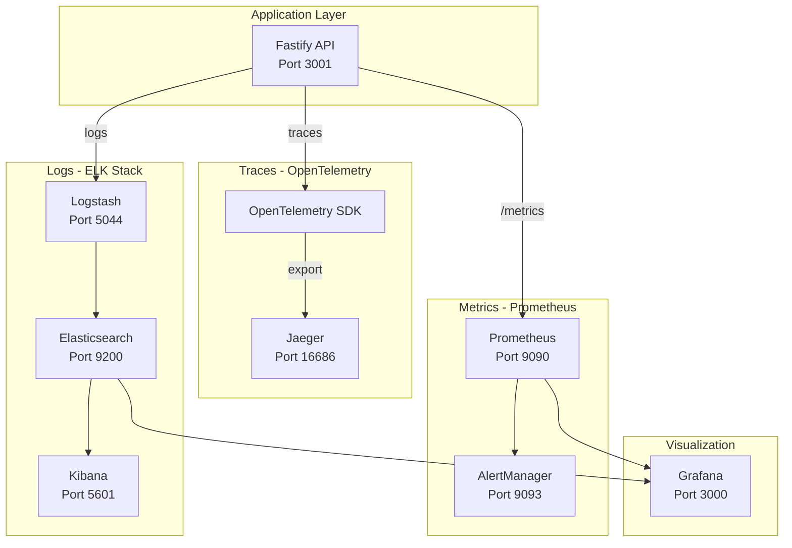

# SoulWallet Observability Guide

Complete observability stack for production monitoring following the three pillars: **Metrics**, **Traces**, and **Logs**.

## Architecture Overview



## Quick Start

### Start Observability Stack
```bash
# Production deployment with all services
docker-compose -f docker-compose.yml -f docker-compose.prod.yml up -d

# Verify all services are healthy
./scripts/verify-observability.sh
```

### Access UIs
| Service | URL | Credentials |
|---------|-----|-------------|
| Prometheus | http://localhost:9090 | N/A |
| Jaeger | http://localhost:16686 | N/A |
| Kibana | http://localhost:5601 | N/A |
| Grafana | http://localhost:3000 | admin/admin |
| AlertManager | http://localhost:9093 | N/A |

## Components

### 1. Prometheus Metrics

**Endpoint**: `GET /metrics`

Custom metrics exposed:
- `soulwallet_http_request_duration_seconds` - HTTP request latency histogram
- `soulwallet_redis_cache_hit_rate` - Redis cache hit ratio
- `soulwallet_prisma_pool_utilization_percent` - Database pool usage
- `soulwallet_up` - Application health status

**Files**:
- `prometheus.yml` - Scrape configuration
- `alerts.yml` - Alerting rules

### 2. OpenTelemetry Tracing

Auto-instrumented spans for:
- HTTP requests (Fastify)
- Redis operations (ioredis)
- Database queries (Prisma/pg)

**Configuration**:
```env
OTEL_TRACING_ENABLED=true
OTEL_SERVICE_NAME=soulwallet-api
OTEL_EXPORTER_JAEGER_ENDPOINT=http://jaeger:14268/api/traces
```

### 3. ELK Stack Logging

Logs flow: Pino → Logstash → Elasticsearch → Kibana

**Kibana Index Pattern**: `soulwallet-logs-*`

**Key Fields**:
- `log_level` - trace/debug/info/warn/error/fatal
- `request_id` - Unique request identifier
- `trace_id` - OpenTelemetry trace ID
- `user_id` - Authenticated user ID

### 4. Grafana Dashboards

Pre-configured dashboards:
- **API Performance** - Request rate, latency, error rate
- **Infrastructure** - Database pool, Redis cache, memory
- **Copy Trading** - Trading-specific metrics
- **Business** - Auth, user activity, API usage

## Alerting

### Alert Rules
| Alert | Severity | Condition |
|-------|----------|-----------|
| HighErrorRate | Critical | 5xx rate > 5% |
| HighLatency | Warning | P95 > 1s |
| APIDown | Critical | soulwallet_up == 0 |
| LowCacheHitRate | Warning | < 70% |
| HighDatabaseConnections | Warning | > 90% pool |

### Notification Channels
Configure in `alertmanager.yml`:
- Webhook → API `/api/alerts/prometheus`
- Email (SMTP)
- Slack

## Troubleshooting

### Metrics not appearing in Prometheus
1. Check targets: http://localhost:9090/targets
2. Verify API `/metrics` endpoint returns data
3. Check Prometheus logs: `docker logs soulwallet-prometheus`

### Traces missing in Jaeger
1. Verify `OTEL_TRACING_ENABLED=true`
2. Check Jaeger collector is receiving: `docker logs soulwallet-jaeger`
3. Make API requests and refresh Jaeger UI

### Logs not in Kibana
1. Check Logstash: `docker logs soulwallet-logstash`
2. Verify Elasticsearch index: `curl http://localhost:9200/_cat/indices`
3. Create index pattern in Kibana: `soulwallet-logs-*`

### Dashboards empty in Grafana
1. Check datasource connectivity: Grafana → Configuration → Data Sources
2. Verify Prometheus is scraping data
3. Check time range selector

## Environment Variables

```env
# OpenTelemetry
OTEL_TRACING_ENABLED=true
OTEL_SERVICE_NAME=soulwallet-api
OTEL_EXPORTER_JAEGER_ENDPOINT=http://jaeger:14268/api/traces
OTEL_DEBUG=false

# Prometheus Webhook Auth
PROMETHEUS_WEBHOOK_USER=prometheus
PROMETHEUS_WEBHOOK_PASSWORD=your-secure-password

# Grafana
GRAFANA_ADMIN_PASSWORD=your-secure-password
GRAFANA_ROOT_URL=https://grafana.yourdomain.com

# AlertManager Email
SMTP_HOST=smtp.gmail.com
SMTP_PORT=587
SMTP_USER=alerts@yourdomain.com
SMTP_PASSWORD=your-app-password
ALERT_EMAIL_FROM=alerts@soulwallet.com
ALERT_EMAIL_TO=oncall@soulwallet.com

# Slack
SLACK_WEBHOOK_URL=https://hooks.slack.com/services/...
```

## Production Recommendations

1. **Enable trace sampling** to reduce storage:
   ```env
   OTEL_TRACES_SAMPLER=parentbased_traceidratio
   OTEL_TRACES_SAMPLER_ARG=0.1  # 10% sampling
   ```

2. **Set log retention** in Elasticsearch ILM policy

3. **Use managed services** for cost optimization:
   - Grafana Cloud (free tier available)
   - Elastic Cloud
   - Datadog/New Relic

4. **Secure dashboards** with authentication in production
