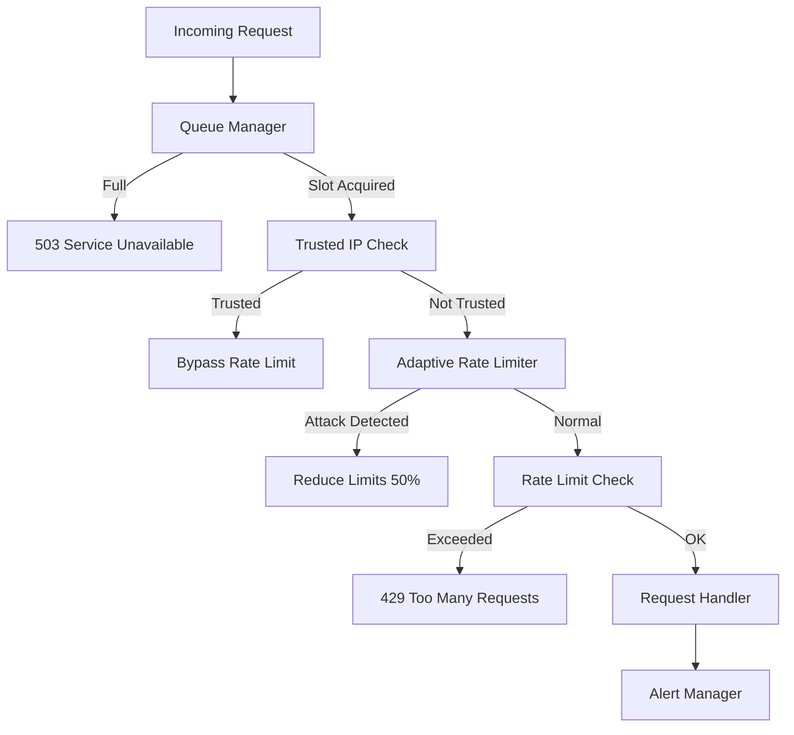

# Rate Limiting & DoS Protection

Production-grade rate limiting and DoS protection for SOULWALLET.

## Architecture Overview



## Configuration

### Environment Variables

```bash
# Request Queue Configuration
MAX_CONCURRENT_REQUESTS_PER_USER=50   # Max concurrent per user
MAX_CONCURRENT_REQUESTS_PER_IP=100    # Max concurrent per IP
MAX_QUEUE_DEPTH=1000                   # Global queue limit
QUEUE_TIMEOUT_MS=30000                 # Request timeout (30s)

# Adaptive Rate Limiting
ENABLE_ADAPTIVE_RATE_LIMITING=true
ATTACK_DETECTION_THRESHOLD=0.10       # 10% violation rate triggers attack mode
ATTACK_DETECTION_WINDOW_MINUTES=5
ADAPTATION_RESTORE_MINUTES=30         # Restore normal limits after 30 min

# Trusted IPs (bypass rate limits)
TRUSTED_IPS=127.0.0.1,::1,10.0.0.0/8
ENABLE_TRUSTED_IP_BYPASS=true

# Alerting
ENABLE_RATE_LIMIT_ALERTS=true
ALERT_EMAIL_RECIPIENTS=admin@example.com
ALERT_WEBHOOK_URL=https://hooks.slack.com/...
ALERT_THROTTLE_MINUTES=5
ALERT_MIN_SEVERITY=WARNING

# Database Connection Pool
DB_CONNECTION_LIMIT=20                # Production: 20, Dev: 10
DB_POOL_TIMEOUT=30
ENABLE_POOL_MONITORING=true
POOL_ALERT_THRESHOLD=0.9              # Alert at 90% utilization
```

## Rate Limit Endpoints

| Endpoint | Limit | Duration | Block |
|----------|-------|----------|-------|
| `login` | 3 | 1 hour | 30 min |
| `signup` | 2 | 1 hour | 2 hours |
| `passwordReset` | 2 | 1 hour | 2 hours |
| `transactionSend` | 20 | 1 hour | 30 min |
| `swapExecute` | 10 | 1 hour | 30 min |
| `admin` | 5 | 1 hour | 4 hours |
| `general` | 100 | 1 min | 1 min |

## Admin API

### tRPC Endpoints (require admin role)

```typescript
// Trusted IP Management
admin.addTrustedIp({ ip: "10.0.0.0/8", reason: "Internal network" })
admin.removeTrustedIp({ ip: "10.0.0.0/8" })
admin.listTrustedIps()
admin.testIpTrust({ ip: "10.1.2.3" })

// Rate Limit Control
admin.getAdaptiveRateLimitStatus()
admin.manualAdaptRateLimit({ endpoint: "login", factor: 0.5 })
admin.manualRestoreRateLimit({ endpoint: "login" })

// Monitoring
admin.getQueueStatus()
admin.getAlertStatus()
```

### REST Endpoints

| Endpoint | Method | Description |
|----------|--------|-------------|
| `/health/database/pool` | GET | Connection pool metrics |
| `/api/admin/rate-limits` | GET | Rate limit status |
| `/api/admin/rate-limits/adaptive` | GET | Adaptive rate limit dashboard |

## Attack Response Runbook

### Symptoms
- High `429 Too Many Requests` errors
- Adaptive rate limiting activated
- Alert notifications received

### Verification
```bash
# Check rate limit dashboard
curl -H "Authorization: Bearer $TOKEN" \
  https://api.example.com/api/admin/rate-limits/adaptive
```

### Response Actions

1. **Monitor**: Check dashboard for attack patterns
2. **Escalate**: Manually tighten limits if needed
   ```typescript
   admin.manualAdaptRateLimit({ endpoint: "login", factor: 0.25 })
   ```
3. **Block**: Add malicious IPs to blocklist
4. **Restore**: After attack subsides (auto-restores after 30 min)

### Disable Adaptive Rate Limiting (Emergency)

```bash
# Set in environment
ENABLE_ADAPTIVE_RATE_LIMITING=false
# Restart backend service
```

## Monitoring Metrics

| Metric | Warning | Critical |
|--------|---------|----------|
| Queue Depth | >700 (70%) | >900 (90%) |
| Violation Rate | >5% | >10% |
| Pool Utilization | >70% | >90% |
| Redis Latency | >100ms | >500ms |

## Integration

### Adding Rate Limits to New Endpoints

```typescript
// 1. Add config in rateLimit.ts
export const RATE_LIMIT_CONFIGS = {
  myNewEndpoint: {
    points: 10,
    duration: 3600,
    blockDuration: 1800,
    keyPrefix: 'my_new_endpoint',
  },
  // ...
};

// 2. Apply in tRPC router
myProcedure
  .input(...)
  .mutation(async ({ ctx }) => {
    await applyRateLimit('myNewEndpoint', {
      ip: ctx.ip,
      userId: ctx.user?.id,
    });
    // ...
  });
```

### Adding Trusted IPs

Via tRPC (recommended):
```typescript
await trpc.admin.addTrustedIp.mutate({
  ip: "192.168.1.0/24",
  reason: "Office network"
});
```

Via environment (for initial setup):
```bash
TRUSTED_IPS=127.0.0.1,::1,192.168.1.0/24
```
