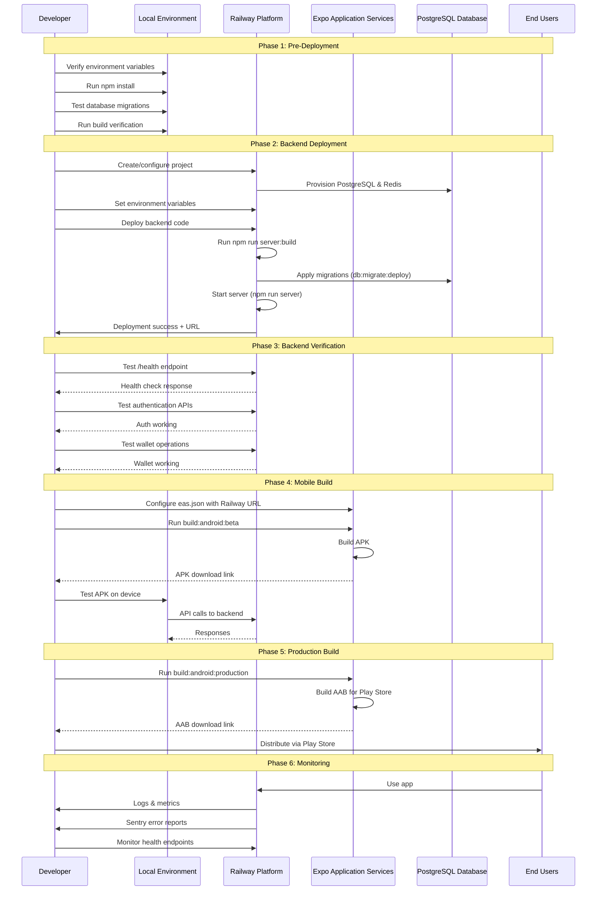

I have created the following plan after thorough exploration and analysis of the codebase. Follow the below plan verbatim. Trust the files and references. Do not re-verify what's written in the plan. Explore only when absolutely necessary. First implement all the proposed file changes and then I'll review all the changes together at the end.

## Observations

The codebase is in excellent condition with **zero TypeScript errors and zero warnings** across both frontend and backend. The project has comprehensive environment validation, proper build configurations for EAS, and well-structured backend services. All console statements are appropriately used in development/test contexts or proper logging frameworks. The Android build configuration is standard and correct, with Hermes engine enabled for optimal performance.

## Approach

The finalization strategy focuses on systematic verification rather than code changes. We'll validate the build pipeline for EAS (Expo Application Services), ensure Railway deployment readiness through environment configuration checks, and establish post-deployment monitoring. The approach prioritizes zero-downtime deployment with comprehensive health checks at each stage, leveraging the existing robust validation infrastructure already built into the application.

## Implementation Steps

### Phase 1: Pre-Deployment Verification

#### 1.1 Environment Configuration Audit
- Review `file:.env.example` and create production `.env` file with all required variables
- **Critical variables for Railway:**
  - `DATABASE_URL` - PostgreSQL connection string from Railway
  - `REDIS_URL` - Redis connection string from Railway
  - `JWT_SECRET` - Generate using: `openssl rand -base64 32`
  - `JWT_REFRESH_SECRET` - Generate using: `openssl rand -base64 32`
  - `WALLET_ENCRYPTION_KEY` - Generate using: `openssl rand -base64 32`
  - `ADMIN_KEY` - Generate secure admin key (32+ characters)
  - `KMS_PROVIDER` - Set to `env` with `ALLOW_ENV_KMS_IN_PROD=true` for beta testing
  - `NODE_ENV` - Set to `production`
  - `ALLOWED_ORIGINS` - Set to your frontend URL
  - `EMAIL_PROVIDER` - Configure email service (smtp/sendgrid/resend)
- **Critical variables for EAS build:**
  - Already configured in `file:eas.json` under `build.production.env`
  - `EXPO_PUBLIC_API_URL` - Points to Railway backend URL
  - `EXPO_PUBLIC_SOLANA_RPC_URL` - Solana RPC endpoint
  - Verify these match your Railway deployment URL

#### 1.2 Dependency Verification
- Run `npm install` to ensure all dependencies are installed
- Check for any peer dependency warnings
- Verify `file:package.json` has no conflicting versions
- Run `npm audit` to check for security vulnerabilities
- Address any high/critical vulnerabilities before deployment

#### 1.3 Database Migration Preparation
- Verify `file:prisma/schema.prisma` is production-ready
- Test migration on local PostgreSQL instance first
- Prepare rollback strategy for migrations
- Document any manual data migration steps needed

### Phase 2: Backend Build Verification (Railway)

#### 2.1 Local Build Test
- Run `npm run server:build` to compile TypeScript backend
- Verify no compilation errors in `dist/` output
- Check that all path aliases resolve correctly (uses `tsc-alias`)
- Verify `file:tsconfig.server.json` configuration is correct

#### 2.2 Database Connection Test
- Run `file:scripts/test-database-connection.ts` to verify PostgreSQL connectivity
- Test with Railway's PostgreSQL connection string
- Verify connection pooling settings in `file:.env.example` (lines 187-193)
- Ensure `DB_CONNECTION_LIMIT` is appropriate for Railway's plan

#### 2.3 Health Endpoint Verification
- Run `file:scripts/test-health-endpoints.ts` to verify all health checks
- Test endpoints defined in `file:src/server/fastify.ts`:
  - `/health` - Basic health check
  - `/health/db` - Database connectivity
  - `/health/redis` - Redis connectivity
  - `/health/solana` - Solana RPC connectivity
  - `/health/detailed` - Comprehensive system status
- Ensure all critical services respond correctly

#### 2.4 Environment Validation Test
- The backend has built-in validation in `file:src/server/index.ts` (lines 149-622)
- Test locally with production-like environment variables
- Verify all security checks pass:
  - JWT secret strength validation
  - KMS provider configuration
  - Redis connectivity
  - Solana RPC validation
  - Email provider configuration
- Address any warnings before deployment

### Phase 3: Railway Deployment

#### 3.1 Railway Project Setup
- Create new Railway project or use existing
- Add PostgreSQL database service
- Add Redis service
- Configure environment variables from Phase 1.1
- Set build command: `npm run server:build`
- Set start command: `npm run server`
- Configure health check endpoint: `/health`

#### 3.2 Database Migration on Railway
- Connect to Railway PostgreSQL instance
- Run `npm run db:migrate:deploy` to apply migrations
- Verify all tables created correctly using `npm run db:studio`
- Run seed scripts if needed (optional for production):
  - `file:prisma/seed-traders.ts` - Featured traders
  - `file:prisma/seed-social.ts` - Social data (dev only)

#### 3.3 Deployment Verification
- Monitor Railway deployment logs for startup messages
- Verify environment validation passes (check for ✅ symbols in logs)
- Confirm services initialize:
  - Database connection
  - Redis connection
  - Rate limiting initialization
  - Cleanup service started
  - Transaction monitor started (if enabled)
  - Copy trading services (if enabled)
- Test health endpoints via Railway public URL
- Verify tRPC endpoints respond correctly

#### 3.4 Post-Deployment Smoke Tests
- Test authentication endpoints:
  - Signup new user
  - Login with credentials
  - Verify JWT token generation
  - Test session management
- Test wallet operations:
  - Create new wallet
  - Fetch SOL balance
  - Query token holdings
- Test market data endpoints:
  - Fetch trending tokens
  - Search tokens
  - Get token details
- Monitor error rates in Railway logs

### Phase 4: Mobile App Build (EAS)

#### 4.1 Pre-Build Checks
- Verify `file:eas.json` configuration:
  - Node version: 22.11.0
  - Build type: `app-bundle` for production
  - Environment variables point to Railway backend
- Update `file:app.json`:
  - Increment `versionCode` (currently 2)
  - Update `version` if needed (currently 1.0.0)
- Verify Android signing credentials are configured in EAS

#### 4.2 Beta APK Build (Testing)
- Run `npm run build:android:beta` to create beta APK
- This uses `beta-apk` profile from `file:eas.json`
- Build type: APK for easy distribution
- Monitor build progress on expo.dev
- Download APK when build completes
- Test on physical Android device:
  - Install APK
  - Test authentication flow
  - Test wallet creation/import
  - Test basic transactions
  - Verify API connectivity to Railway backend

#### 4.3 Production Build (Play Store)
- Run `npm run build:android:production` for Play Store submission
- This uses `production` profile from `file:eas.json`
- Build type: AAB (Android App Bundle)
- Auto-increment version enabled
- Monitor build on expo.dev
- Download AAB when complete
- Verify build artifacts are signed correctly

#### 4.4 Build Verification
- Test production build on multiple devices if possible
- Verify all features work with production backend
- Check for any runtime errors in Sentry (if configured)
- Test offline behavior and error handling
- Verify proper error messages for network issues

### Phase 5: Post-Deployment Monitoring

#### 5.1 Backend Monitoring Setup
- Configure Sentry DSN in Railway environment variables
- Monitor `file:src/server/fastify.ts` metrics endpoints:
  - `/metrics` - Prometheus metrics
  - `/api/alerts/prometheus` - Alert configuration
- Set up Railway monitoring:
  - CPU usage alerts
  - Memory usage alerts
  - Database connection pool monitoring
  - Response time tracking
- Monitor logs for errors and warnings

#### 5.2 Database Performance Monitoring
- Monitor connection pool usage (configured in `file:.env.example` lines 187-193)
- Watch for slow queries
- Monitor database size growth
- Set up automated backups in Railway
- Verify PITR (Point-in-Time Recovery) if configured

#### 5.3 Application Health Monitoring
- Set up automated health check pings to `/health` endpoint
- Monitor critical services:
  - Database connectivity
  - Redis availability
  - Solana RPC responsiveness
  - Transaction processing queue
- Configure alerts for service degradation
- Monitor rate limiting metrics

#### 5.4 Mobile App Monitoring
- Configure Sentry for React Native (already integrated)
- Monitor crash reports
- Track API error rates
- Monitor user authentication success rates
- Track transaction success/failure rates
- Monitor app performance metrics

### Phase 6: Rollback Preparation

#### 6.1 Backend Rollback Strategy
- Document current Railway deployment version
- Keep previous deployment available for quick rollback
- Prepare database migration rollback scripts if needed
- Document environment variable changes
- Test rollback procedure in staging if available

#### 6.2 Mobile App Rollback Strategy
- Keep previous APK/AAB versions archived
- Document version numbers and build IDs
- Prepare communication plan for users if rollback needed
- Consider phased rollout on Play Store (gradual percentage)

### Phase 7: Final Verification Checklist

#### 7.1 Backend Verification
- [ ] All environment variables configured correctly
- [ ] Database migrations applied successfully
- [ ] Redis connection working
- [ ] Solana RPC connectivity verified
- [ ] Health endpoints responding correctly
- [ ] Authentication flow working
- [ ] Wallet operations functional
- [ ] Copy trading services running (if enabled)
- [ ] Transaction monitoring active
- [ ] Rate limiting configured
- [ ] CORS configured for mobile app
- [ ] Sentry error tracking active
- [ ] Logs showing no critical errors

#### 7.2 Mobile App Verification
- [ ] APK/AAB builds successfully
- [ ] App installs without errors
- [ ] Authentication works with production backend
- [ ] Wallet creation/import functional
- [ ] Send/receive transactions work
- [ ] Token swaps execute correctly
- [ ] Market data loads properly
- [ ] Social features functional
- [ ] Portfolio tracking accurate
- [ ] Copy trading features work (if enabled)
- [ ] Error handling graceful
- [ ] No console errors in production

#### 7.3 Integration Verification
- [ ] Mobile app connects to Railway backend
- [ ] API calls succeed with proper authentication
- [ ] Real-time updates work (if implemented)
- [ ] Push notifications configured (if enabled)
- [ ] External integrations working:
  - Jupiter swap API
  - Birdeye market data
  - Solana RPC
  - Jito bundles (if enabled)

## Deployment Sequence Diagram

## Risk Mitigation

| Risk | Impact | Mitigation |
|------|--------|------------|
| Database migration failure | High | Test migrations locally first, prepare rollback scripts, backup before migration |
| Environment variable misconfiguration | High | Use validation script in `file:src/server/index.ts`, test locally with production-like config |
| Railway deployment failure | Medium | Keep previous deployment, test health endpoints, monitor logs closely |
| EAS build failure | Medium | Test beta build first, verify all dependencies, check Android configuration |
| API connectivity issues | High | Verify CORS settings, test endpoints before mobile deployment, use proper error handling |
| Rate limiting too strict | Medium | Monitor rate limit metrics, adjust limits based on usage patterns |
| Solana RPC failures | Medium | Configure fallback RPC endpoints in `file:src/lib/services/rpcManager.ts` |
| Redis connection issues | Medium | Implement graceful degradation, use memory fallback for rate limiting |

## Success Criteria

- ✅ Backend deploys successfully on Railway with zero errors
- ✅ All health endpoints return 200 OK status
- ✅ Database migrations complete without errors
- ✅ Mobile app builds successfully via EAS
- ✅ APK installs and runs on Android devices
- ✅ Authentication flow works end-to-end
- ✅ Wallet operations execute correctly
- ✅ No critical errors in logs for 24 hours post-deployment
- ✅ Response times under 500ms for 95th percentile
- ✅ Zero data loss or corruption