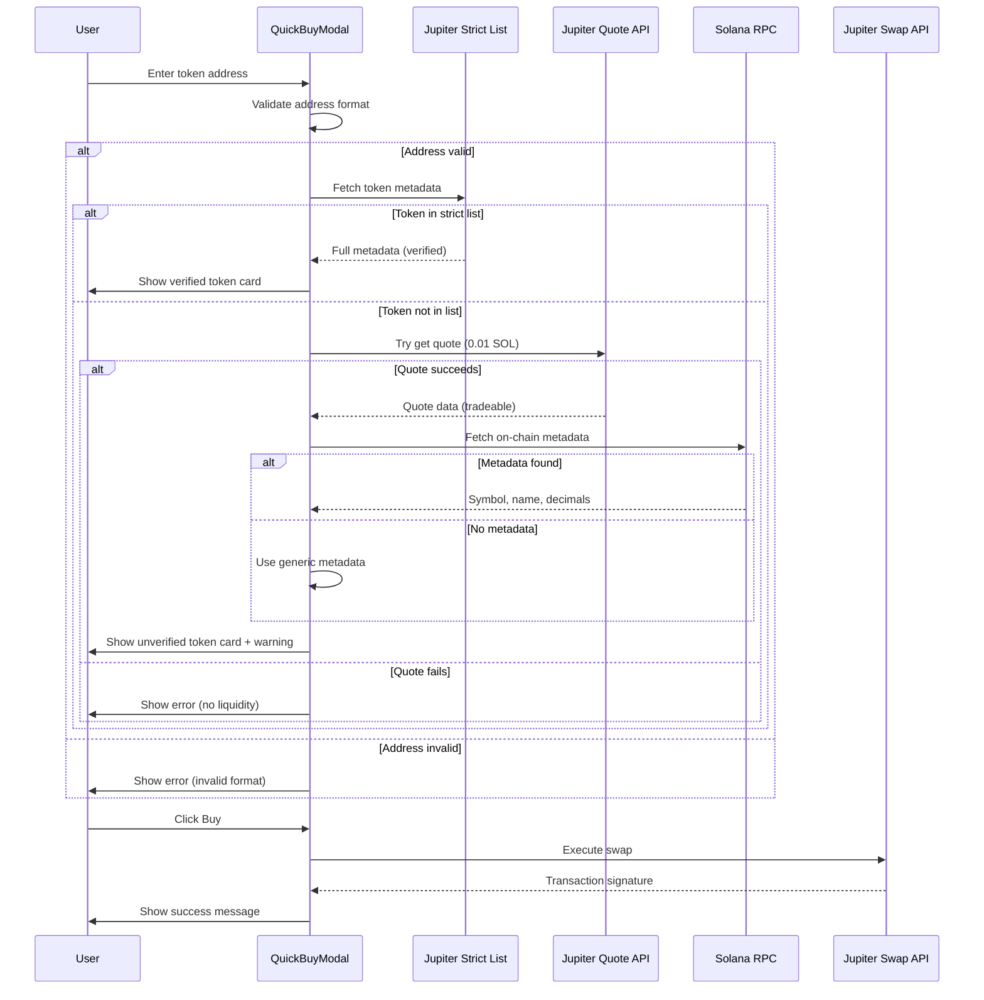

I have created the following plan after thorough exploration and analysis of the codebase. Follow the below plan verbatim. Trust the files and references. Do not re-verify what's written in the plan. Explore only when absolutely necessary. First implement all the proposed file changes and then I'll review all the changes together at the end.

# Implementation Plan: Fix Quick Buy for All Token Types

## Observations

The quick buy modal in the market tab currently uses Jupiter's **strict token list** for verification (`https://tokens.jup.ag/token/${address}`), which only includes curated/verified tokens. This blocks trading of:
- Fresh Pump.fun tokens
- New Raydium launchpad tokens  
- Unverified community tokens
- Any token not in Jupiter's curated list

However, Jupiter's swap API can trade **any token with liquidity**, regardless of verification status. The issue is purely in the verification step at `file:components/QuickBuyModal.tsx` line 83.

## Approach

Implement a **fallback verification strategy** that attempts multiple methods to validate and fetch token metadata:

1. **Primary**: Try Jupiter's strict token list (for verified tokens with full metadata)
2. **Fallback 1**: Try Jupiter's quote API (if quote succeeds, token is tradeable)
3. **Fallback 2**: Use on-chain metadata lookup via Solana RPC
4. **Fallback 3**: Use generic metadata with address as identifier

This ensures the quick buy works for **all valid token addresses** while still providing rich metadata for verified tokens.

## Implementation Steps

### 1. Update Token Verification Logic in QuickBuyModal

**File**: `file:components/QuickBuyModal.tsx`

Modify the `handleVerifyToken` function (lines 66-112) to implement the fallback strategy:

**Current behavior**: Fails if token not in strict list  
**New behavior**: Try multiple verification methods in sequence

**Changes needed**:
- Replace single Jupiter token list fetch with multi-step verification
- Add quote-based verification as fallback
- Add on-chain metadata lookup as secondary fallback
- Use generic metadata as final fallback
- Ensure all paths set `tokenInfo` state correctly

**Verification flow**:
```
1. Try Jupiter strict list → Success? Use full metadata
2. Not found? Try Jupiter quote API → Quote succeeds? Token is tradeable
3. Quote fails? Try on-chain metadata → Found? Use on-chain data
4. All fail? Use generic metadata with address
```

### 2. Add Helper Functions for Fallback Verification

**File**: `file:components/QuickBuyModal.tsx`

Add new helper functions before the component:

**Function 1: `verifyTokenViaQuote`**
- Attempts to get a Jupiter quote for 0.01 SOL → token
- If quote succeeds, token has liquidity and is tradeable
- Returns basic token info (address, decimals from quote)

**Function 2: `getOnChainTokenMetadata`**
- Uses Solana RPC to fetch token mint account
- Extracts decimals from mint data
- Attempts to fetch metadata account (Metaplex standard)
- Returns symbol, name, decimals if available

**Function 3: `createGenericTokenInfo`**
- Creates minimal token info from address
- Uses address substring as symbol
- Sets default decimals (9 for SOL-like, 6 for others)
- Returns tradeable token info

### 3. Update Token Info Interface

**File**: `file:components/QuickBuyModal.tsx`

Extend the `TokenInfo` interface (lines 27-34) to support partial metadata:

**Add optional fields**:
- `verified?: boolean` - Indicates if from strict list
- `source?: 'jupiter' | 'quote' | 'onchain' | 'generic'` - Verification source
- `hasMetadata?: boolean` - Whether full metadata is available

**Update UI rendering** to handle missing metadata gracefully:
- Show warning badge for unverified tokens
- Display "Unknown Token" for missing names
- Show address substring if no symbol available

### 4. Add User Warning for Unverified Tokens

**File**: `file:components/QuickBuyModal.tsx`

Add warning UI in the token card section (after line 291):

**When token is unverified** (`tokenInfo.verified === false`):
- Display warning banner with alert icon
- Message: "⚠️ Unverified token. Verify the contract address before trading."
- Yellow/orange background color
- Link to Solscan for address verification

**Visual indicator**:
- Add badge to token card showing verification status
- Green checkmark for verified tokens
- Yellow warning icon for unverified tokens

### 5. Enhance Error Handling

**File**: `file:components/QuickBuyModal.tsx`

Update error handling in `handleVerifyToken` (lines 106-111):

**Current**: Generic "Token not found" error  
**New**: Specific error messages based on failure reason

**Error scenarios**:
- Invalid address format → "Invalid Solana address format"
- No liquidity found → "Token has no liquidity on any DEX"
- RPC failure → "Unable to verify token. Check your connection."
- All methods failed → "Token verification failed. Proceed with caution."

### 6. Update Buy Flow to Handle Unverified Tokens

**File**: `file:components/QuickBuyModal.tsx`

Modify `handleBuy` function (lines 126-212) to handle tokens without full metadata:

**Changes**:
- Use decimals from tokenInfo (may be estimated)
- Handle missing price data (show "Price unavailable" warning)
- Add extra confirmation for unverified tokens
- Log verification source for debugging

**Additional validation**:
- Require user to confirm if token is unverified
- Show estimated output as "~X tokens (estimated)" if no price
- Disable buy button if decimals are unknown

### 7. Add Integration with Solana Wallet Store

**File**: `file:hooks/solana-wallet-store.ts`

Verify that `executeSwap` function (lines 811-972) handles all token types:

**Current implementation**: ✅ Already supports any token address  
**No changes needed**: Function uses Jupiter's swap API which supports all tokens

**Validation**:
- Confirm no hardcoded token lists
- Ensure no filtering by token source
- Verify error handling for failed swaps

### 8. Update Market Store Token Validation

**File**: `file:hooks/market-store.ts`

Verify that market data doesn't filter out certain token types:

**Current implementation**: ✅ Uses DexScreener data, no source filtering  
**No changes needed**: Market tab already shows all token types

**Validation**:
- Confirm no Pump.fun/Raydium filters
- Ensure all tokens from DexScreener are displayed
- Verify token card rendering handles missing metadata

### 9. Add Logging for Debugging

**File**: `file:components/QuickBuyModal.tsx`

Add comprehensive logging throughout verification flow:

**Log points**:
- Token address entered
- Verification method attempted
- Verification result (success/failure)
- Metadata source used
- Quote/swap execution status

**Use existing logger**: `file:lib/client-logger.ts`

**Log levels**:
- `info` for successful verifications
- `warn` for fallback methods used
- `error` for verification failures

### 10. Testing Recommendations

**Test cases to verify**:

1. **Verified token** (e.g., BONK)
   - Should use Jupiter strict list
   - Full metadata displayed
   - Green verification badge

2. **Fresh Pump.fun token**
   - Should fallback to quote verification
   - Generic metadata displayed
   - Yellow warning badge
   - Swap should execute successfully

3. **New Raydium token**
   - Should fallback to quote verification
   - On-chain metadata if available
   - Swap should execute successfully

4. **Invalid address**
   - Should show clear error message
   - Buy button disabled

5. **Token with no liquidity**
   - Should fail quote verification
   - Show "no liquidity" error
   - Buy button disabled

## Visual Flow Diagram



## Key Files to Modify

| File | Changes | Priority |
|------|---------|----------|
| `file:components/QuickBuyModal.tsx` | Update verification logic, add fallbacks, UI warnings | **High** |
| `file:lib/client-logger.ts` | Add logging for verification flow | Medium |
| `file:hooks/solana-wallet-store.ts` | Verify no restrictions (likely no changes) | Low |
| `file:hooks/market-store.ts` | Verify no token filtering (likely no changes) | Low |

## Success Criteria

✅ Quick buy works for verified tokens (Jupiter strict list)  
✅ Quick buy works for Pump.fun tokens (quote verification)  
✅ Quick buy works for Raydium launchpad tokens (quote verification)  
✅ Quick buy works for any valid token address with liquidity  
✅ Clear warnings shown for unverified tokens  
✅ Graceful error handling for invalid addresses  
✅ Proper metadata display (full or generic)  
✅ Swap execution succeeds for all token types