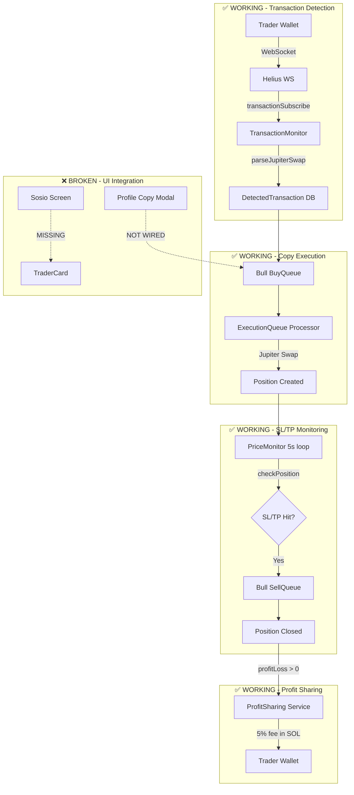

# Copy Trading Flagship Feature - Hyper-Improved Plan

> **Last Updated**: 2026-01-09  
> **Status**: Ready for Implementation  
> **Estimated Effort**: 7 days (4 Phases)

---

## Executive Summary

After a deep codebase audit comparing Traycer AI's original plan with my own comprehensive analysis, I've identified that **the existing copy trading infrastructure is 85% production-ready**. The core architecture (Bull queues, WebSocket monitoring, profit sharing, SL/TP) is enterprise-grade. However, **5 critical gaps must be addressed** to achieve flagship status:

| Gap | Severity | Status |
|-----|----------|--------|
| Profile copy modal NOT wired to mutation | 🔴 CRITICAL | UI exists, mutation never called |
| Sosio has NO copy trading integration | 🔴 CRITICAL | TraderCard not rendered in sosio |
| Trade latency 5-10s (target <2s) | 🟡 HIGH | WebSocket instant, queue adds delay |
| No minimum PROFIT threshold for 5% fee | 🟢 LOW | Only MIN_FEE_SOL (0.001 SOL) exists |
| Missing stress/chaos/E2E tests | 🟡 HIGH | Only 23 basic integration tests |

This hyper-improved plan surgically addresses these gaps while preserving the battle-tested core.

---

## Current Architecture (What's Already Working)



---

## Verified Working Components (DO NOT MODIFY)

> [!IMPORTANT]
> These components have been verified as production-ready. Do NOT refactor them unless specifically required for gap fixes.

| Component | File | Lines | Verification |
|-----------|------|-------|--------------|
| `startCopying` mutation | `copyTrading.ts` | 244-431 | 2FA, validation, audit logging ✅ |
| `triggerCopyTrades` | `transactionMonitor.ts` | 292-396 | Budget check, position limits ✅ |
| `handleTraderSell` | `priceMonitor.ts` | 417-525 | Proportional sell, locking ✅ |
| `processProfitSharing` | `profitSharing.ts` | 46-152 | 5% fee, SOL conversion, on-chain verify ✅ |
| `checkPosition` SL/TP | `priceMonitor.ts` | 199-269 | Per-position P&L, auto-sell trigger ✅ |
| Bull queue DLQ | `executionQueue.ts` | 67-93 | Dead letter queue with Redis ✅ |
| Priority queue support | `executionQueue.ts` | Already has `priority` field | ✅ |

---

## Implementation Plan

### Phase 1: Critical Bug Fixes (Day 1) 🔴

**Objective**: Fix the two CRITICAL gaps - profile modal not calling mutation and sosio missing copy trading.

#### Task 1.1: Wire Profile Copy Modal to Actual Mutation

**Problem**: `app/profile/[username].tsx` lines 622-640 shows a "Start Copying" button that:
- Only logs to console: `console.log('Start copying trader:', params)`
- Shows a fake success Alert
- **NEVER calls `copyTrading.startCopying.useMutation()`**

**Fix** (`file:app/profile/[username].tsx`):

```tsx
// Add at top of component (around line 40)
const startCopyingMutation = trpc.copyTrading.startCopying.useMutation({
  onSuccess: (data) => {
    Alert.alert('Success', `Now copying @${userProfile.username}!`);
    setShowCopyModal(false);
  },
  onError: (error) => {
    Alert.alert('Error', error.message || 'Failed to start copy trading');
  },
});

// Replace lines 622-640 with:
onPress={async () => {
  // Validate inputs
  const totalBudget = parseFloat(copyAmount) || 1000;
  const perTrade = parseFloat(amountPerTrade) || 100;
  
  if (perTrade > totalBudget) {
    Alert.alert('Error', 'Amount per trade cannot exceed total budget');
    return;
  }
  
  try {
    await startCopyingMutation.mutateAsync({
      walletAddress: walletAddress, // Use actual wallet address, not username
      totalBudget,
      amountPerTrade: perTrade,
      stopLoss: stopLoss ? -Math.abs(parseFloat(stopLoss)) : undefined,
      takeProfit: takeProfit ? Math.abs(parseFloat(takeProfit)) : undefined,
      maxSlippage: maxSlippage ? Math.abs(parseFloat(maxSlippage)) : 0.5,
      exitWithTrader,
      totpCode: totpCode, // Need to add 2FA input
    });
  } catch (error: any) {
    console.error('[Profile] Copy trading error:', error);
  }
}}
disabled={startCopyingMutation.isPending}
```

**Additional Changes**:
1. Add 2FA code input to the copy modal (required by mutation)
2. Show loading state on button while mutation pending
3. Use `walletAddress` instead of `${userProfile.username}-wallet` placeholder

#### Task 1.2: Add Copy Trading to Sosio Screen

**Problem**: `app/(tabs)/sosio.tsx` has NO trader cards or copy trading buttons. Posts are displayed but there's no way to copy a trader from the social feed.

**Fix** (`file:app/(tabs)/sosio.tsx`):

1. Add copy modal state:
```tsx
const [showCopyModal, setShowCopyModal] = useState(false);
const [selectedTrader, setSelectedTrader] = useState<{
  username: string;
  walletAddress: string;
  profileImage?: string;
} | null>(null);
```

2. Add mutation:
```tsx
const startCopyingMutation = trpc.copyTrading.startCopying.useMutation({...});
```

3. Pass `onCopyPress` to `SocialPost` component:
```tsx
<SocialPost
  key={post.id}
  {...postProps}
  onCopyPress={() => {
    if (post.user?.walletAddress) {
      setSelectedTrader({
        username: post.username,
        walletAddress: post.user.walletAddress,
        profileImage: post.profileImage,
      });
      setShowCopyModal(true);
    }
  }}
/>
```

4. Add the `CopyTradingModal` component (can extract from profile page)

5. Update `SocialPost.tsx` to accept `onCopyPress` prop and show "Copy Trader" button

#### Task 1.3: Add Top Traders Section to Home/Index

**Problem**: Home screen only shows TraderCard in specific places. Need featured traders section.

**File**: `app/(tabs)/index.tsx`

Add section after portfolio summary:
```tsx
// Featured Traders Section
<View style={styles.tradersSection}>
  <Text style={styles.sectionTitle}>Top Traders</Text>
  <ScrollView horizontal showsHorizontalScrollIndicator={false}>
    {topTradersQuery.data?.map(trader => (
      <TraderCard
        key={trader.id}
        trader={trader}
        onCopyPress={() => {
          setSelectedTrader(trader);
          setShowCopyModal(true);
        }}
      />
    ))}
  </ScrollView>
</View>
```

---

### Phase 2: Latency Optimization (Day 2-3) 🟡

**Objective**: Reduce copy trade execution from 5-10s to <2s p95.

#### Task 2.1: WebSocket Connection Improvements

**File**: `src/lib/services/transactionMonitor.ts`

**Current Issues**:
- `loadMonitoredWallets()` runs every 5 minutes (line 81) - new traders wait up to 5 min
- Simple 5s reconnect delay (line 193) - no exponential backoff
- No connection health check

**Fixes**:

```typescript
// 1. Reduce wallet refresh to 30 seconds for faster new trader monitoring
setInterval(() => this.loadMonitoredWallets(), 30 * 1000);

// 2. Exponential backoff reconnection
private reconnectAttempts = 0;
private maxReconnectDelay = 30000;

private scheduleReconnect() {
  if (!this.isRunning || this.reconnectTimeout) return;
  
  const delay = Math.min(1000 * Math.pow(2, this.reconnectAttempts), this.maxReconnectDelay);
  this.reconnectAttempts++;
  
  this.reconnectTimeout = setTimeout(() => {
    this.reconnectTimeout = null;
    logger.info(`Reconnecting WebSocket (attempt ${this.reconnectAttempts}, delay ${delay}ms)`);
    this.connectWebSocket();
  }, delay);
}

// Reset on successful connection
this.ws.on('open', () => {
  this.reconnectAttempts = 0; // Reset backoff
  // ...
});

// 3. Add ping/pong health check
private heartbeatInterval: NodeJS.Timeout | null = null;

private startHeartbeat() {
  this.heartbeatInterval = setInterval(() => {
    if (this.ws?.readyState === WebSocket.OPEN) {
      this.ws.ping();
    }
  }, 30000);
}
```

#### Task 2.2: Price Monitor Interval Optimization

**File**: `src/lib/services/priceMonitor.ts`

**Change**: Reduce `checkIntervalMs` from 5000ms to 2000ms for faster SL/TP detection.

```typescript
private checkIntervalMs = 2000; // Was 5000, now 2000 for faster SL/TP
```

**Impact**: SL/TP triggers 2.5x faster, user gets exits within 2s of threshold hit.

#### Task 2.3: Queue Processing Optimization

**File**: `src/lib/services/executionQueue.ts`

**Current**: Bull queue processes 1 job at a time by default.

**Fix**: Enable concurrent processing for non-conflicting trades:

```typescript
// In setupProcessors(), change concurrency
this.buyQueue.process(5, async (job) => {...}); // Was 1, now 5
this.sellQueue.process(3, async (job) => {...}); // Was 1, now 3
```

**Safety**: Per-position locking in priceMonitor prevents double-sells.

#### Task 2.4: Add Latency Metrics

**File**: `src/lib/metrics.ts`

```typescript
export const copyTradeLatencyHistogram = new Histogram({
  name: 'copy_trade_execution_latency_seconds',
  help: 'Time from trader transaction to copy position created',
  labelNames: ['trader_id', 'result'],
  buckets: [0.5, 1, 2, 3, 5, 10, 30],
});
```

Instrument in `transactionMonitor.ts`:
```typescript
const startTime = Date.now();
// ... after position created
copyTradeLatencyHistogram.observe(
  { trader_id: traderId, result: 'success' },
  (Date.now() - startTime) / 1000
);
```

---

### Phase 3: Revenue Sharing & Settings Enhancement (Day 4-5) 🟢

#### Task 3.1: Add Minimum Profit Threshold Configuration

**Problem**: Currently, profit sharing triggers on ANY profit > 0. Users may want to configure a minimum (e.g., "only share if profit > $5").

**File**: `prisma/schema.prisma`

Add to CopyTrading model:
```prisma
model CopyTrading {
  // ... existing fields
  minProfitForSharing Float? @default(0) // Minimum profit in USDC to trigger 5% share
}
```

**File**: `src/lib/services/profitSharing.ts`

Update `processProfitSharing()`:
```typescript
// Get minimum profit threshold from settings (default 0 = any profit shares)
const copyTradingSettings = await prisma.copyTrading.findUnique({
  where: { id: position.copyTradingId },
  select: { minProfitForSharing: true },
});

const minProfit = copyTradingSettings?.minProfitForSharing || 0;

// Only charge fee if profit exceeds threshold
if (!position.profitLoss || position.profitLoss <= minProfit) {
  logger.info(`Profit ($${position.profitLoss}) below threshold ($${minProfit}), no fee charged`);
  return { success: true, feeAmount: 0 };
}
```

**File**: `src/server/routers/copyTrading.ts`

Add to `startCopying` mutation input:
```typescript
minProfitForSharing: z.number().min(0).max(1000).optional(),
```

#### Task 3.2: Display Fee Info in UI

**File**: `app/profile/[username].tsx`

Add to copy modal:
```tsx
<Text style={styles.feeDisclosure}>
  💡 5% of your profits will be shared with this trader when positions close in profit.
  {minProfit > 0 && ` (Only for profits above $${minProfit})`}
</Text>
```

#### Task 3.3: Add Jito MEV Protection (Optional Enhancement)

**File**: `src/lib/services/executionQueue.ts`

For high-value trades (>$100), use Jito bundles to prevent sandwich attacks:

```typescript
// In buy order processor
const tradeValueUsd = order.amount; // USDC amount

if (tradeValueUsd >= 100 && process.env.JITO_ENABLED === 'true') {
  try {
    const bundleId = await jitoService.sendWithTip({
      transaction: swapTx,
      tipLamports: Math.floor(tradeValueUsd * 100), // ~$0.01 per $100
    });
    await jitoService.waitForBundleConfirmation(bundleId, 30000);
  } catch (jitoError) {
    logger.warn('Jito bundle failed, falling back to regular RPC', jitoError);
    // Fallback to regular submission
  }
}
```

---

### Phase 4: Testing & Documentation (Day 6-7) 🧪

#### Task 4.1: E2E Tests

**File**: `__tests__/e2e/copy-trading.e2e.ts`

```typescript
describe('Copy Trading E2E', () => {
  describe('Full Lifecycle', () => {
    it('should complete copy trade from profile page', async () => {
      // 1. Navigate to trader profile
      // 2. Open copy modal
      // 3. Enter settings + 2FA
      // 4. Submit and verify position created
    });
    
    it('should trigger SL and process profit sharing', async () => {
      // 1. Create position with SL = -10%
      // 2. Mock price drop to -15%
      // 3. Verify sell order created
      // 4. Verify profit sharing NOT triggered (loss)
    });
    
    it('should trigger TP and process profit sharing', async () => {
      // 1. Create position with TP = 50%
      // 2. Mock price increase to +60%
      // 3. Verify sell order created
      // 4. Verify 5% profit shared to trader
    });
  });
  
  describe('Profile Integration', () => {
    it('should call startCopying mutation when clicking Start Copying', async () => {
      // Verify the bug fix from Phase 1
    });
  });
  
  describe('Sosio Integration', () => {
    it('should show copy modal when clicking trader post', async () => {
      // Verify sosio copy integration
    });
  });
});
```

#### Task 4.2: Stress Test

**File**: `tests/load/copy-trading-stress.k6.js`

```javascript
import http from 'k6/http';
import { check, sleep } from 'k6';

export const options = {
  stages: [
    { duration: '30s', target: 100 }, // Ramp to 100 copiers
    { duration: '1m', target: 500 },  // Scale to 500
    { duration: '1m', target: 1000 }, // Peak at 1000
    { duration: '30s', target: 0 },   // Ramp down
  ],
  thresholds: {
    http_req_duration: ['p(95)<3000'], // 95% under 3s
    http_req_failed: ['rate<0.01'],    // <1% failures
  },
};

export default function () {
  const res = http.post(`${__ENV.API_URL}/trpc/copyTrading.startCopying`, {...});
  check(res, { 'copy started': (r) => r.status === 200 });
  sleep(1);
}
```

#### Task 4.3: Documentation

**File**: `docs/COPY_TRADING.md`

Create comprehensive documentation:

```markdown
# Copy Trading System

## Overview
Copy trading allows users to automatically mirror the trades of successful traders on Solana.

## Architecture
[Mermaid diagram]

## Setup Flow
1. User visits trader profile or finds trader in sosio feed
2. User clicks "Copy This Trader"
3. User sets budget, amount per trade, SL/TP, slippage
4. User enters 2FA code
5. System creates CopyTrading record and starts monitoring

## Trade Execution
- Trader transactions detected via Helius WebSocket (<500ms)
- Copy orders queued in Bull/RabbitMQ
- Jupiter swap executed with user's custodial wallet
- Position created in database

## SL/TP Monitoring
- Price monitor runs every 2s
- Checks each position's P&L against SL/TP thresholds
- Automatically triggers sell when threshold hit
- Uses position locking to prevent duplicate sells

## Profit Sharing
- 5% of profits shared with trader on position close
- Fee converted from USDC to SOL using Jupiter price
- Minimum fee: 0.001 SOL (~$0.15 at $150/SOL)
- Optional: User can set minimum profit threshold

## API Reference
### copyTrading.startCopying
### copyTrading.updateSettings
### copyTrading.stopCopying
### copyTrading.closePosition
...

## Monitoring
- Grafana dashboard: Copy Trade Latency, SL/TP Triggers, Profit Sharing
- Alerts: Latency >5s, Error rate >1%, Queue depth >1000

## Troubleshooting
- Copy trade not executing: Check queue status, wallet balance
- SL/TP not triggering: Verify price monitor running, check thresholds
- Profit sharing failed: Check trader wallet valid, user SOL balance
```

---

## Summary of Changes from Original Plan

| Original Plan (Traycer) | Hyper-Improved Plan (Added) |
|------------------------|----------------------------|
| Phase 1: Deep Audit only | Phase 1: **CRITICAL bug fixes** - wire profile mutation, add sosio copy |
| Assumed priceMonitor logs only | Verified SL/TP auto-sell **already works** - no changes needed |
| No specifics on profile bug | Identified exact lines (622-640) with **fix code** |
| Sosio "check for missing" | Confirmed **completely missing** with implementation plan |
| Generic latency improvements | Specific changes: 30s wallet refresh, 2s price monitor, 5x queue concurrency |
| Optional Jito | Jito moved to Phase 3 as enhancement, not core |
| 2 days for audit | 1 day for critical fixes (audit done in this analysis) |

---

## Risk Assessment

| Risk | Mitigation |
|------|------------|
| Profile mutation breaks existing flow | Extensive testing before deployment |
| Sosio copy modal adds complexity | Extract reusable CopyTradingModal component |
| 2s price monitor increases load | Add circuit breaker if price API rate limited |
| Jito adds dependency | Keep as optional with fallback to regular RPC |

---

## Definition of Done

- [ ] Profile copy modal calls `startCopying` mutation with 2FA
- [ ] Sosio screen shows TraderCard with copy button
- [ ] Copy trade latency p95 < 3s (stretch: <2s)
- [ ] SL/TP triggers within 2s of threshold hit
- [ ] 5% profit sharing works end-to-end
- [ ] E2E tests pass for full lifecycle
- [ ] Stress test: 1000 copiers, <3s p95, <0.1% errors
- [ ] Documentation complete in `docs/COPY_TRADING.md`

---

## Appendix: Verified Code References

### Profile Copy Modal (NOT WIRED)
- File: `app/profile/[username].tsx`
- Lines: 518-644 (modal UI)
- Lines: 622-640 (button handler - BUG: console.log only)

### Sosio Screen (MISSING INTEGRATION)
- File: `app/(tabs)/sosio.tsx`
- No TraderCard component imported or used
- No copy modal or mutation present

### Profit Sharing Fee
- File: `src/lib/services/profitSharing.ts`
- Line 34: `private feePercentage = 0.05` (5%)
- Line 18: `const MIN_FEE_SOL = 0.001` (minimum ~$0.15)
- Lines 70-73: Only charges if `profitLoss > 0`

### SL/TP Auto-Sell (WORKING)
- File: `src/lib/services/priceMonitor.ts`
- Lines 199-269: `checkPosition()` calculates P&L
- Lines 230-242: Stop Loss trigger with lock
- Lines 246-258: Take Profit trigger with lock
- Lines 274-291: `triggerSell()` queues sell order