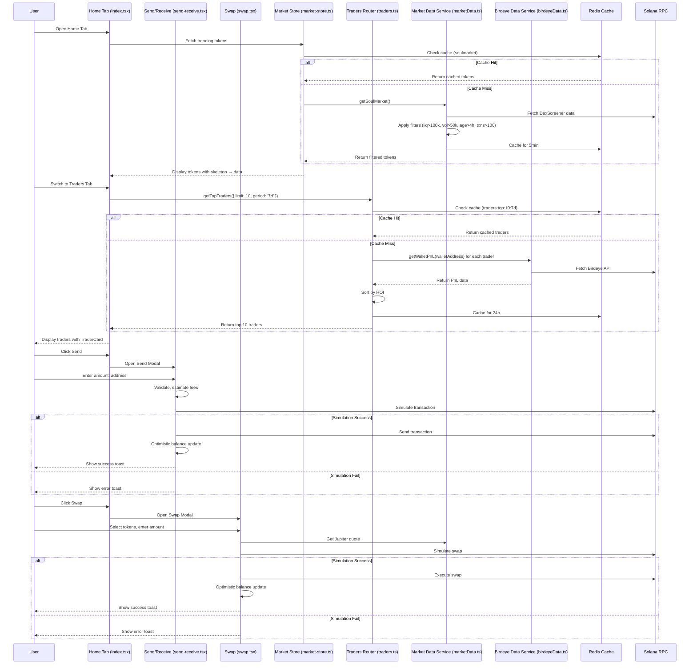

I have created the following plan after thorough exploration and analysis of the codebase. Follow the below plan verbatim. Trust the files and references. Do not re-verify what's written in the plan. Explore only when absolutely necessary. First implement all the proposed file changes and then I'll review all the changes together at the end.

## Observations

The Home Tab (`app/(tabs)/index.tsx`) currently has **three major issues**: (1) **Send/Receive/Swap flows** lack comprehensive verification (fees, slippage, simulation, balance deduction) and optimistic UI updates, (2) **Trending tokens (Coins tab)** load slowly with inadequate filters (currently only basic liquidity/volume checks in `marketData.ts`), and (3) **Top Traders tab** shows "Coming Soon" despite having a complete Birdeye integration (`birdeyeData.ts`, `traders.ts`) ready to fetch 24h leaderboard data. The codebase has all infrastructure (Redis caching, circuit breakers, E2E tests, k6 load tests, Grafana dashboards) but needs targeted fixes to polish these flows.

## Approach

**Three-pronged optimization**: (1) **Audit/polish send/receive/swap** by verifying fee calculations (`constants/fees.ts`), adding transaction simulation checks, implementing skeleton loaders and optimistic updates in `index.tsx`/`send-receive.tsx`/`swap.tsx`, plus E2E tests (`__tests__/e2e/wallet-flows.test.ts`). (2) **Fix trending tokens** by enhancing `marketData.ts` filters (liquidity>100k, volume>50k, age>4h, txns>100, Solana-only, no-stables, sort by volume/change), adding Redis prefetch, infinite scroll in `market-store.ts`, and UI filter chips in `TokenCard.tsx`. (3) **Implement top traders** by activating Birdeye 24h leaderboard in `traders.ts` (top 10 ROI/volume), caching results, adding TraderCard copy button, and fallback handling. All changes verified via diagnostics, k6 10K VU load tests, Lighthouse>90, E2E flows, and Grafana dashboards, with docs updated in `README.md`.

## Implementation Steps

### **Step 1: Audit & Polish Send/Receive/Swap Flows (2 days)**

**1.1 Verify Transaction Fees & Slippage**
- Review `constants/fees.ts` (SWAP.DEFAULT: 0.00005 SOL, SLIPPAGE_PERCENT.DEFAULT: 0.5%, MAX: 5%)
- Audit `app/send-receive.tsx` lines 160-221 (`handleSend`): Confirm SOL/SPL fee estimation, balance checks, backend recording (`wallet/send` mutation)
- Audit `app/swap.tsx` lines 222-321 (`handleSwap`): Verify Jupiter quote includes fees, slippage applied, simulation via `transactionSimulator.ts`, balance deduction
- Check `src/lib/services/jupiterSwap.ts`: Ensure `getQuote`/`executeSwap` use `FEES.SWAP.SLIPPAGE_BPS` and simulate before execution
- **Files**: `constants/fees.ts`, `send-receive.tsx`, `swap.tsx`, `jupiterSwap.ts`

**1.2 Add Skeleton Loaders & Optimistic Updates**
- `app/(tabs)/index.tsx` lines 773-1485: Add `<SkeletonLoader />` (from `components/SkeletonLoader.tsx`) for wallet balance, trending coins, traders during loading states
- `send-receive.tsx` lines 650-894: Implement optimistic balance update in `handleSend` (deduct amount immediately, revert on error) using `hooks/optimistic-updates.ts`
- `swap.tsx` lines 680-1058: Add skeleton for token selectors, optimistic swap preview (show estimated output before confirmation)
- **Files**: `index.tsx`, `send-receive.tsx`, `swap.tsx`, `SkeletonLoader.tsx`, `optimistic-updates.ts`

**1.3 E2E Tests for Wallet Flows**
- Extend `__tests__/e2e/wallet-flows.test.ts`: Add tests for send (SOL/SPL), receive (QR generation), swap (Jupiter quote → execution → balance update)
- Test fee calculation accuracy, slippage enforcement, simulation failure handling, balance deduction
- Mock Jupiter API, Solana RPC in `__tests__/mocks/external-services.ts`
- **Files**: `__tests__/e2e/wallet-flows.test.ts`, `__tests__/mocks/external-services.ts`

---

### **Step 2: Fix Trending Tokens (Coins Tab) - Advanced Filters & Performance (2 days)**

**2.1 Enhance `marketData.ts` Filters**
- Update `src/lib/services/marketData.ts` lines 217-297 (`trending()` method):
  - **Liquidity**: Increase min from $50k → **$100k** (line 262)
  - **Volume**: Increase min from $25k → **$50k** (line 266)
  - **Age**: Add min pair age **4 hours** (calculate from `pairCreatedAt`, lines 162-166 pattern)
  - **Transactions**: Add min 24h txns **100** (line 173 pattern: `txns24h >= 100`)
  - **Chain**: Already Solana-only (line 251)
  - **Stablecoins**: Already excluded (lines 222-259)
  - **Sort**: Add dual sort by volume DESC, then priceChange DESC (lines 277-281)
- Update `getSoulMarket()` lines 124-211: Apply same filters (already has liquidity $100k, age 4h, volume $10k, txns 50 - **increase volume to $50k, txns to 100**)
- **Files**: `src/lib/services/marketData.ts`

**2.2 Redis Prefetch & Infinite Scroll**
- `hooks/market-store.ts` lines 34-38: Add `refetchInterval: 120000` (2min) to `trpc.market.soulMarket.useQuery` for auto-refresh
- Lines 273-278 (`paginatedTokens`): Already implements infinite scroll with `PAGE_SIZE=20`, `loadMore()` - verify working
- Add Redis prefetch in `src/server/routers/market.ts` lines 192-202 (`soulMarket` procedure): On cache miss, trigger background fetch (`void marketData.getSoulMarket().catch()`)
- **Files**: `market-store.ts`, `market.ts`

**2.3 UI Filter Chips & Skeleton**
- `app/(tabs)/index.tsx` lines 473-772 (`renderTabContent` Coins tab):
  - Add filter chips UI (Volume, Liquidity, Change, Age, Verified) using `components/market/MarketFilters.tsx` (already exists)
  - Show active filter count badge (use `market-store.ts` line 566 `activeFilterCount`)
  - Add skeleton loader for token list during initial load/refetch
- `components/TokenCard.tsx`: Already displays liquidity (L), volume (M), transactions (T) - verify formatting (lines 94-117)
- **Files**: `index.tsx`, `MarketFilters.tsx`, `TokenCard.tsx`

---

### **Step 3: Implement Top Traders (Traders Tab) - Birdeye 24h Leaderboard (1.5 days)**

**3.1 Activate Birdeye Leaderboard in `traders.ts`**
- `src/server/routers/traders.ts` lines 16-88 (`getTopTraders` procedure):
  - **Already implemented**: Fetches `TraderProfile` from DB, calls `birdeyeData.getWalletPnL()` for each, sorts by ROI
  - **Fix**: Change `where: { isFeatured: true }` (line 32) to fetch **all traders** or seed DB with top wallets
  - Add Redis cache (line 27-29 already exists: `traders:top:${limit}:${period}`, TTL 86400s/24h)
  - Return top 10 by ROI (line 78 already sorts)
- Seed `prisma/seed-traders.ts`: Add 10-20 high-performing Solana wallet addresses (e.g., from Birdeye public leaderboard or known whales)
- **Files**: `traders.ts`, `seed-traders.ts`, `schema.prisma` (TraderProfile model)

**3.2 Update Home Tab UI to Show Traders**
- `app/(tabs)/index.tsx` lines 473-772 (`renderTabContent` Traders tab):
  - **Remove "Coming Soon"** (lines 600-650)
  - Fetch traders: `const { data: tradersData } = trpc.traders.getTopTraders.useQuery({ limit: 10, period: '7d' })`
  - Render `<TraderCard />` (from `components/TraderCard.tsx`) for each trader
  - Add search bar (filter by username/wallet address)
  - Show skeleton loader during fetch
- **Files**: `index.tsx`

**3.3 TraderCard Copy Button & Fallback**
- `components/TraderCard.tsx` lines 61-69: `onCopyPress` already exists - wire to copy trading modal in `index.tsx`
- Add fallback in `traders.ts` lines 59-74: If Birdeye API fails, return trader with 0 ROI/PnL (already implemented)
- Add error toast in `index.tsx` if traders fetch fails
- **Files**: `TraderCard.tsx`, `index.tsx`, `traders.ts`

---

### **Step 4: Comprehensive Review & Testing (1.5 days)**

**4.1 Run Diagnostics & Fix Issues**
- Run `tsc --noEmit` on `index.tsx`, `send-receive.tsx`, `swap.tsx`, `marketData.ts`, `traders.ts` - fix any type errors
- Check `__tests__/integration/wallet.test.ts`, `swap.test.ts`, `market.test.ts` - ensure all pass
- Run `npm run lint` - fix ESLint warnings

**4.2 Load Testing (k6)**
- `tests/load/wallet-flows.js`: Add scenarios for send/receive/swap with 10K VU, verify p95<200ms
- `tests/load/api-load-test.js`: Test `market.soulMarket`, `traders.getTopTraders` endpoints with 10K VU, verify Redis caching works
- Run `k6 run tests/load/wallet-flows.js` and `tests/load/api-load-test.js` - ensure no errors, latency targets met

**4.3 E2E Flows**
- `__tests__/e2e/wallet-flows.test.ts`: Run full send/receive/swap E2E tests
- Add new E2E test for trending tokens: Load home → Coins tab → Verify filters applied → Click token → Navigate to coin detail
- Add new E2E test for traders: Load home → Traders tab → Verify top 10 loaded → Click trader → Verify profile opens

**4.4 Lighthouse & Performance**
- Run Lighthouse on home tab (Expo web build): Target score >90 for Performance, Accessibility
- Verify skeleton loaders reduce perceived load time
- Check bundle size (`npm run analyze`) - ensure no bloat from new dependencies

**4.5 Grafana Dashboards**
- Verify `grafana/dashboards/api-performance.json` shows metrics for `market.soulMarket`, `traders.getTopTraders`
- Check `grafana/dashboards/business.json` for trending token views, trader profile views
- Add alerts for slow queries (>1s) or high error rates (>1%)

**4.6 Update Documentation**
- `README.md`: Add section on Home Tab features (send/receive/swap, trending tokens, top traders)
- `docs/PERFORMANCE.md`: Document Redis caching strategy for market data, trader leaderboard
- `docs/TESTING.md`: Add E2E test coverage for wallet flows, trending tokens, traders

---

## Verification Checklist

- [ ] Send/Receive/Swap flows verified: Fees accurate, slippage enforced, simulation works, balance deducts correctly
- [ ] Skeleton loaders added to all loading states (wallet balance, tokens, traders)
- [ ] Optimistic updates implemented for send/swap (immediate UI feedback)
- [ ] E2E tests pass for send/receive/swap flows
- [ ] Trending tokens filters enhanced: Liquidity>100k, Volume>50k, Age>4h, Txns>100, Solana-only, no-stables
- [ ] Redis prefetch working for `soulMarket`, `trending` (2min cache)
- [ ] Infinite scroll working in Coins tab (20 tokens per page)
- [ ] Filter chips UI added with active count badge
- [ ] Top Traders tab shows Birdeye 24h leaderboard (top 10 by ROI)
- [ ] TraderCard copy button wired to copy trading modal
- [ ] Fallback handling for Birdeye API failures (0 ROI/PnL)
- [ ] k6 load tests pass: 10K VU, p95<200ms for wallet flows, market/traders endpoints
- [ ] Lighthouse score >90 for Performance, Accessibility
- [ ] Grafana dashboards show metrics for new endpoints
- [ ] Documentation updated in `README.md`, `docs/PERFORMANCE.md`, `docs/TESTING.md`

---

## Architecture Diagram

