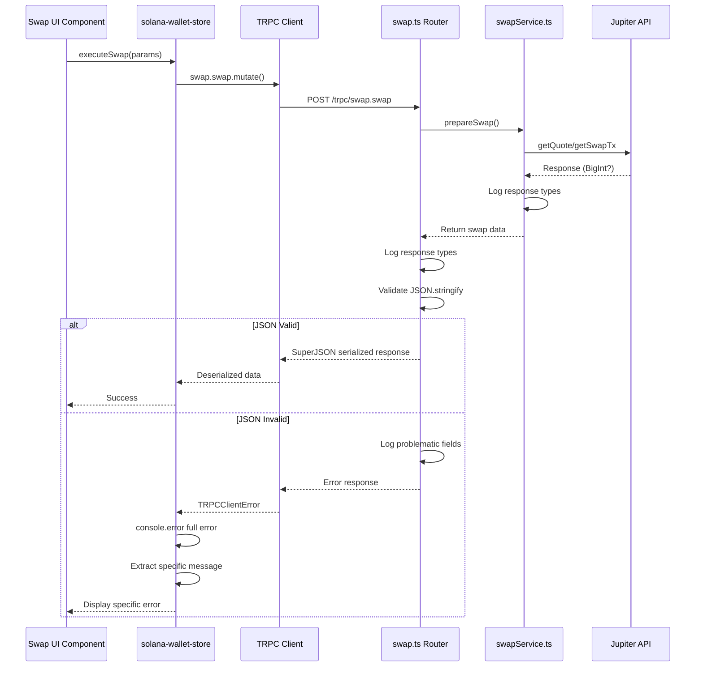

I have created the following plan after thorough exploration and analysis of the codebase. Follow the below plan verbatim. Trust the files and references. Do not re-verify what's written in the plan. Explore only when absolutely necessary. First implement all the proposed file changes and then I'll review all the changes together at the end.

## Observations

The swap serialization error stems from **incomplete error diagnostics** in the client-side error handler. Currently, `hooks/solana-wallet-store.ts` (lines 979-1029) only logs `error?.message`, masking the actual TRPC error structure. The backend (`src/server/routers/swap.ts`) returns raw response values relying on SuperJSON but lacks pre-return validation or type logging. Additionally, obsolete 2FA error checks (lines 1008-1012) remain despite 2FA removal. The error UI across components (`app/(tabs)/index.tsx`, `components/QuickBuyModal.tsx`, `components/TokenBagModal.tsx`) displays generic messages without exposing root causes.

## Approach

This plan implements **comprehensive diagnostic logging** at three critical points: (1) client-side full TRPC error capture with structured logging, (2) backend response type validation before return, and (3) swapService response type logging. The strategy removes obsolete 2FA checks, adds JSON.stringify validation to detect serialization issues early, and enhances error UI with specific messages. This diagnostic-first approach will expose the exact serialization failure point, enabling permanent resolution in the subsequent review phase.

## Implementation Steps

### 1. Client-Side Error Diagnostics Enhancement (`hooks/solana-wallet-store.ts`)

**Location**: Lines 979-1029 (executeSwap catch block)

**Changes**:
- **Line 990**: Replace `logger.logCritical('Swap execution failed:', error)` with comprehensive logging:
  ```typescript
  console.error('TRPC Error Full:', error);
  console.error('TRPC Error Structure:', {
    message: error?.message,
    code: error?.code,
    data: error?.data,
    cause: error?.cause,
    shape: error?.shape
  });
  logger.logCritical('Swap execution failed:', {
    message: error?.message,
    code: error?.code,
    data: error?.data,
    stack: error?.stack
  });
  ```

- **Lines 996-1000**: Refine serialization error detection to check for true SuperJSON errors:
  ```typescript
  if (errorMessage.includes('transform') || errorMessage.includes('serialize') || 
      errorMessage.includes('superjson') || errorMessage.includes('deserialize') ||
      errorMessage.includes('JSON') || errorMessage.includes('parse')) {
    throw new Error('Response serialization error. Please try again.');
  }
  ```

- **Lines 1008-1012**: **DELETE** entire 2FA error check block (2FA removed from app)

- **Line 1028**: Update fallback to use full error object:
  ```typescript
  throw new Error(error?.message || error?.data?.message || 'Swap failed. Please try again.');
  ```

**Files**: `file:hooks/solana-wallet-store.ts`

---

### 2. Backend Response Type Validation (`src/server/routers/swap.ts`)

**Location**: Lines 145-154 (swap mutation return statement)

**Changes**:
- **Before line 146** (before return statement), add response type logging and validation:
  ```typescript
  // Log response types for debugging
  logger.info('Swap response types:', {
    swapTransaction: typeof swapTx.swapTransaction,
    lastValidBlockHeight: typeof swapTx.lastValidBlockHeight,
    transactionId: typeof transaction.id,
    inputAmount: typeof input.amount,
    outputAmount: typeof (Number(quote.outAmount) / 1_000_000),
    priceImpact: typeof Number(quote.priceImpactPct),
    fee: typeof 0.00005
  });

  // Validate JSON serializability
  try {
    JSON.stringify({
      swapTransaction: swapTx.swapTransaction,
      lastValidBlockHeight: swapTx.lastValidBlockHeight,
      transactionId: transaction.id,
      inputAmount: input.amount,
      outputAmount: Number(quote.outAmount) / 1_000_000,
      priceImpact: Number(quote.priceImpactPct),
      fee: 0.00005
    });
    logger.info('Swap response JSON validation: PASSED');
  } catch (jsonError: any) {
    logger.error('Swap response JSON validation: FAILED', {
      error: jsonError.message,
      problematicFields: Object.entries({
        swapTransaction: swapTx.swapTransaction,
        lastValidBlockHeight: swapTx.lastValidBlockHeight,
        transactionId: transaction.id,
        inputAmount: input.amount,
        outputAmount: Number(quote.outAmount) / 1_000_000,
        priceImpact: Number(quote.priceImpactPct),
        fee: 0.00005
      }).filter(([k, v]) => {
        try { JSON.stringify(v); return false; } catch { return true; }
      }).map(([k]) => k)
    });
    throw new Error('Response contains non-serializable values');
  }
  ```

**Files**: `file:src/server/routers/swap.ts`

---

### 3. SwapService Response Type Logging (`src/lib/services/swapService.ts`)

**Location**: Lines 91-96 (prepareSwap return statement)

**Changes**:
- **Before line 91** (before return statement), add response type logging:
  ```typescript
  // Log response types for debugging
  logger.info('SwapService prepareSwap response types:', {
    swapTransaction: typeof swapTx.swapTransaction,
    swapTransactionLength: swapTx.swapTransaction?.length,
    lastValidBlockHeight: typeof swapTx.lastValidBlockHeight,
    lastValidBlockHeightValue: swapTx.lastValidBlockHeight,
    transactionId: typeof txn.id,
    quoteType: typeof quote,
    quoteOutAmount: typeof quote.outAmount,
    quotePriceImpact: typeof quote.priceImpactPct
  });

  // Check for problematic values
  const problematicValues = [];
  if (typeof swapTx.lastValidBlockHeight === 'bigint') {
    problematicValues.push('lastValidBlockHeight is BigInt');
  }
  if (swapTx.lastValidBlockHeight === Infinity || swapTx.lastValidBlockHeight === -Infinity) {
    problematicValues.push('lastValidBlockHeight is Infinity');
  }
  if (Number.isNaN(swapTx.lastValidBlockHeight)) {
    problematicValues.push('lastValidBlockHeight is NaN');
  }
  if (problematicValues.length > 0) {
    logger.warn('SwapService detected problematic values:', problematicValues);
  }
  ```

**Files**: `file:src/lib/services/swapService.ts`

---

### 4. Enhanced Error UI Messages

**Update error handling in swap-calling components to display more specific messages:**

#### 4.1 Main Swap Interface (`app/(tabs)/index.tsx`)

**Location**: Line 456

**Change**:
```typescript
} catch (error: any) {
  console.error('Swap execution error:', error);
  const errorMsg = error?.message || error?.data?.message || 'Failed to execute swap';
  Alert.alert('Swap Failed', errorMsg);
}
```

**Files**: `file:app/(tabs)/index.tsx`

---

#### 4.2 Quick Buy Modal (`components/QuickBuyModal.tsx`)

**Location**: Lines 203-206

**Change**:
```typescript
} catch (err: any) {
  console.error('Quick buy failed:', err);
  const errorMsg = err?.message || err?.data?.message || 'Transaction failed. Please try again.';
  setError(errorMsg);
}
```

**Files**: `file:components/QuickBuyModal.tsx`

---

#### 4.3 Token Bag Modal (`components/TokenBagModal.tsx`)

**Location**: Lines 313-317

**Change**:
```typescript
} catch (error: any) {
  console.error('Sell swap failed:', error);
  const errorMsg = error?.message || error?.data?.message || 'Failed to execute sell swap';
  Alert.alert('Swap Failed', errorMsg);
}
```

**Files**: `file:components/TokenBagModal.tsx`

---

### 5. Testing Validation Checklist

After implementation, verify:

1. **Console Logs**: Run swap, check console for:
   - Full TRPC error structure (client-side)
   - Response type logs (backend swap.ts)
   - SwapService response types (swapService.ts)
   - JSON validation results

2. **Error Detection**: Confirm logs show:
   - No `BigInt` types in response
   - No `NaN` or `Infinity` values
   - All fields are JSON-serializable

3. **Error Messages**: Verify UI displays specific error messages from backend, not generic "serialization error"

4. **Network Tab**: Check browser/React Native debugger network tab for TRPC response structure

---

## Diagram: Error Diagnostic Flow



---

## Summary

This implementation adds **three layers of diagnostic logging** (client, backend router, service) to expose the exact point of serialization failure. By logging response types, validating JSON serializability, and capturing full TRPC error structures, the root cause will be immediately visible in console logs. The removal of obsolete 2FA checks and enhancement of error UI messages ensures users receive actionable feedback. This diagnostic foundation enables the subsequent review phase to verify the permanent fix.