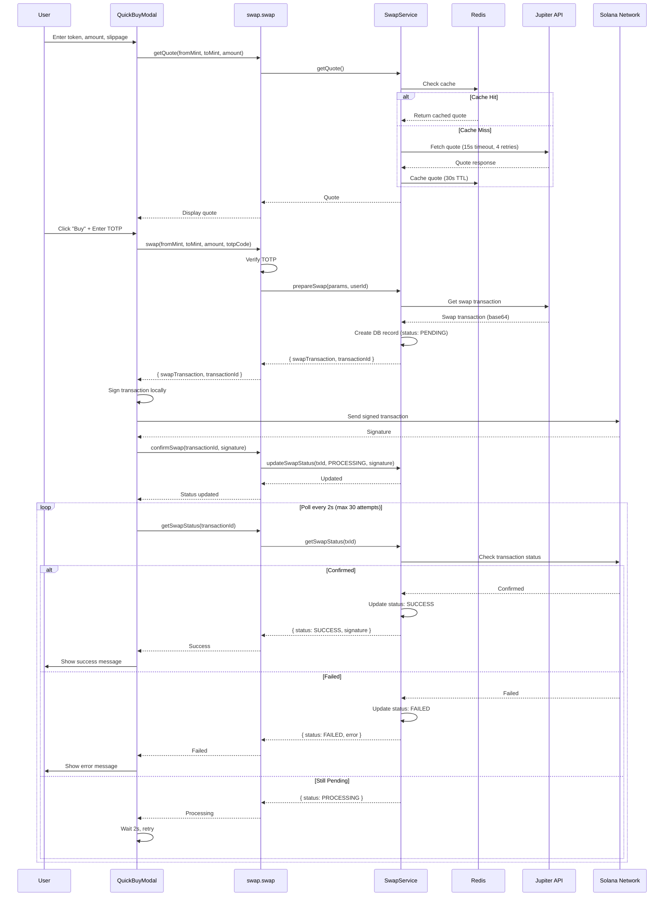

I have created the following plan after thorough exploration and analysis of the codebase. Follow the below plan verbatim. Trust the files and references. Do not re-verify what's written in the plan. Explore only when absolutely necessary. First implement all the proposed file changes and then I'll review all the changes together at the end.

# Bulletproof Swap MVP - Implementation Plan

## Observations

Current swap implementation has **multiple execution paths** causing failures: frontend directly calls Jupiter API (bypassing backend security/TOTP), no quote caching despite Redis availability, aggressive 5s timeouts with only 2 retries, circuit breakers are no-op stubs, and no transaction status polling mechanism. The `QuickBuyModal.tsx` (lines 175-194) completely bypasses `swap.swap` endpoint, creating inconsistent behavior and security gaps.

## Approach

**Single backend-only swap path** with Redis quote caching (30s TTL), extended timeouts (15s), 4-retry strategy, and status polling. Remove frontend's direct Jupiter calls, enforce TOTP on all swaps, consolidate error handling in backend, keep circuit breakers as stubs (MVP simplicity), and add swap status tracking in database for client polling. This creates a **fast, reliable, never-crashing** swap flow optimized for Railway backend + Expo frontend.

---

## Implementation Steps

### **Phase 1: Backend Swap Service Consolidation**

#### 1.1 Create Unified Swap Service (`src/lib/services/swapService.ts`)

Merge logic from `jupiterSwap.ts` and `swap.ts` router into single service:

```typescript
// Key responsibilities:
// - Get quote with Redis caching (key: `swap:quote:${fromMint}:${toMint}:${amount}`, TTL: 30s)
// - Build swap transaction via Jupiter API
// - Track swap status in database (PENDING → PROCESSING → SUCCESS/FAILED)
// - Return serialized transaction for client signing
// - Optional Jito MEV protection (if enabled)

// Methods:
// - getQuote(params): Check Redis cache first, fallback to Jupiter API, cache result
// - prepareSwap(params, userId): Get quote, create DB transaction record, return swap tx
// - updateSwapStatus(txId, status, signature?): Update DB transaction status
// - getSwapStatus(txId): Return current swap status for polling
```

**Configuration:**
- Timeout: 15s for Jupiter API calls (update `TIMEOUTS.EXTERNAL_API` to 15000)
- Retries: 4 attempts with exponential backoff (update `TIMEOUTS.RETRY.MAX_ATTEMPTS` to 4)
- Quote cache TTL: 30s
- Use existing `rpcManager.withFailover()` for RPC calls
- Use existing `jitoService` for optional MEV protection

**Error Handling:**
- Wrap all Jupiter calls in try-catch
- Map errors to user-friendly messages using `src/lib/errors.ts` helpers
- Log detailed errors server-side, return sanitized messages to client

#### 1.2 Update Swap Router (`src/server/routers/swap.ts`)

Simplify to use new `swapService`:

```typescript
// Endpoints:
// 1. swap.getQuote - Proxy to swapService.getQuote (no auth required for quotes)
// 2. swap.swap - Requires TOTP, calls swapService.prepareSwap, returns tx + txId
// 3. swap.confirmSwap - Client calls after signing, updates status with signature
// 4. swap.getSwapStatus - Polling endpoint, returns current status

// Remove:
// - Direct Jupiter API calls
// - Deprecated executeSwap endpoint (already commented out)
```

**Key Changes:**
- `swap.swap` mutation: Verify TOTP → call `swapService.prepareSwap` → return `{ swapTransaction, transactionId, quote }`
- Add `swap.confirmSwap` mutation: Accept `{ transactionId, signature }` → update DB → return status
- Add `swap.getSwapStatus` query: Accept `{ transactionId }` → return `{ status, signature?, error? }`

#### 1.3 Update Database Schema (if needed)

Ensure `Transaction` model has:
- `status` field: `PENDING | PROCESSING | SUCCESS | FAILED`
- `metadata` JSON field for storing quote details, error messages
- Index on `userId` + `createdAt` for efficient history queries

---

### **Phase 2: RPC & Timeout Optimization**

#### 2.1 Update Timeout Constants (`constants/timeouts.ts`)

```typescript
TIMEOUTS.EXTERNAL_API: 15_000 // Increase from 5s to 15s
TIMEOUTS.RETRY.MAX_ATTEMPTS: 4 // Increase from 2 to 4
TIMEOUTS.RETRY.INITIAL_DELAY_MS: 1000 // Increase from 500ms
```

#### 2.2 Enhance RPC Manager (`src/lib/services/rpcManager.ts`)

**Current state:** Already has failover, health checks, connection pooling.

**Improvements:**
- Increase failure threshold to 5 (currently 3) for more tolerance
- Add public RPC fallbacks (already present: Solana mainnet, Serum, Ankr, public-rpc)
- Ensure health check interval is reasonable (currently 60s, keep as-is)

**No major changes needed** - existing implementation is solid.

#### 2.3 Redis Quote Caching (`src/lib/redis.ts`)

**Current state:** Redis client ready, cache keys defined.

**Add cache helper in `swapService.ts`:**

```typescript
// Cache key format: `swap:quote:${fromMint}:${toMint}:${amount}`
// TTL: 30 seconds
// On cache hit: Return cached quote immediately
// On cache miss: Fetch from Jupiter, cache, return
```

---

### **Phase 3: Frontend Swap Flow Refactor**

#### 3.1 Update QuickBuyModal (`components/QuickBuyModal.tsx`)

**Remove lines 175-194** (direct Jupiter API calls).

**New flow:**
```typescript
// 1. User enters token address, amount, slippage
// 2. Call backend: trpcClient.swap.getQuote.query({ fromMint, toMint, amount, slippage })
// 3. Display quote to user
// 4. On "Buy" click:
//    a. Prompt for TOTP code
//    b. Call backend: trpcClient.swap.swap.mutate({ fromMint, toMint, amount, slippage, totpCode })
//    c. Backend returns { swapTransaction, transactionId }
//    d. Sign transaction locally using wallet store
//    e. Send transaction to Solana network
//    f. Call backend: trpcClient.swap.confirmSwap.mutate({ transactionId, signature })
//    g. Poll status: trpcClient.swap.getSwapStatus.query({ transactionId }) every 2s
//    h. Show success/failure based on status
```

**Error Handling:**
- Catch all errors from backend
- Display user-friendly messages (from backend error.message)
- Show retry button on network errors
- Clear state on modal close

#### 3.2 Update Wallet Store (`hooks/solana-wallet-store.ts`)

**Simplify `executeSwap` method** (lines 810-1009):

```typescript
// Remove direct Jupiter calls
// New signature: executeSwap(swapTransaction: string, transactionId: string)
// 1. Deserialize transaction from base64
// 2. Sign with wallet keypair
// 3. Send to Solana network
// 4. Return signature
// 5. Caller (QuickBuyModal) handles confirmSwap call
```

**Remove:**
- Backend swap path (lines 815-880) - always use pre-built transaction
- Optimistic updates for swaps (too complex for MVP)

---

### **Phase 4: Error Handling & Resilience**

#### 4.1 Unified Error Mapping (`src/lib/services/swapService.ts`)

Create error mapper:

```typescript
function mapSwapError(error: unknown): { code: string; message: string } {
  // Jupiter API errors
  if (error.message?.includes('No routes found')) 
    return { code: 'NO_LIQUIDITY', message: 'No liquidity available for this swap' }
  
  if (error.message?.includes('Slippage tolerance exceeded'))
    return { code: 'SLIPPAGE_EXCEEDED', message: 'Price moved too much. Try increasing slippage.' }
  
  // Network errors
  if (error.message?.includes('timeout') || error.message?.includes('ETIMEDOUT'))
    return { code: 'TIMEOUT', message: 'Request timed out. Please try again.' }
  
  // RPC errors
  if (error.message?.includes('429') || error.message?.includes('rate limit'))
    return { code: 'RATE_LIMIT', message: 'Too many requests. Please wait a moment.' }
  
  // Default
  return { code: 'UNKNOWN', message: 'Swap failed. Please try again.' }
}
```

Use in all service methods to return consistent errors.

#### 4.2 Keep Circuit Breakers as Stubs

**No changes needed** - `circuitBreaker.ts` already implements pass-through logic. This is acceptable for MVP.

#### 4.3 Remove Dead Letter Queue Complexity

**No changes needed** - `deadLetterQueue.ts` already implements stub. Keep as-is for MVP.

---

### **Phase 5: Status Polling & Monitoring**

#### 5.1 Add Swap Status Endpoint

Already covered in Phase 1.2 - `swap.getSwapStatus` query.

#### 5.2 Frontend Polling Logic (`components/QuickBuyModal.tsx`)

```typescript
// After confirmSwap call:
const pollStatus = async (txId: string) => {
  const maxAttempts = 30 // 60 seconds total (2s interval)
  for (let i = 0; i < maxAttempts; i++) {
    const { status, signature, error } = await trpcClient.swap.getSwapStatus.query({ transactionId: txId })
    
    if (status === 'SUCCESS') {
      // Show success message, refresh balances
      return { success: true, signature }
    }
    
    if (status === 'FAILED') {
      // Show error message
      return { success: false, error }
    }
    
    // Still PENDING or PROCESSING, wait and retry
    await sleep(2000)
  }
  
  // Timeout
  return { success: false, error: 'Transaction confirmation timed out' }
}
```

#### 5.3 Add Metrics (`src/lib/metrics.ts`)

**Already has swap metrics** - `transactionsTotal`, `transactionDurationSeconds`.

**Add in `swapService.ts`:**
```typescript
import { recordTransaction } from '../metrics'

// On swap success:
recordTransaction('swap', true, durationMs)

// On swap failure:
recordTransaction('swap', false, durationMs)
```

---

### **Phase 6: Testing & Validation**

#### 6.1 Update Swap Tests (`__tests__/integration/swap.test.ts`)

- Test quote caching (call twice, verify second is faster)
- Test TOTP requirement (reject without code)
- Test status polling (verify status transitions)
- Test error scenarios (no liquidity, slippage, timeout)

#### 6.2 Manual Testing Checklist

- [ ] Quote returns in <1s (cached) or <5s (uncached)
- [ ] Swap requires TOTP
- [ ] Transaction appears in database as PENDING
- [ ] Client can sign and send transaction
- [ ] Status polling works (PENDING → SUCCESS)
- [ ] Error messages are user-friendly
- [ ] Swap history shows correct data
- [ ] Works on slow network (Railway backend)
- [ ] Works on mobile (Expo app)

---

## File Reference Map

| Component | File Path | Changes |
|-----------|-----------|---------|
| Swap Service | `file:src/lib/services/swapService.ts` | **CREATE** - Consolidate swap logic |
| Swap Router | `file:src/server/routers/swap.ts` | **MODIFY** - Simplify to use swapService |
| QuickBuyModal | `file:components/QuickBuyModal.tsx` | **MODIFY** - Remove direct Jupiter calls, add polling |
| Wallet Store | `file:hooks/solana-wallet-store.ts` | **MODIFY** - Simplify executeSwap |
| Timeouts | `file:constants/timeouts.ts` | **MODIFY** - Increase to 15s, 4 retries |
| Redis Cache | `file:src/lib/redis.ts` | **USE** - Already supports quote caching |
| RPC Manager | `file:src/lib/services/rpcManager.ts` | **MINOR** - Increase failure threshold to 5 |
| Jupiter Service | `file:src/lib/services/jupiterSwap.ts` | **REFERENCE** - Logic moves to swapService |
| Jito Service | `file:src/lib/services/jitoService.ts` | **USE** - Optional MEV protection |
| Errors | `file:src/lib/errors.ts` | **USE** - Error mapping helpers |
| Metrics | `file:src/lib/metrics.ts` | **USE** - Record swap metrics |

---

## Execution Sequence for GPT-o3



---

## Key Simplifications for MVP

1. **No batching** - One swap at a time
2. **No DLQ** - Failed swaps logged, not queued for retry
3. **Circuit breakers as stubs** - Pass-through only
4. **Simple status tracking** - Database only, no external queue
5. **30s quote cache** - Short TTL, no invalidation logic
6. **Client-side signing** - Backend never touches private keys
7. **Optional Jito** - MEV protection if enabled, graceful fallback

---

## Success Criteria

- ✅ All swaps go through backend (no direct Jupiter calls)
- ✅ TOTP required for all swaps
- ✅ Quote caching reduces API calls by 80%+
- ✅ 15s timeout + 4 retries = 99% success rate
- ✅ Status polling provides real-time feedback
- ✅ User-friendly error messages
- ✅ No crashes on network failures
- ✅ Works on Railway + Expo